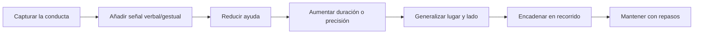

# Base de conocimiento de entrenamiento

| Campo | Valor |
|---|---|
| Producto | Rally O Trainer |
| Estado | Revisado para el corte P1 |
| Enfoque | Entrenamiento en positivo, sesiones breves y criterios observables |

## 1. Principios obligatorios

1. El bienestar prevalece sobre la duración, el número de repeticiones y el estado de progreso.
2. Quince minutos es un máximo orientativo; terminar antes es válido.
3. Se refuerza la conducta deseada y se modifica el entorno cuando la tarea resulta demasiado difícil.
4. No se recomienda dolor, miedo, intimidación, tirones, collares de púas o eléctricos ni manipulación física forzada.
5. Una ayuda es una herramienta temporal, no un error moral.
6. La autonomía se construye retirando ayudas de forma gradual.
7. Pocas repeticiones de calidad son preferibles a repetir con deterioro.
8. Cada sesión termina con una actividad sencilla y positiva.
9. Las señales se practican por ambos lados cuando la habilidad lo permite, aunque el grado inicial solo evalúe uno.
10. La aplicación orienta; no sustituye valoración veterinaria ni ayuda profesional ante dolor, miedo o problemas de conducta.

## 2. Ciclo de aprendizaje

No se avanzan simultáneamente distancia, duración y distracción. Si el rendimiento baja, se reduce una sola dificultad y se recupera fluidez.

## 3. Estructura de 15 minutos

### Activación — aproximadamente 2 minutos

- paseo corto o movimiento suave;
- contacto voluntario;
- dos o tres conductas fáciles conocidas;
- comprobar superficie, espacio y disposición del perro.

### Trabajo — aproximadamente 10 u 11 minutos

- una señal principal;
- bloques breves de una a tres repeticiones;
- pausas reales entre bloques;
- un criterio prioritario cada vez;
- cambiar a una versión más fácil ante dos repeticiones claramente peores;
- finalizar antes si aparece fatiga, frustración o desconexión.

### Cierre — aproximadamente 2 o 3 minutos

- conducta sencilla;
- refuerzo o juego apropiado;
- bajar activación si es necesario;
- guardar la sesión sin prolongar el trabajo para “mejorar el resultado”.

## 4. Jerarquía de ayudas

La jerarquía no es universal; se elige la ayuda menos invasiva que permita comprender la tarea.

| Ayuda | Uso correcto | Retirada |
|---|---|---|
| Entorno | Pared, cono o marca facilita trayectoria | Aumentar distancia o retirar referencia |
| Diana | Indica posición o dirección | Reducir tamaño y frecuencia |
| Gesto | Aclara movimiento | Hacerlo más pequeño |
| Señuelo visible | Inicia una conducta nueva | Pasar pronto a mano vacía |
| Orden verbal adicional | Recupera respuesta | Volver a una sola señal |
| Correa suave | Seguridad u orientación sin tensión | Trabajar en entorno seguro sin guía física |
| Criterio reducido | Menos pasos, tiempo o distancia | Aumentar una variable cada vez |

Si la ayuda aparece en la ejecución, el resultado se registra como `Correcto con ayuda`, salvo que esa ayuda forme parte de la ejecución final permitida.

## 5. Selección del criterio

Antes de un bloque se elige una pregunta observable:

- ¿adopta la posición correcta?;
- ¿mantiene las patas quietas?;
- ¿gira en la dirección y ángulo correctos?;
- ¿permanece alineado?;
- ¿sale al mismo tiempo que el guía?;
- ¿puede hacerlo sin ayuda adicional?;

No se corrigen simultáneamente todos los detalles. La ficha muestra hasta tres criterios y el objetivo de sesión prioriza uno.

## 6. Respuesta ante un intento incorrecto

1. No castigar ni mostrar frustración.
2. Pausar brevemente.
3. Comprobar si la señal fue clara y el entorno apropiado.
4. Reducir un criterio: distancia, duración, ángulo o distracción.
5. Añadir una ayuda conocida si facilita comprensión.
6. Reforzar una respuesta más sencilla.
7. Tras dos deterioros consecutivos, proponer pausa o cierre.

El sistema no recomienda repetir de manera idéntica esperando un resultado distinto.

## 7. Patrones de entrenamiento

### Posición junto al guía

- construir valor en la posición;
- reforzar alineación antes de duración;
- añadir un paso y después varios;
- generalizar izquierda y derecha por separado.

### Transición de posiciones

- enseñar cada posición de forma aislada;
- practicar transiciones concretas;
- añadir parada del guía;
- reforzar que mantenga la posición hasta salir.

### Inmovilidad mientras el guía se mueve

- un pequeño desplazamiento del guía;
- medio arco;
- vuelta completa;
- diferentes lados y entornos;
- mantener duración corta al aumentar movimiento.

### Giros en junto

- referencia de suelo;
- pocos pasos y giro amplio;
- reforzar posición interior/exterior;
- reducir radio;
- añadir ritmo normal;
- practicar ambas direcciones y lados.

### Frente y regreso al junto

- frente recto independiente;
- regreso por una ruta concreta;
- posición final;
- unir frente y regreso;
- añadir movimiento anterior y posterior.

### Lateral y atrás

- conciencia corporal con plataforma o pared segura;
- un paso;
- varios pasos;
- alineación;
- retirada de referencia;
- generalización sin forzar articulaciones.

### Distancia y llamada

- estabilidad a distancia mínima;
- el guía se aleja un paso;
- aumentar distancia;
- añadir llamada;
- añadir obstáculos solo con habilidad sólida y material seguro.

### Conos y figuras

- aproximación a un único cono;
- recorrido claro y amplio;
- reducir separación solo con fluidez;
- usar árboles o postes únicamente si son seguros y la adaptación no se presenta como ejecución reglamentaria completa cuando cambie medidas.

### Salto

- comprobar salud, superficie y material;
- usar altura adecuada y barra que pueda caer;
- enseñar aproximación y salida por separado;
- pocas repeticiones;
- no improvisar un salto inseguro;
- detener ante dolor, duda persistente o mala recepción.

## 8. Generalización

Orden recomendado:

1. lugar familiar y sin distracciones;
2. nueva orientación dentro del mismo lugar;
3. lado contrario;
4. exterior reducido;
5. club o pista;
6. señal física propia;
7. pequeña secuencia;
8. recorrido.

Cambiar de entorno puede justificar volver temporalmente a una ayuda sin considerar que el aprendizaje se ha perdido.

## 9. Uso de recompensas

- elegir recompensa apropiada al perro y contexto;
- entregar de forma que favorezca la siguiente posición;
- evitar mostrar comida cuando se busca autonomía si actúa como señuelo;
- variar la frecuencia después de que la conducta sea fiable, no retirar de golpe;
- en simulación competitiva, respetar las reglas del grado y distinguirla del entrenamiento.

## 10. Señales de pausa o cierre

- evita repetidamente la zona de trabajo;
- reduce velocidad o muestra fatiga;
- olfatea como forma persistente de desconexión;
- pierde conductas fáciles;
- aparece frustración creciente;
- el guía se vuelve impreciso o impaciente;
- la superficie o el entorno dejan de ser seguros.

Estos signos son orientativos, no diagnóstico.

## 11. Registro honesto

- `Incorrecto`: la ejecución no cumple el criterio elegido.
- `Correcto con ayuda`: cumple gracias a una ayuda adicional o criterio reducido.
- `Correcto autónomo`: cumple la ejecución final sin ayuda adicional.

Registrar con ayuda no perjudica al perro; permite que el planificador proponga retirar esa ayuda de manera realista.

## Riesgos

- Convertir recomendaciones generales en prescripciones universales.
- Avanzar demasiado rápido por perseguir el estado “aprendida”.
- Interpretar señales de estrés sin contexto profesional.
- Improvisar material de salto o superficies inseguras.
- Confundir entrenamiento positivo con ausencia de criterios claros.

## Mejoras posibles

- Revisión externa por una persona especialista en entrenamiento positivo.
- Vídeos propios de microhabilidades.
- Variantes para perros mayores o con limitaciones, revisadas profesionalmente.
- Glosario visual de ayudas y posiciones.

## Decisiones pendientes

- Validar los patrones con el primer perro piloto.
- Determinar si el sistema sugiere una pausa automática tras dos deterioros o solo muestra una opción.
- Revisar la sección de salto antes de publicar señales que lo utilicen.
