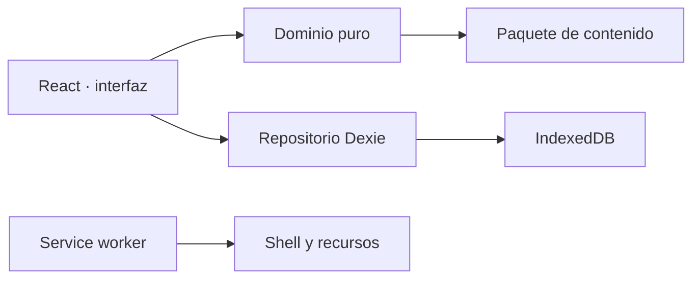

<!-- Copyright © 2026 José María Quirós Iglesias. Todos los derechos reservados sobre la documentación original. Los materiales de terceros conservan su titularidad. Véanse LICENSE y THIRD_PARTY_NOTICES.md. -->

# Manual del desarrollador de Rally O Trainer

## 1. Arquitectura ejecutable

Rally O Trainer es una aplicación React y TypeScript compilada por Vite. Toda la información personal vive en IndexedDB mediante Dexie. No existe backend, autenticación, analítica ni dependencia de red durante el entrenamiento.

La separación clave es contenido versionado frente a evidencia del usuario. Una actualización editorial no debe reescribir sesiones históricas.

## 2. Requisitos y comandos

- Node.js 22 o superior.
- pnpm 11.

| Comando | Resultado |
|---|---|
| `pnpm dev` | servidor local de desarrollo |
| `pnpm build` | comprobación TypeScript y PWA de producción |
| `pnpm test` | pruebas unitarias |
| `pnpm content:build` | regenera el paquete Debutante desde el lote editorial |
| `pnpm content:build:advanced` | regenera Grupos 2–4 y su checklist |
| `pnpm content:build:published` | compone solo las fichas aprobadas para la PWA |
| `pnpm content:validate` | valida inventario, campos y relaciones |
| `pnpm sources:validate` | comprueba tamaño y checksum de los PDF de referencia |
| `pnpm pwa:validate` | comprueba la distribución, manifiesto, iconos, caché y ausencia de fuentes privadas |
| `pnpm pages:validate` | comprueba rutas relativas y el flujo de GitHub Pages |
| `pnpm check` | cadena completa de validación |

## 3. Directorios

| Ruta | Responsabilidad |
|---|---|
| `src/domain/` | tipos, cálculo de progreso y planificador sin UI |
| `src/data/` | IndexedDB, transacciones y copias |
| `src/content/` | acceso de solo lectura al paquete editorial |
| `src/pages/` | pantallas y orquestación de casos de uso |
| `src/components/` | elementos compartidos de interfaz |
| `Contenido/` | fuentes extraídas, edición y conocimiento de entrenamiento |
| `Reglamento/` | reglas de progresión trazables |
| `scripts/` | extracción, generación y validación reproducibles |

## 4. Persistencia

La base `rally-o-trainer` usa actualmente la versión 3 y las tablas:

- `dogs`;
- `settings`;
- `sessions`;
- `blocks`;
- `records`;
- `courses`;
- `courseItems`.

La versión 2 añade pistas. La versión 3 convierte la sesión individual en una sesión estructurada multiseñal y añade modalidad, estado pausado, tiempo activo, descansos, impresiones y notas por bloque. La migración completa valores seguros sin eliminar perros, sesiones, bloques ni registros anteriores. Los cambios que alteren datos existentes deben crear una nueva versión Dexie con migración idempotente. No se modifica una versión ya publicada.

Una sesión nueva se crea con todos sus bloques en una transacción. Solo puede existir una sesión `active` o `paused` por instalación, y solo las sesiones `completed` aportan evidencia al progreso. Las descartadas conservan trazabilidad local pero quedan excluidas del historial y de las estadísticas.

La modalidad se interpreta sin duplicar un “índice actual” mutable:

- `repetition`: el siguiente paso es el primer bloque con menos de diez registros;
- `circuit`: el siguiente bloque se deriva de `records.length % blocks.length`;
- cada registro nuevo recibe `sessionSequence`, además de su secuencia dentro del bloque;
- `Deshacer` elimina el registro con la última secuencia global y el paso se recalcula.

## 5. Algoritmo de progreso

`calculateProgress` es una función pura. Filtra por lado, acepta evidencia individual o en circuito, ordena cronológicamente y evalúa ventanas móviles de diez intentos. Conserva el primer momento en el que se alcanzó aprendizaje para poder detectar una regresión posterior. En registros nuevos, `autonomous` representa la pulsación visible **Correcta** y `incorrect` representa **Incorrecta**; el valor heredado `assisted` se conserva para importar historial antiguo y se contabiliza como no correcto en los nuevos resúmenes.

`trainingSession.ts` contiene las reglas puras de orden de pasos, umbral 7/10, tiempo activo, recordatorio de descanso y selección del último registro. La UI no debe reimplementar esas reglas.

No cambies umbrales sin:

1. incrementar la versión de reglas del planificador;
2. añadir pruebas de borde;
3. documentar el impacto sobre datos existentes;
4. validar el comportamiento con el propietario del producto.

## 6. Contenido y reglamento

`fci-signals.source.json` es material de comparación, no contenido publicable. `debutante-signals.es.json` es generado por un script a partir de registros revisados. Los Grupos 2–4 se generan como borrador y solo entran en `published-signals.es.json` si el propietario añade su código a `advanced-review.json`. Cada señal necesita identidad estable, revisión, clave de compatibilidad, asignaciones reglamentarias y tres capas de texto.

Flujo editorial:

1. conservar la fuente y su checksum;
2. extraer inventario;
3. redactar sin copiar imágenes ni largas secciones oficiales;
4. revisar visualmente contra el PDF;
5. marcar el código aprobado en `advanced-review.json`;
6. ejecutar generadores y validadores;
7. publicar una versión inmutable del paquete.

## 7. PWA

`vite-plugin-pwa` genera el manifiesto y un service worker `generateSW`. El registro se hace desde `main.tsx`. La caché contiene el shell, JavaScript, estilos, iconos y JSON incluidos en el bundle. Las fuentes PDF no se distribuyen con la aplicación.

Antes de desplegar:

- servir siempre por HTTPS;
- comprobar instalación en Safari iOS y Chrome Android;
- abrir una vez con red, cerrar, activar modo avión y recorrer una sesión completa;
- comprobar actualización con una sesión activa y sin pérdida de datos.

El flujo `.github/workflows/deploy-pages.yml` publica `dist/` en GitHub Pages después de ejecutar `pnpm check`. El repositorio recomendado es público y se llama `rally-o-trainer`; consulta `Manuales/03 - Publicación en GitHub Pages.md` para la primera publicación y las pruebas posteriores.

## 8. Copias e importación

El formato v2 incluye identificador, versión de esquema, fecha, versión del contenido y todas las tablas. La restauración acepta también copias v1 y añade los valores de sesión estructurada antes de abrir la transacción que reemplaza los datos. Las migraciones futuras deben aceptar versiones anteriores mediante adaptadores explícitos.

Nunca ejecutes código contenido en una copia ni incluyas HTML sin sanear en notas.

## 9. Pruebas mínimas para una entrega

- `pnpm check` sin errores;
- `git diff --check` sin problemas de espacio;
- alta y cambio de perro;
- selección de una y varias señales, búsqueda y filtros;
- repetición y circuito, avance automático y umbral 7/10;
- registro binario, deshacer global y cierre anticipado;
- pausa, reanudación, recordatorio recurrente y recuperación tras recarga;
- impresiones, notas, resumen y repetición de pendientes;
- progresión separada por lados;
- exportación y restauración;
- instalación y sesión sin conexión;
- contraste, tamaño táctil y zoom al 200 %;
- iPhone 16 Pro y al menos un Android físico antes del piloto.

## 10. Política de costes y privacidad

La arquitectura base no requiere servicios de pago. No añadas SDK de analítica, publicidad, autenticación o nube por conveniencia. Una futura sincronización será optativa, cifrada, separada del modo local y aprobada como decisión de producto.

## Riesgos

- Safari puede desalojar almacenamiento local en determinadas condiciones.
- Una migración incorrecta podría afectar datos sin copia externa.
- El contenido reglamentario envejece aunque el código no cambie.
- Las pruebas unitarias no sustituyen pruebas físicas de instalación y modo avión.

## Mejoras posibles

- Añadir pruebas de IndexedDB con una implementación controlada para test.
- Incorporar pruebas end-to-end cuando exista un navegador automatizable estable.
- Dividir el bundle por rutas si las funciones avanzadas hacen crecer de forma material la carga inicial.
- Automatizar el informe de diferencias entre revisiones reglamentarias.

## Decisiones pendientes

- Completar la validación física de la versión publicada en iPhone 16 Pro y Android.
- Elegir el dispositivo Android de referencia del club.
- Definir la política de firma y publicación de paquetes de contenido.
