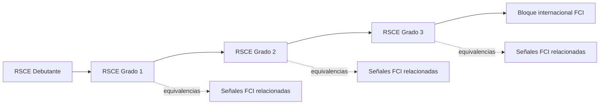
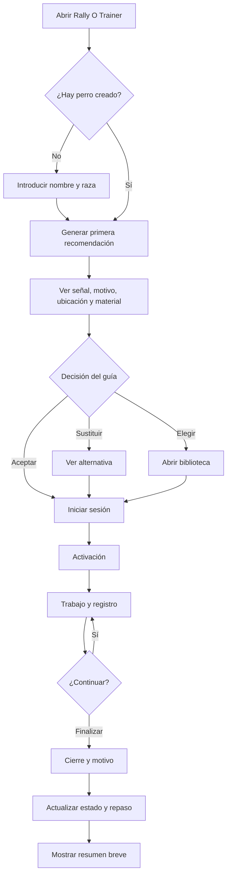
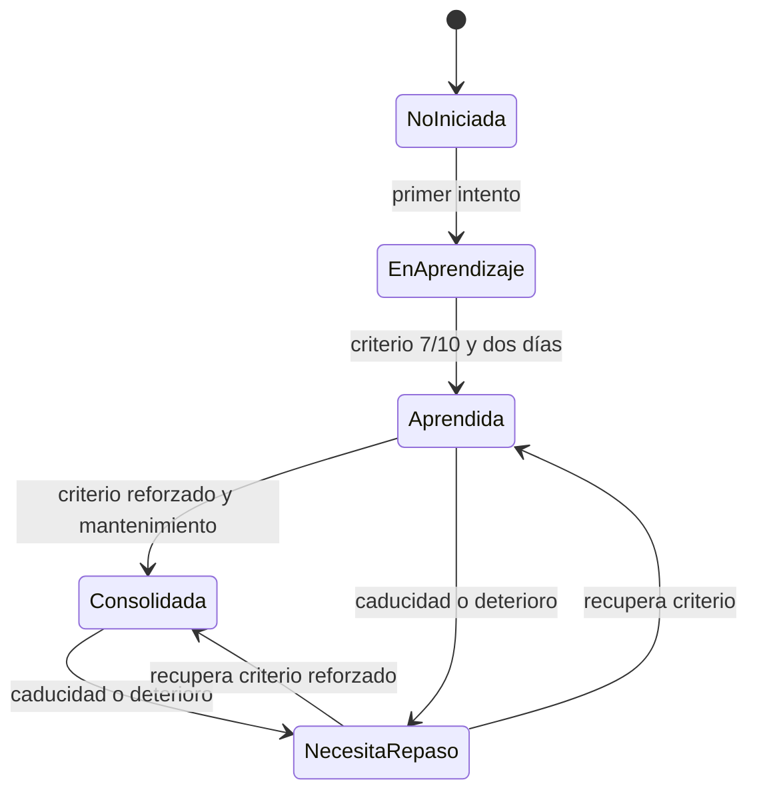

# PRD — Capítulo 02: Visión, alcance y experiencia principal

| Campo | Valor |
|---|---|
| Producto | Rally O Trainer |
| Tipo | Progressive Web App local-first |
| Estado del capítulo | Borrador para aprobación |
| Fecha | 5 de agosto de 2026 |
| Alcance | Visión operativa, límites del MVP, progresión y experiencia principal |
| Capítulo anterior | 01 — Resumen ejecutivo |
| Próximo capítulo | Usuarios, casos de uso e historias de usuario |

> Este capítulo define qué experiencia debe entregar Rally O Trainer y qué queda dentro o fuera del primer producto útil. No selecciona todavía el stack técnico, el esquema definitivo de datos ni la navegación visual.

---

## Análisis previo

### 1. Hipótesis sometidas a revisión

| Hipótesis | Punto débil | Resolución propuesta |
|---|---|---|
| “Desbloquear” un grado debe impedir consultar su contenido. | Un bloqueo real dificulta aprender, comparar o preparar una sesión libre. También castiga al usuario cuando el algoritmo se equivoca. | Toda la biblioteca será consultable. El desbloqueo solo determinará qué contenido se recomienda como siguiente paso para cada perro. |
| El MVP debe construirse completo antes de poder utilizarse. | Cargar y revisar RSCE hasta Grado 3 y el bloque FCI es un esfuerzo editorial grande para un proyecto personal sin presupuesto. Retrasaría la validación del entrenamiento diario. | Mantener el alcance reglamentario completo del MVP, pero incorporarlo mediante incrementos internos comenzando por Debutante. Cada incremento deberá ser utilizable. |
| Una sesión inteligente necesita muchas preguntas previas. | Configurar tiempo, energía, objetivo, ubicación, material y dificultad antes de cada sesión contradice la rapidez buscada. | Fijar 15 minutos, recordar contexto anterior y pedir únicamente decisiones que alteren la recomendación. El resto utilizará valores predeterminados editables. |
| Cuantos más datos tenga el perfil del perro, mejores serán las recomendaciones. | Foto, sexo, peso o información extensa no mejoran necesariamente la decisión diaria y aumentan la fricción. | El perfil obligatorio contendrá solo nombre y raza. El progreso se calculará desde la práctica registrada. |
| El progreso puede resumirse en un porcentaje general. | Mezcla lados, ayudas, días y contextos; un 70 % aislado puede producir una falsa sensación de dominio. | Evaluar por señal, perro, lado y contexto comparable, usando intentos recientes y consistencia entre días. |
| Una señal no practicada durante 30 días debe perder su logro. | Confunde estado actual con historial y desmotiva. | Conservar el logro histórico y cambiar únicamente el estado operativo a “necesita repaso”. |
| Para entrenar hacia competición hay que registrar competiciones y fechas. | Añade gestión que no ayuda al objetivo inmediato de planificar el entrenamiento cotidiano. | Permitir un objetivo de preparación por grado o competición sin calendario ni registro de resultados oficiales. |
| El constructor de pistas debe estar en el primer incremento. | La necesidad inmediata es saber qué señal entrenar hoy en poco espacio. Un editor espacial aumenta mucho el alcance y no mejora ese primer ciclo. | Posponer bloques, recorridos y constructor. El MVP inicial trabajará señal por señal, dejando el modelo preparado para agruparlas después. |
| Una experiencia idéntica en iPhone y Android garantiza compatibilidad. | Los patrones de instalación y comportamiento PWA varían por plataforma. | Mantener el mismo modelo mental y las mismas capacidades principales, admitiendo adaptaciones de plataforma y pruebas específicas. |

### 2. Tensiones de producto detectadas

#### 2.1 Alcance amplio frente a coste cero

El contenido objetivo comprende RSCE Debutante y Grados 1, 2 y 3, además de contenido FCI relacionado y avanzado. Esto es compatible con una arquitectura sencilla, pero no con una carga editorial simultánea sin validación. La solución no es reducir el destino del producto, sino separar **alcance comprometido** de **orden de incorporación**.

#### 2.2 Orientación frente a autonomía

El producto debe decir qué conviene practicar, pero el guía conserva la decisión. Una recomendación no puede convertirse en una barrera. La experiencia ofrecerá siempre tres salidas: aceptar, sustituir o elegir libremente.

#### 2.3 Registro preciso frente a uso con una mano

La planificación necesita conocer intentos, ayudas y lados; pedir todos esos datos en un formulario haría inviable el uso en pista. La captura principal se limita a tres resultados de un toque y deriva el contexto de la sesión. Los detalles serán opcionales o se solicitarán al cerrar el bloque.

#### 2.4 Progresión reglamentaria frente a progresión de habilidades

Los grados organizan el reglamento, pero las habilidades se reutilizan y pueden aparecer en ámbitos diferentes. La recomendación deberá depender de prerrequisitos y equivalencias entre señales, no solo de que un grado entero esté completo.

#### 2.5 Duración fija frente a bienestar

Quince minutos es un marco de diseño, no una obligación de consumo. La sesión podrá finalizar en cualquier momento y registrará el motivo sin penalizar al perro ni al guía. El cierre positivo se propondrá cuando las circunstancias lo permitan, nunca como exigencia si existe indisposición.

### 3. Mejoras propuestas y justificación

#### 3.1 Sustituir bloqueos por una progresión recomendada

Cada perro tendrá un nivel recomendado derivado de su historial. La interfaz podrá mostrar contenido futuro como “avanzado” o “todavía no recomendado”, pero permitirá abrirlo, estudiarlo y elegirlo. Así se conserva el valor pedagógico sin crear restricciones artificiales.

#### 3.2 Diseñar una experiencia de configuración casi nula

La aplicación recordará perro, ubicación, objetivo e inventario utilizados anteriormente. Al abrirla mostrará directamente la recomendación de hoy. Solo pedirá confirmar un cambio cuando sea relevante para la sesión.

#### 3.3 Separar contenido reglamentario, explicación y consejo

Cada señal presentará tres capas con distinta responsabilidad:

1. descripción reglamentaria redactada de forma propia y fiel;
2. explicación sencilla para comprender qué se solicita;
3. consejo de entrenamiento en positivo.

La autoridad, versión, vigencia y enlace de referencia acompañarán al contenido, pero Rally O Trainer no se presentará como aplicación oficial ni reproducirá imágenes oficiales.

#### 3.4 Empezar por el caso más pequeño que cierra el ciclo

El primer incremento deberá ser capaz de recomendar una señal de Debutante, explicar cómo trabajarla, registrar varios intentos y programar un repaso. Esto valida el núcleo antes de multiplicar señales, grados y pantallas.

#### 3.5 Hacer visible el motivo de una interrupción

Finalizar antes de 15 minutos no se considerará abandono. El resumen permitirá indicar, con una sola elección, si la sesión terminó por objetivo cumplido, cansancio, distracción, falta de tiempo, dificultad, indisposición u otro motivo. Este dato evitará que el planificador interprete una interrupción como falta de compromiso o como fallo técnico.

---

## Versión definitiva

### 1. Visión operativa

Rally O Trainer será el acompañante cotidiano de un guía que quiere avanzar desde sus primeros entrenamientos de Rally Obedience hasta los niveles superiores de RSCE y el trabajo internacional FCI. Su función principal será eliminar la duda previa al entrenamiento: al abrir la aplicación, el usuario deberá saber en pocos segundos qué señal practicar con cada perro, por qué conviene trabajarla, dónde puede hacerlo y qué material necesita.

El producto estará pensado inicialmente para una persona que conoce los fundamentos básicos, empieza en Debutante y quiere avanzar de forma progresiva hacia competición. No sustituirá a un instructor, no emitirá certificaciones y no juzgará oficialmente una ejecución. Organizará la práctica declarada por el guía y ofrecerá orientación basada en reglas comprensibles.

#### 1.1 Promesa principal

> Abre Rally O Trainer y empieza en menos de treinta segundos una práctica útil de quince minutos, adaptada al perro y posible con el espacio y material disponibles.

#### 1.2 Trabajo que el producto debe resolver

Cuando el usuario piensa “quiero entrenar, pero no sé qué conviene hacer hoy”, Rally O Trainer deberá:

1. identificar el perro activo;
2. revisar señales pendientes, vencidas o débiles;
3. proponer una señal y explicar el motivo;
4. indicar ubicación y material necesarios;
5. mostrar una explicación reglamentaria y una pauta accesible de entrenamiento;
6. permitir registrar cada intento sin interrumpir la práctica;
7. actualizar el estado de la señal;
8. determinar cuándo conviene repetirla.

#### 1.3 Jerarquía de valor

| Prioridad | Valor | Consecuencia de diseño |
|---:|---|---|
| 1 | Saber qué practicar hoy | La recomendación ocupa el centro del inicio. |
| 2 | Poder practicarlo ahora | Se consideran ubicación y material disponible. |
| 3 | Saber cómo practicarlo | La señal separa regla, explicación y consejo. |
| 4 | Registrar sin distraerse | Tres resultados grandes de un toque. |
| 5 | Saber cuándo repetir | El repaso se calcula automáticamente y se explica. |
| 6 | Consultar y explorar | Toda la biblioteca está disponible sin bloqueos reales. |

### 2. Usuario y contexto de referencia

#### 2.1 Usuario primario

- Guía principiante o intermedio.
- Con conocimientos básicos de Rally Obedience.
- Quiere progresar hacia competición, pero utiliza la aplicación para entrenar, no para gestionar resultados oficiales.
- Entrena uno o varios perros con historiales independientes.
- Usa principalmente un teléfono con una mano.
- Dispone de poco tiempo y no quiere preparar manualmente una sesión.

#### 2.2 Perro piloto

El caso inicial será un perro en nivel Debutante. El perfil obligatorio se limitará a:

- **nombre**;
- **raza**.

La aplicación asignará un identificador interno y calculará estados, grados recomendados y fechas desde el historial. No solicitará fotografía, sexo, peso, fecha de nacimiento, microchip ni datos médicos en el MVP.

#### 2.3 Dispositivo y entorno

- Dispositivo principal de diseño y prueba: iPhone 16 Pro.
- Compatibilidad requerida: iOS y Android.
- Validación inicial: propietario y aproximadamente cinco personas del club.
- Prueba Android física: necesaria antes de considerar el MVP distribuible; mientras tanto podrán usarse emuladores para desarrollo, pero no sustituirán la validación real.

#### 2.4 Ubicaciones

| Ubicación | Descripción | Ejemplos |
|---|---|---|
| Casa | Espacio muy reducido | Habitación, pasillo, patio pequeño |
| Exterior reducido | Zona abierta sin pista completa | Parque, camino, espacio con árboles |
| Club o pista | Zona de entrenamiento preparada | Pista, área con soportes y equipamiento |

La ubicación anterior se recordará por perro. Cambiarla será opcional antes de empezar.

#### 2.5 Material

El usuario podrá mantener un inventario opcional. El caso inicial contempla:

- conos;
- elementos naturales utilizables como referencia, por ejemplo árboles;
- ningún equipamiento especializado asumido por defecto.

Antes de comenzar, la recomendación indicará el material necesario. Si no está disponible, el usuario podrá sustituir la señal o cambiar la ubicación; nunca deberá descubrir la necesidad de material después de iniciar el ejercicio.

### 3. Alcance reglamentario

#### 3.1 Cobertura comprometida

| Autoridad | Cobertura | Presentación |
|---|---|---|
| RSCE | Debutante y Grados 1, 2 y 3 | Ruta principal y prioritaria |
| FCI | Señales relacionadas durante la progresión y bloque internacional avanzado | Área separada, vinculada mediante prerrequisitos y equivalencias |

Las fuentes oficiales de referencia serán la [documentación de Rally Obedience de la RSCE](https://www.rsce.es/tipo-de-reglamentos/rally-obediencia/) y la [documentación de Rally Obedience de la FCI](https://www.fci.be/es/Rally-Obedience-4746.html). El producto será independiente y deberá indicarlo expresamente.

#### 3.2 Estructura mínima de una señal

Cada señal incluida deberá disponer de:

- identificador interno estable;
- autoridad y reglamento;
- grado o clase;
- número y denominación;
- versión y vigencia;
- enlace a la fuente;
- descripción reglamentaria de redacción propia;
- explicación sencilla;
- consejo de entrenamiento en positivo;
- lado o lados aplicables;
- prerrequisitos;
- ubicación posible;
- material necesario;
- ilustración propia cuando esté disponible;
- estado de revisión editorial.

Las ilustraciones serán originales y esquemáticas. No se utilizarán imágenes oficiales ni se imitará su diseño de forma que pueda confundirse el producto con una publicación oficial.

#### 3.3 Progresión y consulta

No existirá bloqueo de acceso. Se diferenciarán dos conceptos:

- **Consultable:** el usuario puede abrir cualquier grado o señal disponible.
- **Recomendable:** el planificador considera que la señal es un siguiente paso apropiado para ese perro.

La progresión recomendada seguirá este orden general:

Una señal FCI relacionada podrá empezar a recomendarse cuando se hayan aprendido sus prerrequisitos RSCE, sin esperar a completar todo Grado 3. El bloque internacional avanzado se recomendará al alcanzar las habilidades fundamentales de RSCE Grado 3. Estas relaciones deberán definirse señal por señal en la base de conocimiento y no mediante una regla global rígida.

#### 3.4 Incorporación incremental

El alcance final del MVP no obliga a cargar todo el contenido simultáneamente. El orden interno de construcción será:

1. RSCE Debutante.
2. RSCE Grado 1 y equivalencias FCI relevantes.
3. RSCE Grado 2 y equivalencias FCI relevantes.
4. RSCE Grado 3.
5. Bloque internacional FCI completo definido para el producto.

Cada incremento deberá conservar el mismo modelo de datos y ser plenamente utilizable. No se crearán soluciones temporales específicas para Debutante que impidan añadir los demás grados.

### 4. Experiencia principal

#### 4.1 Contrato de la pantalla de inicio

La pantalla inicial responderá a una sola pregunta: **“¿Qué entreno ahora con este perro?”**

Mostrará como contenido principal:

- nombre del perro activo;
- señal recomendada;
- motivo de la recomendación;
- ubicación adecuada;
- material necesario;
- botón **Empezar entrenamiento**.

Ofrecerá como acciones secundarias:

- sustituir recomendación;
- elegir cualquier señal;
- consultar señales;
- revisar historial.

No mostrará en primer plano estadísticas complejas, noticias, actividad social, promociones ni configuraciones.

#### 4.2 Flujo principal

#### 4.3 Inicio de sesión

Antes de empezar se mostrará una confirmación compacta:

| Dato | Comportamiento |
|---|---|
| Perro | Usa el activo; se puede cambiar. |
| Duración | 15 minutos; no requiere selección. |
| Objetivo | Recuerda el anterior; se puede cambiar. |
| Ubicación | Recuerda la anterior; se puede cambiar. |
| Material | Lista informativa antes de comenzar. |
| Señal | Recomendada, sustituida o elegida manualmente. |

Objetivos permitidos:

- progreso equilibrado;
- aprender señales nuevas;
- repasar puntos débiles;
- preparar un grado;
- preparar competición sin fecha ni registro oficial;
- entrenamiento libre.

#### 4.4 Estructura temporal

La sesión propondrá:

| Fase | Duración orientativa | Propósito |
|---|---:|---|
| Activación | 2 minutos | Conectar con el perro y preparar una conducta sencilla. |
| Trabajo principal | 10–11 minutos | Practicar la señal en bloques breves con descanso y variación. |
| Cierre | 2–3 minutos | Terminar con un ejercicio sencillo, juego o actividad positiva. |

La aplicación no obligará a consumir el tiempo completo. Finalizar estará disponible en todo momento.

#### 4.5 Registro durante la práctica

Cada intento podrá registrarse con uno de tres botones grandes:

| Resultado | Definición | Efecto principal |
|---|---|---|
| Incorrecta | No se completa el criterio previsto. | Reduce la confianza actual y puede activar una simplificación. |
| Correcta con ayuda | Se completa usando una ayuda adicional. | Registra progreso, pero no cuenta como ejecución autónoma para el dominio. |
| Correcta autónoma | Se completa de forma reglamentariamente válida y sin ayuda adicional. | Cuenta para aprendizaje, consolidación y repaso. |

Se considerarán ayudas adicionales:

- orden verbal adicional;
- gesto adicional;
- señuelo o comida visible usada para guiar;
- tensión o guía mediante la correa;
- ayuda corporal no prevista;
- reducción de distancia o simplificación no contemplada en el objetivo del intento.

Además del registro intento a intento, se permitirá introducir un resultado agregado, como 7 correctas de 10, cuando el guía prefiera no manipular el teléfono durante la práctica. Deshacer la última valoración será inmediato.

El premio utilizado, la motivación, las notas y otros detalles serán opcionales al cerrar el bloque. No impedirán guardar la sesión.

#### 4.6 Finalización anticipada

Finalizar antes de 15 minutos será una acción normal. Se solicitará un único motivo:

- objetivo cumplido;
- cansancio;
- distracción;
- falta de tiempo;
- dificultad excesiva;
- indisposición;
- otro.

Si el motivo es indisposición, la aplicación no propondrá compensar con más carga ni generará una racha negativa. Si es dificultad excesiva, el planificador podrá recomendar un prerrequisito o una versión más sencilla en la siguiente sesión.

### 5. Modelo funcional de progreso

#### 5.1 Unidad de progreso

El progreso se calculará para la combinación:

> perro + señal + versión reglamentaria + lado aplicable + contexto comparable

No se mezclará el historial de perros diferentes ni se combinarán automáticamente ejecuciones de lados distintos cuando la señal requiera ambos.

#### 5.2 Estados

| Estado | Definición operativa |
|---|---|
| No iniciada | No existen intentos registrados. |
| En aprendizaje | Existen intentos, pero no se cumple el criterio de aprendida. |
| Aprendida | Al menos 7 de los últimos 10 intentos comparables son correctos autónomos, distribuidos en dos días distintos. |
| Consolidada | Al menos 8 de los últimos 10 son correctos autónomos, distribuidos en tres días y mantenidos después de un intervalo mínimo. |
| Necesita repaso | La señal aprendida o consolidada ha caducado por tiempo o muestra deterioro reciente. |

Cuando una señal deba ejecutarse por ambos lados, el estado global no superará el menor estado de los lados requeridos. La interfaz deberá explicar qué lado necesita trabajo.

#### 5.3 Activación de repaso

Una señal pasará a “necesita repaso” si se cumple cualquiera de estas condiciones:

- no se ha ejecutado durante 30 días, ni individualmente ni dentro de un recorrido;
- baja de 7 correctas autónomas entre los últimos 10 intentos comparables;
- registra dos fallos consecutivos después de haber sido aprendida;
- vuelve a requerir ayuda de forma recurrente.

La práctica individual y la ejecución dentro de un recorrido se almacenarán separadamente. Ambas evitan la caducidad temporal, pero el algoritmo podrá valorar de forma distinta la dificultad del contexto.

Cambiar a “necesita repaso” no borrará la fecha en que la señal fue aprendida o consolidada.

### 6. Alcance funcional del MVP

#### 6.1 Incluido

- creación y selección de varios perros mediante nombre y raza;
- recomendación diaria por perro;
- elección manual de cualquier señal;
- biblioteca consultable sin restricciones de acceso;
- cobertura RSCE Debutante y Grados 1, 2 y 3;
- contenido FCI relacionado y bloque internacional separado;
- descripción reglamentaria propia, explicación sencilla y consejo positivo;
- ilustraciones propias;
- sesiones individuales de 15 minutos;
- ubicaciones casa, exterior reducido y club/pista;
- inventario de material opcional;
- aviso de material necesario;
- registro por intento y agregado;
- tres resultados rápidos y deshacer;
- progreso por perro, señal y lado;
- repaso por tiempo y deterioro;
- historial sencillo;
- finalización anticipada y motivo;
- funcionamiento offline después de la primera carga completa;
- instalación PWA en plataformas compatibles;
- copia completa descargable sin contraseña;
- recordatorio de copia cada 30 días;
- restauración de una copia compatible;
- eliminación completa de datos con doble confirmación;
- temas claro y oscuro;
- identidad visual basada en verde bosque, dorado y marfil;
- accesibilidad equivalente en iOS y Android.

#### 6.2 Preparado en el modelo, no expuesto inicialmente

- agrupación de varias señales en un bloque;
- ejecución de señales dentro de un recorrido;
- relaciones entre habilidades y señales equivalentes;
- importación de nuevos paquetes reglamentarios;
- ampliación de campos del perro sin migraciones destructivas;
- futura sincronización opcional.

#### 6.3 Fuera del MVP

- constructor visual de pistas;
- generación automática de recorridos completos;
- registro de resultados de competición;
- calendario o cuenta atrás para competiciones;
- modo instructor;
- entrenamiento colaborativo;
- red social o clasificaciones;
- vídeos obligatorios;
- almacenamiento en nube;
- cuenta de usuario;
- telemetría de producto;
- inteligencia artificial remota;
- diagnóstico veterinario o conductual;
- reproducción de imágenes oficiales.

### 7. Incorporación sin cuenta

La primera ejecución solo solicitará:

1. nombre del perro;
2. raza;
3. ubicación habitual.

Después mostrará una primera recomendación de Debutante. No solicitará correo, contraseña, permisos de notificación, fotografía ni configuración avanzada antes de demostrar valor.

El inventario de material podrá omitirse. En ese caso se asumirá que no existe equipamiento especializado y se priorizarán señales compatibles con espacio reducido, conos o elementos naturales.

### 8. Métricas de éxito del alcance

#### 8.1 Éxito personal durante el primer mes

La primera versión será útil si permite al propietario:

- consultar diariamente una recomendación comprensible;
- saber si puede practicarla en casa o necesita ir al club;
- conocer el material antes de empezar;
- completar sesiones sin planificarlas manualmente;
- identificar señales débiles o vencidas;
- saber cuándo conviene repetir cada señal.

#### 8.2 Indicadores iniciales

| Indicador | Objetivo inicial |
|---|---:|
| Tiempo hasta empezar la recomendación | ≤ 30 segundos |
| Pulsaciones para iniciar desde el inicio | ≤ 3 |
| Pulsaciones para registrar un intento | 1 |
| Sesiones utilizables sin conexión | 100 % |
| Recomendaciones con explicación visible | 100 % |
| Señales con fuente, versión y revisión identificadas | 100 % antes de publicarse |
| Pérdida de registros confirmados al cerrar o recargar | 0 |
| Usuarios capaces de completar el flujo principal sin ayuda | 4 de 5 en la primera ronda; objetivo 5 de 5 tras iterar |

Estas métricas evaluarán el producto, no el rendimiento deportivo del perro. La aplicación no prometerá que usarla garantiza aprobar un grado o mejorar una puntuación oficial.

### 9. Criterios de aceptación del capítulo

- [ ] El usuario puede comprender en una frase qué problema resuelve Rally O Trainer.
- [ ] La consulta de contenido no depende del nivel recomendado.
- [ ] La progresión se calcula por perro.
- [ ] RSCE y FCI se presentan como ámbitos separados y trazables.
- [ ] El alcance incluye RSCE hasta Grado 3 y el bloque FCI definido.
- [ ] La incorporación incremental no modifica el modelo entre grados.
- [ ] Una sesión puede iniciarse sin configurar duración.
- [ ] Material y ubicación se conocen antes de empezar.
- [ ] El usuario puede aceptar, sustituir o elegir una señal.
- [ ] Registrar un intento habitual requiere una sola acción.
- [ ] La sesión puede finalizar anticipadamente sin penalización.
- [ ] Los estados de progreso tienen reglas observables.
- [ ] La caducidad no elimina logros históricos.
- [ ] El perfil obligatorio solo exige nombre y raza.
- [ ] No se registran competiciones ni se exige una fecha.
- [ ] El producto sigue siendo útil sin backend, cuenta ni telemetría.

### 10. Registro de decisiones del capítulo

| ID | Decisión | Estado |
|---|---|---|
| DE-02-001 | El nombre del producto es Rally O Trainer. | Aprobada |
| DE-02-002 | RSCE Debutante y Grados 1, 2 y 3 forman la ruta principal. | Aprobada |
| DE-02-003 | FCI se presenta por separado y se recomienda progresivamente. | Aprobada |
| DE-02-004 | Toda la biblioteca es consultable; el progreso no bloquea acceso. | Aprobada |
| DE-02-005 | La progresión se calcula independientemente para cada perro. | Aprobada |
| DE-02-006 | El perfil obligatorio contiene solo nombre y raza. | Aprobada |
| DE-02-007 | El MVP trabaja inicialmente señal por señal. | Aprobada |
| DE-02-008 | Las sesiones duran hasta 15 minutos y pueden finalizar antes. | Aprobada |
| DE-02-009 | El registro rápido utiliza incorrecta, correcta con ayuda y correcta autónoma. | Aprobada |
| DE-02-010 | Aprendida exige 7/10 autónomas en dos días; consolidada exige un criterio reforzado. | Aprobada |
| DE-02-011 | A los 30 días sin práctica o ante deterioro, una señal necesita repaso. | Aprobada |
| DE-02-012 | La aplicación no registra resultados de competición. | Aprobada |
| DE-02-013 | La copia será simple, descargable y sin contraseña. | Aprobada |
| DE-02-014 | El producto comienza sin backend, cuenta ni telemetría. | Aprobada |
| DE-02-015 | El dispositivo principal de diseño y prueba es un iPhone 16 Pro. | Aprobada |

## Riesgos

| Riesgo | Impacto | Probabilidad | Mitigación |
|---|---|---:|---|
| El alcance editorial de todos los grados retrasa el primer uso | Alto | Alta | Incorporación incremental, empezando por un ciclo completo de Debutante. |
| La redacción reglamentaria introduce errores | Alto | Media | Fuente y versión obligatorias, estado editorial y revisión final por el propietario. |
| Las ilustraciones propias se interpretan como oficiales | Medio | Media | Identidad claramente distinta y aviso de producto independiente. |
| El criterio 7/10 favorece repeticiones excesivas en una sesión | Alto | Media | Bloques recomendados de 3–5 intentos, reparto entre días y cierre anticipado. |
| Registrar cada intento distrae | Alto | Media | Entrada agregada alternativa, botones grandes y deshacer inmediato. |
| El grado recomendado se percibe como prohibición | Medio | Media | Usar lenguaje de recomendación y mantener siempre “Elegir cualquier señal”. |
| Las equivalencias RSCE/FCI son incorrectas o demasiado simplistas | Alto | Media | Relaciones explícitas señal por señal y revisión editorial. |
| El inventario opcional queda desactualizado | Bajo | Media | Mostrar material antes de empezar y permitir sustitución inmediata. |
| Solo se prueba físicamente en iPhone | Alto | Alta | Incorporar al menos un Android real antes de distribuir el MVP. |
| La base local se pierde por acción del sistema o del usuario | Alto | Media | Recordatorio de copia cada 30 días y restauración probada. |
| La marca detallada no funciona como icono pequeño | Medio | Alta | Diseñar variantes horizontal, compacta e icono PWA simplificado. |

## Mejoras posibles

- Permitir bloques de dos o tres señales cuando el registro individual esté validado.
- Añadir recorridos completos sin alterar el historial por señal.
- Ajustar la recomendación según energía declarada del perro con una sola selección.
- Incorporar vibración opcional al registrar intentos.
- Permitir paquetes descargables de ilustraciones o contenido avanzado.
- Añadir modo examen alimentado por los errores de conocimiento.
- Ofrecer informes PDF sin convertirlos en una función central.
- Permitir copias más frecuentes o automáticas cuando exista un destino seguro elegido por el usuario.
- Crear variantes de marca específicas para icono, pantalla de instalación y cabecera.

## Decisiones pendientes

| ID | Decisión | Motivo | Momento límite |
|---|---|---|---|
| DP-02-001 | Ediciones exactas de RSCE y FCI que constituirán la primera base | Deben inventariarse y fecharse antes de estructurar las señales. | Capítulo de base reglamentaria |
| DP-02-002 | Catálogo exacto de equivalencias y prerrequisitos RSCE/FCI | Requiere analizar todas las señales y habilidades. | Base de señales y modelo de datos |
| DP-02-003 | Intervalo mínimo para alcanzar “consolidada” | Se ha aprobado el concepto, pero no su duración concreta. | Algoritmo de repaso |
| DP-02-004 | Umbral exacto de “ayuda recurrente” | Debe ser observable y no reaccionar en exceso a un único día. | Algoritmo de repaso |
| DP-02-005 | Lista de materiales y ubicaciones válidas por señal | Depende del inventario reglamentario y de entrenamiento. | Base de señales |
| DP-02-006 | Sistema gráfico de ilustraciones propias | Debe resolverse sin copiar imágenes oficiales y funcionar a tamaño móvil. | Sistema de diseño |
| DP-02-007 | Adaptación del logotipo a “Rally O Trainer” | La referencia adjunta todavía contiene el nombre “Rally Entrena”. | Identidad visual |
| DP-02-008 | Dispositivo Android físico de validación | Aún no se ha confirmado un probador con Android. | Antes de aceptar el MVP |
| DP-02-009 | Framework y persistencia local | No corresponde fijarlos antes del análisis técnico. | Arquitectura técnica |
