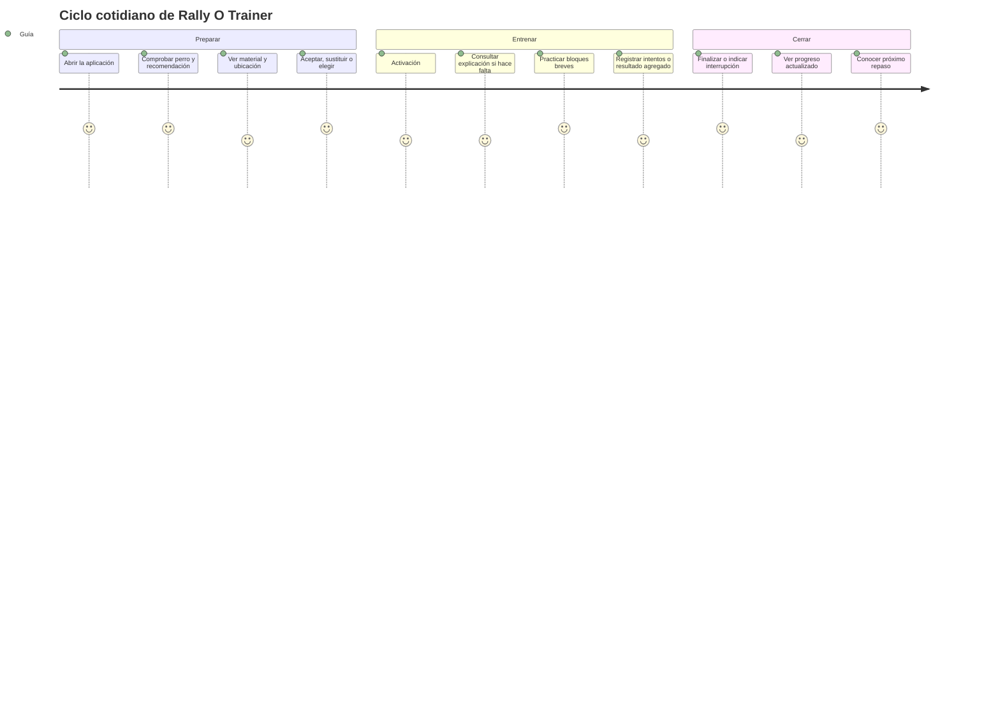

# PRD — Capítulo 03: Usuarios, casos de uso e historias de usuario

| Campo | Valor |
|---|---|
| Producto | Rally O Trainer |
| Estado del capítulo | Borrador para aprobación |
| Fecha | 5 de agosto de 2026 |
| Alcance | Usuarios, contextos, necesidades, casos de uso e historias del MVP |
| Capítulo anterior | 02 — Visión, alcance y experiencia principal |
| Próximo capítulo | Mapa funcional y arquitectura funcional |

> Este capítulo define para quién se construye Rally O Trainer y qué debe poder conseguir. No diseña todavía las pantallas ni selecciona componentes técnicos.

---

## Análisis previo

### 1. Hipótesis sometidas a revisión

| Hipótesis | Punto débil | Resolución propuesta |
|---|---|---|
| Se necesitan varias clases de usuario desde el inicio. | Guía, instructor, administrador y club implicarían permisos, cuentas y colaboración sin aportar valor al entrenamiento personal inmediato. | Un único rol funcional en el MVP: guía. La experiencia puede variar por progreso, perro y contexto, no por permisos. |
| Una persona debe incluir edad, profesión y biografía ficticias. | Esos datos no se han investigado y podrían introducir decisiones basadas en estereotipos. | Definir personas por comportamiento, competencia, contexto, objetivos y fricciones observables. |
| Principiante y competidor necesitan aplicaciones distintas. | Ambos comparten el ciclo elegir-practicar-registrar-repasar. Cambian la profundidad del contenido y la autonomía, no el núcleo. | Mantener un mismo flujo con explicación progresiva y elección manual siempre disponible. |
| El usuario quiere interactuar mucho con la aplicación. | En pista, mirar y tocar el teléfono compite con la atención al perro. | Medir el éxito por reducción de interacción, no por uso prolongado. |
| Todas las historias tienen la misma prioridad. | Diluiría el primer incremento entre biblioteca, progreso, copias, instalación y funciones futuras. | Priorizar el ciclo diario completo y usar una clasificación Must/Should/Could/Won't. |
| El camino feliz basta para especificar el producto. | La aplicación funcionará en exterior, offline y con interrupciones; los casos alternativos son frecuentes, no excepcionales. | Cada caso crítico incluirá sustitución, cancelación, falta de material, cierre inesperado y ausencia de historial. |
| “Varios perros” puede resolverse duplicando datos o usando el último perro implícito. | Provocaría registros asignados al perro incorrecto. | Mostrar siempre el perro activo antes y durante la sesión y exigir asociación explícita en cada registro. |
| Una recomendación fallida es un error del usuario. | El algoritmo puede no conocer el contexto real, y el guía conserva la decisión. | Permitir aceptar, sustituir o elegir libremente sin penalización ni mensajes culpabilizadores. |

### 2. Debilidades que deben evitarse

1. **Onboarding excesivo.** Pedir objetivos, experiencia, equipamiento y preferencias antes de mostrar valor retrasaría la primera práctica.
2. **Jerga prematura.** Términos como binomio, prerrequisito o consolidación necesitan contexto accesible para una persona principiante.
3. **Confusión entre estudiar y entrenar.** Consultar una señal no debe crear una sesión ni alterar el progreso.
4. **Falsa autoridad.** Los consejos no deben parecer instrucciones oficiales de RSCE o FCI.
5. **Castigo por cambiar de plan.** Sustituir una recomendación o terminar antes no debe generar rachas negativas.
6. **Progreso sin explicación.** Un cambio de estado debe indicar qué ocurrió y qué falta para avanzar.
7. **Dependencia del teléfono durante el ejercicio.** Debe existir registro agregado para quien prefiera guardar el móvil.
8. **Pérdida de contexto al cambiar de perro.** Historial, recomendación, grado sugerido y repaso deben recalcularse inmediatamente.

### 3. Mejoras propuestas y justificación

#### 3.1 Personas basadas en modos de uso

Una misma persona puede comportarse como principiante al aprender una señal y como usuario autónomo al repasar otra. Por ello, las personas representarán modos de uso y no identidades rígidas. El diseño deberá permitir pasar de orientación intensa a consulta rápida sin crear configuraciones separadas.

#### 3.2 Ayuda progresiva

La primera exposición a una señal mostrará más explicación. En sesiones posteriores se priorizarán recordatorios breves y el registro. La información completa seguirá disponible mediante una acción explícita.

#### 3.3 Perro activo siempre visible

El nombre del perro será visible en inicio, preparación, sesión, resumen e historial. Cambiar de perro antes de empezar será rápido; durante una sesión requerirá finalizarla o descartarla para impedir historiales mezclados.

#### 3.4 Historias verticales

Los incrementos deberán cerrar valor completo. Por ejemplo, “entrenar una señal de Debutante” incluirá contenido, recomendación, registro, persistencia y repaso; no se aceptará construir primero todas las pantallas vacías y dejar la lógica para el final.

---

## Versión definitiva

### 1. Roles y actores

#### 1.1 Rol funcional del MVP

El único rol funcional será **guía**. Puede:

- crear y seleccionar perros;
- consultar todo el contenido disponible;
- recibir y sustituir recomendaciones;
- iniciar y finalizar entrenamientos;
- registrar intentos;
- consultar progreso e historial;
- exportar, restaurar y borrar sus datos.

No existirán autenticación, permisos, administradores, propietarios de club ni perfiles de instructor.

#### 1.2 Actores no funcionales

| Actor | Relación con el producto | Límite |
|---|---|---|
| Instructor o persona experimentada | Puede validar contenido o aconsejar fuera de la aplicación. | No dispone de cuenta, panel ni acceso al historial. |
| Club | Facilita espacio, material y usuarios de prueba. | No administra miembros ni datos. |
| RSCE | Fuente reglamentaria prioritaria. | No se implica respaldo, afiliación ni oficialidad. |
| FCI | Fuente reglamentaria internacional. | Su contenido permanece separado y trazable. |
| Sistema operativo | Proporciona instalación, almacenamiento, archivos y capacidades del dispositivo. | Sus límites no pueden convertir una función principal en dependiente de red. |

### 2. Personas

Las personas siguientes son arquetipos de comportamiento que deberán validarse con aproximadamente cinco usuarios del club. No incluyen datos demográficos inventados.

#### 2.1 Persona primaria — Guía orientado que empieza

| Aspecto | Descripción |
|---|---|
| Conocimiento | Entiende conceptos básicos, pero no domina todas las señales ni la progresión. |
| Objetivo | Avanzar desde Debutante hacia grados superiores y eventual competición. |
| Contexto | Entrena con frecuencia en casa o espacio reducido; acude al club cuando necesita pista o material. |
| Dispositivo | Teléfono móvil, normalmente con una mano libre. |
| Pregunta principal | “¿Qué practico hoy y cómo lo hago?” |
| Frustración principal | Perder tiempo decidiendo o repetir siempre lo que ya conoce. |
| Necesita | Recomendación sencilla, explicación accesible, material previo y repaso automático. |
| Evita | Configuraciones largas, estadísticas difíciles y lenguaje institucional. |

#### 2.2 Persona secundaria — Guía que repasa con autonomía

| Aspecto | Descripción |
|---|---|
| Conocimiento | Conoce muchas señales y quiere consultar rápidamente una concreta. |
| Objetivo | Mantener habilidades, corregir puntos débiles o preparar un grado. |
| Contexto | Alterna casa, exterior y club; puede decidir su propio ejercicio. |
| Pregunta principal | “¿Qué tengo pendiente y cuándo fue la última vez que lo trabajé?” |
| Frustración principal | Que el sistema le obligue a seguir una secuencia o esconda contenido. |
| Necesita | Elección manual, historial claro, estados por lado y recomendación explicable. |
| Evita | Bloqueos artificiales y pasos pedagógicos repetitivos. |

#### 2.3 Persona contextual — Guía con varios perros

| Aspecto | Descripción |
|---|---|
| Situación | Entrena perros con niveles e historiales diferentes. |
| Pregunta principal | “¿Qué corresponde trabajar con este perro?” |
| Riesgo principal | Registrar una ejecución en el perfil equivocado. |
| Necesita | Perro activo visible, cambio rápido y separación estricta de datos. |
| No necesita | Cuentas separadas, equipos, invitaciones ni permisos. |

#### 2.4 Condiciones transversales

El mismo guía puede:

- estar al aire libre con reflejos en la pantalla;
- llevar correa, premios u otro material en una mano;
- usar el dispositivo con prisa;
- ser interrumpido por el perro o por otras personas;
- perder conectividad;
- cerrar accidentalmente la aplicación;
- preferir no tocar el teléfono durante un bloque.

Estas condiciones son requisitos de diseño, no casos marginales.

### 3. Trabajos que el usuario necesita resolver

| ID | Cuando… | Quiero… | Para… | Prioridad |
|---|---|---|---|---:|
| JTBD-01 | tengo 15 minutos para entrenar | recibir una propuesta inmediata | no perder tiempo planificando | Crítica |
| JTBD-02 | recibo una propuesta | entender por qué aparece | decidir si tiene sentido hoy | Crítica |
| JTBD-03 | no tengo el material o espacio | sustituir la señal | poder entrenar de todos modos | Crítica |
| JTBD-04 | quiero trabajar algo concreto | elegir cualquier señal | conservar el control del entrenamiento | Crítica |
| JTBD-05 | no conozco bien una señal | leer la regla y una explicación sencilla | practicarla correctamente | Crítica |
| JTBD-06 | estoy trabajando con el perro | registrar el resultado con un toque | no interrumpir la sesión | Crítica |
| JTBD-07 | no quiero usar el móvil en cada intento | guardar un resultado agregado | mantener la atención en el perro | Alta |
| JTBD-08 | la sesión no puede continuar | terminar e indicar el motivo | evitar conclusiones incorrectas | Crítica |
| JTBD-09 | vuelvo otro día | saber qué necesita repaso | mantener habilidades sin repetir al azar | Crítica |
| JTBD-10 | cambio de perro | ver su propia recomendación | no mezclar progresos | Alta |
| JTBD-11 | no tengo cobertura | seguir usando la aplicación | entrenar en cualquier lugar | Crítica |
| JTBD-12 | temo perder los datos | crear una copia sencilla | mantener el historial bajo mi control | Alta |

### 4. Contextos de uso

| Contexto | Espacio | Material asumido | Tipo de práctica preferido | Restricción dominante |
|---|---|---|---|---|
| Casa | Muy reducido | Ninguno | Posiciones, comprensión y partes de una señal | Evitar desplazamientos amplios |
| Exterior reducido | Reducido | Conos y elementos naturales | Señal individual con algo de movimiento | Entorno variable y distracciones |
| Club o pista | Amplio | No se presupone; se consulta inventario | Señales que requieren soporte, salto o más recorrido | Tiempo disponible y atención compartida |

Una señal podrá admitir más de un contexto. El planificador deberá elegir una opción viable, no etiquetar toda la señal como exclusiva de una ubicación si puede descomponerse de forma segura.

### 5. Mapa de actividades del usuario



### 6. Priorización funcional

| Prioridad | Significado en este PRD |
|---|---|
| Must | Sin ello no existe el ciclo útil del MVP o se comprometen datos y funcionamiento offline. |
| Should | Mejora importante prevista, pero requiere una decisión explícita antes de convertirla en requisito de salida. |
| Could | Mejora posterior compatible con el MVP. |
| Won't | Fuera del MVP aprobado. |

#### 6.1 Must

- crear y seleccionar perro;
- crear y cambiar entre varios perros sin mezclar sus historiales;
- recomendación explicable;
- sustitución y elección manual;
- ficha de señal con las tres capas de contenido;
- sesión de una o varias señales con pausa y recordatorio de descanso;
- registro rápido y agregado;
- finalización anticipada;
- estados de progreso y repaso;
- historial sencillo por perro y señal;
- persistencia y recuperación de sesión;
- funcionamiento offline;
- copia y restauración.
- recordatorio de copia;
- instalación PWA guiada;
- señales gráficas oficiales para todo el contenido publicado.

#### 6.2 Should

- inventario opcional de material persistente;
- filtros avanzados de historial;
- búsqueda por múltiples atributos;

#### 6.3 Could

- vibración opcional;
- notas por dictado del sistema;
- filtros avanzados de biblioteca;
- modo examen inicial.

#### 6.4 Won't

- instructor, club o permisos;
- competición y calendario;
- colaboración;
- constructor de pistas;
- sincronización;
- telemetría;
- red social.

### 7. Casos de uso

#### UC-01 — Crear el primer perro y obtener valor

| Campo | Especificación |
|---|---|
| Actor | Guía sin datos previos |
| Disparador | Abre Rally O Trainer por primera vez |
| Precondición | Aplicación cargada; no es necesaria una cuenta |
| Flujo principal | 1. Introduce nombre. 2. Introduce o selecciona raza. 3. Elige ubicación habitual. 4. Guarda. 5. Recibe una recomendación inicial de Debutante. |
| Alternativas | Puede corregir los datos antes de guardar. Puede omitir inventario y cualquier configuración no obligatoria. |
| Resultado | Existe un perro activo y una recomendación utilizable. |
| Restricción | No se pedirán correo, contraseña, fotografía, notificaciones ni datos médicos. |

#### UC-02 — Iniciar la recomendación diaria

| Campo | Especificación |
|---|---|
| Actor | Guía con perro activo |
| Disparador | Abre la aplicación para entrenar |
| Precondición | Existe al menos un perro y contenido compatible |
| Flujo principal | 1. Ve perro, señal, motivo, ubicación y material. 2. Pulsa “Empezar entrenamiento”. 3. Revisa la preparación compacta. 4. Inicia. |
| Alternativas | Sustituye la recomendación; cambia ubicación; cambia objetivo; cambia perro; elige manualmente. |
| Resultado | Se crea una sesión activa vinculada al perro y señal correctos. |
| Restricción | Desde inicio, aceptar la propuesta requiere como máximo tres pulsaciones. |

#### UC-03 — Sustituir o elegir una señal

| Campo | Especificación |
|---|---|
| Actor | Guía que no quiere o no puede realizar la propuesta |
| Disparador | La recomendación no encaja con el material, ubicación o intención |
| Flujo principal | 1. Pulsa “Sustituir”. 2. El sistema presenta una alternativa viable y su motivo. 3. El guía la acepta. |
| Flujo manual | 1. Pulsa “Elegir señal”. 2. Consulta cualquier grado o ámbito. 3. Selecciona una señal. |
| Resultado | La sesión utiliza la señal elegida. |
| Restricción | Sustituir o elegir no reduce progreso, no crea un fallo y no oculta futuras recomendaciones. |

#### UC-04 — Consultar una señal sin entrenarla

| Campo | Especificación |
|---|---|
| Actor | Guía que estudia o resuelve una duda |
| Disparador | Abre la biblioteca o una señal futura |
| Flujo principal | 1. Busca o navega por autoridad y grado. 2. Abre una señal. 3. Consulta descripción reglamentaria, explicación sencilla, consejo, material, lados y fuente. |
| Resultado | Obtiene información sin iniciar sesión ni modificar progreso. |
| Restricción | Toda señal disponible es consultable aunque no sea recomendable todavía. |

#### UC-05 — Registrar una práctica

| Campo | Especificación |
|---|---|
| Actor | Guía durante una sesión activa |
| Precondición | Sesión asociada a perro, señal, versión, lado y contexto |
| Flujo principal | 1. Practica un intento. 2. Pulsa incorrecta, correcta con ayuda o correcta autónoma. 3. Recibe confirmación visual inmediata. 4. Continúa o descansa. |
| Alternativas | Deshace el último registro; guarda un total agregado; consulta de nuevo la explicación; cambia el lado dentro de la misma señal cuando proceda. |
| Resultado | Los intentos confirmados quedan persistidos inmediatamente. |
| Restricción | El sistema no exige notas, premios ni valoración detallada para continuar. |

#### UC-06 — Finalizar o interrumpir la sesión

| Campo | Especificación |
|---|---|
| Actor | Guía con sesión activa |
| Disparador | Termina el plan o decide parar antes |
| Flujo principal | 1. Pulsa finalizar. 2. Selecciona un motivo. 3. Añade detalles opcionales. 4. Confirma. 5. Ve resumen, estado y próximo repaso. |
| Alternativas | Si no hay intentos, puede descartar o guardar como sesión sin práctica, según motivo. |
| Resultado | La sesión queda cerrada de forma coherente. |
| Restricción | Cansancio, indisposición o falta de tiempo no producen mensajes de culpa ni objetivos compensatorios. |

#### UC-07 — Recuperar una sesión interrumpida

| Campo | Especificación |
|---|---|
| Actor | Guía cuya aplicación se cerró o recargó |
| Precondición | Existía una sesión activa persistida |
| Flujo principal | 1. Reabre la aplicación. 2. Ve “Continuar sesión”. 3. Continúa desde el estado guardado o decide finalizarla. |
| Alternativas | Descarta la sesión incompleta mediante confirmación; conserva siempre los intentos ya confirmados salvo decisión explícita. |
| Resultado | No se pierden registros ni se crean sesiones duplicadas. |

#### UC-08 — Revisar progreso y repaso

| Campo | Especificación |
|---|---|
| Actor | Guía después de entrenar o antes de elegir |
| Flujo principal | 1. Abre historial o señal. 2. Ve estado, lado, últimos resultados, fecha individual, fecha en recorrido y próximo repaso. 3. Lee por qué tiene ese estado. |
| Resultado | Puede comprender qué ha mejorado y qué falta. |
| Restricción | No se muestra un porcentaje general que mezcle perros, lados o contextos incompatibles. |

#### UC-09 — Cambiar de perro

| Campo | Especificación |
|---|---|
| Actor | Guía con varios perros |
| Precondición | Hay al menos dos perfiles |
| Flujo principal | 1. Pulsa el perro activo. 2. Selecciona otro. 3. Inicio recalcula recomendación, progreso y material para ese perro. |
| Alternativas | Si hay sesión activa, debe finalizarla o descartarla antes de cambiar. |
| Resultado | Ningún dato se transfiere entre perros. |

#### UC-10 — Crear y restaurar una copia

| Campo | Especificación |
|---|---|
| Actor | Guía responsable de sus datos |
| Flujo de copia | 1. Abre Datos. 2. Pulsa “Crear copia”. 3. El sistema genera un archivo completo. 4. El usuario elige destino mediante el sistema operativo. |
| Flujo de restauración | 1. Selecciona un archivo. 2. La aplicación valida tipo y versión. 3. Muestra resumen. 4. El usuario confirma sustitución. 5. Se restaura o se revierte sin cambios si falla. |
| Resultado | Datos portables y recuperables. |
| Restricción | No se solicita contraseña; restaurar nunca debe dejar un estado parcial. |

#### UC-11 — Borrar todos los datos

| Campo | Especificación |
|---|---|
| Actor | Guía |
| Flujo principal | 1. Abre Datos. 2. Elige borrar todo. 3. Lee el alcance. 4. Confirma una primera vez. 5. Realiza una segunda confirmación explícita. 6. Se eliminan datos personales locales. |
| Resultado | La aplicación vuelve al estado inicial. |
| Restricción | Debe ofrecer crear una copia antes, sin convertirla en obligación. |

### 8. Historias de usuario del MVP

| ID | Prioridad | Historia | Criterio de aceptación resumido |
|---|---:|---|---|
| US-ONB-01 | Must | Como guía nuevo, quiero crear un perro con nombre y raza para empezar sin una cuenta. | Solo nombre, raza y ubicación son necesarios antes de recibir valor. |
| US-DOG-01 | Must | Como guía, quiero ver siempre el perro activo para no registrar en el perfil incorrecto. | Nombre visible en inicio, preparación, sesión y resumen. |
| US-DOG-02 | Must | Como guía con varios perros, quiero cambiar de perro para obtener su recomendación independiente. | El cambio recalcula datos y no se permite silenciosamente durante una sesión activa. |
| US-REC-01 | Must | Como guía, quiero recibir una señal recomendada al abrir para no planificar desde cero. | La recomendación aparece con perro, razón, ubicación y material. |
| US-REC-02 | Must | Como guía, quiero conocer el motivo de la recomendación para decidir si me resulta útil. | Toda recomendación contiene al menos una razón legible. |
| US-REC-03 | Must | Como guía, quiero sustituir una recomendación inviable para seguir entrenando. | Se ofrece alternativa compatible sin registrar fallo. |
| US-REC-04 | Must | Como guía autónomo, quiero elegir cualquier señal para conservar el control. | Ningún estado impide consultar o seleccionar contenido disponible. |
| US-LIB-01 | Must | Como guía, quiero navegar por RSCE y FCI separadamente para no confundir ámbitos. | Autoridad y versión permanecen visibles en listado y detalle. |
| US-SIG-01 | Must | Como principiante, quiero una explicación sencilla para comprender la señal. | Regla, explicación y consejo aparecen separados y etiquetados. |
| US-SIG-02 | Must | Como guía, quiero saber el material y ubicación antes de practicar. | Ambos aparecen antes del botón de inicio. |
| US-SES-01 | Must | Como guía, quiero iniciar rápidamente una sesión con una o varias señales. | Aceptar la recomendación, seleccionar modalidad e iniciar requiere un máximo de tres pulsaciones. |
| US-SES-02 | Must | Como guía, quiero registrar un intento con un toque para mantener la atención en el perro. | Correcta e Incorrecta se guardan con una pulsación y avanzan automáticamente. |
| US-SES-03 | Must | Como guía, quiero introducir un resultado agregado para guardar el teléfono mientras practico. | Puede indicar total, autónomas, con ayuda e incorrectas; la suma se valida. |
| US-SES-04 | Must | Como guía, quiero deshacer el último resultado para corregir un toque accidental. | Deshacer está visible tras registrar y restaura cálculos y datos. |
| US-SES-05 | Must | Como guía, quiero terminar antes e indicar el motivo para respetar al perro y el contexto. | Se puede finalizar en cualquier momento con una sola selección de motivo. |
| US-SES-06 | Must | Como guía interrumpido, quiero continuar la sesión para no perder intentos. | Recargar o cerrar conserva sesión e intentos confirmados. |
| US-PRO-01 | Must | Como guía, quiero ver un estado comprensible para saber si una señal progresa. | El estado muestra regla aplicada y datos que faltan para el siguiente. |
| US-PRO-02 | Must | Como guía, quiero separar lados cuando corresponda para no ocultar una debilidad. | El estado global refleja el lado menos avanzado y permite ver ambos. |
| US-PRO-03 | Must | Como guía, quiero que una señal vencida aparezca para repaso sin perder su logro. | “Necesita repaso” conserva fechas de aprendida y consolidada. |
| US-HIS-01 | Must | Como guía, quiero consultar el historial de una señal para entender su evolución. | Muestra sesiones, resultados, lados, ayudas y contexto en orden temporal. |
| US-OFF-01 | Must | Como guía sin cobertura, quiero entrenar y guardar resultados con normalidad. | Tras la primera carga, flujo principal completo funciona en modo avión. |
| US-DAT-01 | Must | Como guía, quiero descargar una copia completa para controlar mis datos. | El archivo contiene perfiles, contenido necesario, sesiones, intentos y ajustes. |
| US-DAT-02 | Must | Como guía, quiero restaurar una copia para recuperar mi historial. | La restauración se valida antes de sustituir y es atómica. |
| US-DAT-03 | Must | Como guía, quiero borrar todos mis datos cuando lo decida. | Requiere doble confirmación y devuelve la aplicación al inicio. |
| US-PWA-01 | Must | Como guía, quiero instalar la aplicación para abrirla como una app. | Se ofrece orientación compatible con la plataforma sin bloquear el uso web. |

### 9. Criterios detallados de los flujos críticos

#### 9.1 Primera recomendación

```gherkin
Dado que la aplicación no contiene perros
Cuando el guía introduce un nombre, una raza y una ubicación
Entonces se crea un perro activo
Y se muestra una recomendación inicial de Debutante
Y no se solicita crear una cuenta
Y la recomendación indica motivo, ubicación y material
```

#### 9.2 Elección libre

```gherkin
Dado que una señal está marcada como avanzada o todavía no recomendada
Cuando el guía abre la biblioteca
Entonces puede consultar la señal completa
Y puede iniciar una sesión manual con ella
Y la aplicación informa de sus prerrequisitos sin impedir continuar
```

#### 9.3 Registro autónomo

```gherkin
Dado que existe una sesión activa para un perro, señal y lado
Cuando el guía pulsa “Correcta autónoma”
Entonces el intento se guarda inmediatamente
Y queda asociado al perro, versión, lado y contexto correctos
Y el estado se recalcula
Y se ofrece deshacer la acción
```

#### 9.4 Cierre inesperado

```gherkin
Dado que hay una sesión activa con intentos confirmados
Cuando el sistema cierra la aplicación o la página se recarga
Entonces los intentos confirmados permanecen guardados
Y al volver se ofrece continuar o finalizar la sesión
Y no se crea una segunda sesión
```

#### 9.5 Finalización por indisposición

```gherkin
Dado que hay una sesión activa
Cuando el guía finaliza y elige “Indisposición”
Entonces la sesión se cierra conservando los intentos
Y no se genera una penalización ni una racha negativa
Y el planificador no recomienda compensar carga automáticamente
```

#### 9.6 Restauración segura

```gherkin
Dado que el guía selecciona una copia compatible
Cuando confirma la restauración
Entonces la aplicación valida todo el archivo antes de sustituir datos
Y si la operación falla conserva el estado anterior completo
Y si finaliza correctamente muestra perros y sesiones restaurados
```

### 10. Matriz de trazabilidad

| Resultado del capítulo 02 | Casos de uso | Historias principales |
|---|---|---|
| Empezar en menos de 30 segundos | UC-01, UC-02 | US-ONB-01, US-REC-01, US-SES-01 |
| Recomendación explicable y sustituible | UC-02, UC-03 | US-REC-02, US-REC-03, US-REC-04 |
| Contenido RSCE/FCI separado y consultable | UC-04 | US-LIB-01, US-SIG-01 |
| Registro de un toque | UC-05 | US-SES-02, US-SES-03, US-SES-04 |
| Cierre anticipado respetuoso | UC-06 | US-SES-05 |
| Recuperación ante interrupciones | UC-07 | US-SES-06 |
| Progreso por perro, lado y contexto | UC-08, UC-09 | US-DOG-01, US-PRO-01, US-PRO-02, US-PRO-03 |
| Control y portabilidad de datos | UC-10, UC-11 | US-DAT-01, US-DAT-02, US-DAT-03 |
| Uso sin conexión | UC-01–UC-10 | US-OFF-01 |

### 11. Corte vertical recomendado para implementación

El primer incremento demostrable no debe ser “crear todas las pantallas”. Debe cerrar esta historia vertical:

1. crear un perro;
2. cargar una señal de Debutante revisada;
3. mostrarla como recomendación;
4. iniciar una sesión;
5. registrar intentos;
6. cerrar la sesión;
7. recalcular estado;
8. cerrar y volver a abrir sin perder datos;
9. recibir una recomendación de repaso.

El segundo incremento añadirá sustitución, elección manual y varias señales. Los grados posteriores reutilizarán el mismo ciclo.

### 12. Criterios de aceptación del capítulo

- [ ] Existe un único rol funcional y no requiere autenticación.
- [ ] Las personas se basan en comportamientos y contextos verificables.
- [ ] El usuario primario es un guía principiante orientado a progresar.
- [ ] No se introducen funciones de instructor, club o competición.
- [ ] Cada trabajo crítico está cubierto por al menos un caso de uso.
- [ ] Los casos críticos contemplan alternativas e interrupciones.
- [ ] Toda historia Must aporta al ciclo diario, la resiliencia o el control de datos.
- [ ] Consultar una señal no modifica el progreso.
- [ ] Sustituir una recomendación no se considera fallo.
- [ ] Cada registro está asociado explícitamente a un perro.
- [ ] Las historias permiten probar el funcionamiento offline.
- [ ] El primer corte de implementación entrega valor de extremo a extremo.

### 13. Registro de decisiones del capítulo

| ID | Decisión | Estado |
|---|---|---|
| DE-03-001 | El MVP tendrá un único rol funcional: guía. | Aprobada |
| DE-03-002 | No existirán permisos de instructor, club o administrador. | Aprobada |
| DE-03-003 | Las personas se definirán por comportamiento, no por demografía inventada. | Aprobada |
| DE-03-004 | El perro activo será visible en todo el ciclo de entrenamiento. | Propuesta para aprobación |
| DE-03-005 | Consultar contenido no inicia sesión ni altera progreso. | Propuesta para aprobación |
| DE-03-006 | Sustituir o elegir una señal no genera penalización. | Aprobada por los principios existentes |
| DE-03-007 | Se permitirá registro por intento y agregado. | Aprobada |
| DE-03-008 | Una sesión activa debe sobrevivir al cierre o recarga. | Propuesta para aprobación |
| DE-03-009 | La primera implementación será un corte vertical completo de Debutante. | Propuesta para aprobación |
| DE-03-010 | Los actores del club solo participan en validación externa durante el MVP. | Aprobada por alcance |

## Riesgos

| Riesgo | Impacto | Probabilidad | Mitigación |
|---|---|---:|---|
| Las personas reflejan solo al propietario | Alto | Alta | Contrastar tareas y lenguaje con cinco usuarios del club antes de alta fidelidad. |
| El registro de un toque produce errores accidentales | Medio | Alta | Deshacer inmediato, separación visual y retroalimentación clara. |
| El modo agregado pierde secuencia temporal | Medio | Media | Identificarlo como resumen de bloque y no fabricar orden de intentos inexistente. |
| Cambiar de perro mezcla sesiones | Alto | Media | Bloquear cambio silencioso durante sesión y mostrar perro activo persistentemente. |
| La ayuda progresiva molesta a usuarios experimentados | Medio | Media | Recordar contenido visto y permitir abrir o cerrar detalles. |
| El texto accesible simplifica demasiado el reglamento | Alto | Media | Mantener descripción reglamentaria separada y enlazar fuente/versionado. |
| Una recomendación sin alternativa viable bloquea el entrenamiento | Alto | Media | Ofrecer elección manual y explicar si falta contenido compatible. |
| La restauración sobrescribe datos por error | Alto | Media | Resumen previo, confirmación explícita y operación atómica. |
| La interfaz de varios perros añade fricción al caso inicial de un solo perro | Medio | Media | Mantener la creación inicial mínima y mostrar el selector solo cuando exista más de un perro. |
| Los criterios de progreso se interpretan como evaluación oficial | Alto | Media | Etiquetarlos como estado de entrenamiento declarado por el guía. |

## Mejoras posibles

- Validar las personas mediante observación de sesiones reales, no solo entrevistas.
- Permitir ajustar el nivel de explicación sin crear un “modo experto” separado.
- Añadir accesos rápidos diferentes según ubicación recordada.
- Incorporar dictado de notas usando capacidades del sistema operativo.
- Ofrecer una vista previa de la siguiente recomendación sin fomentar planificación excesiva.
- Permitir compartir una copia o recorrido por archivo cuando esos módulos existan.
- Añadir modo examen como actividad separada del entrenamiento práctico.
- Crear pruebas de usabilidad específicas para cambio de perro y registro agregado.

## Decisiones pendientes

| ID | Decisión | Motivo | Momento límite |
|---|---|---|---|
| DP-03-001 | Entrada de raza mediante lista, texto libre o combinación | Debe equilibrar rapidez, razas no listadas y ausencia de uso algorítmico inmediato. | Modelo de datos y wireframes |
| DP-03-002 | Contenido exacto de la primera recomendación sin historial | Depende de la base revisada de Debutante y sus prerrequisitos. | Base de señales |
| DP-03-003 | Orden de alternativas al sustituir una señal | Depende de las reglas de planificación y material. | Algoritmo de planificación |
| DP-03-004 | Presentación exacta del perro activo | Requiere probar alcance del pulgar y prevención de errores. | Wireframes |
| DP-03-005 | Forma de introducir resultados agregados | Contadores, teclado o selector deben compararse en prototipo. | Wireframes y pruebas de usabilidad |
| DP-03-006 | Información mínima del historial | Debe informar sin convertirse en un panel complejo. | Arquitectura funcional y wireframes |
| DP-03-007 | Dispositivo Android para pruebas físicas | No se ha identificado todavía. | Antes de distribuir el MVP |
| DP-03-008 | Terminología final para “correcta con ayuda”, “aprendida” y “consolidada” | Debe entenderse sin formación previa. | Guía de estilo y pruebas con usuarios |
