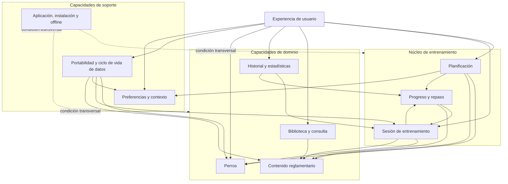
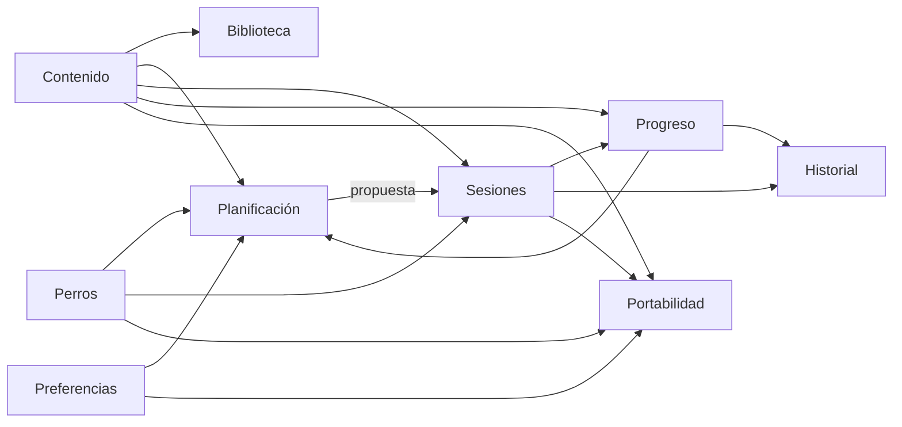
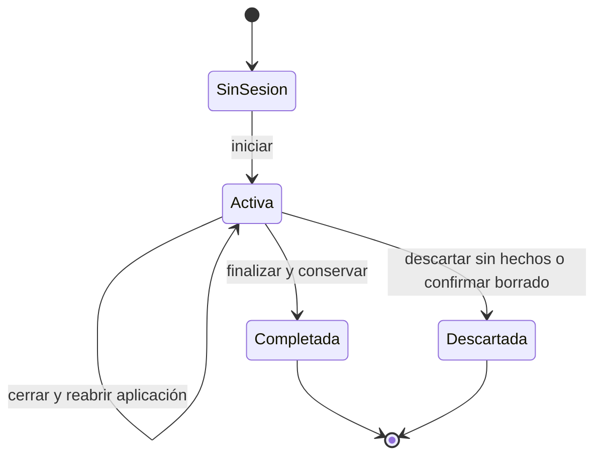
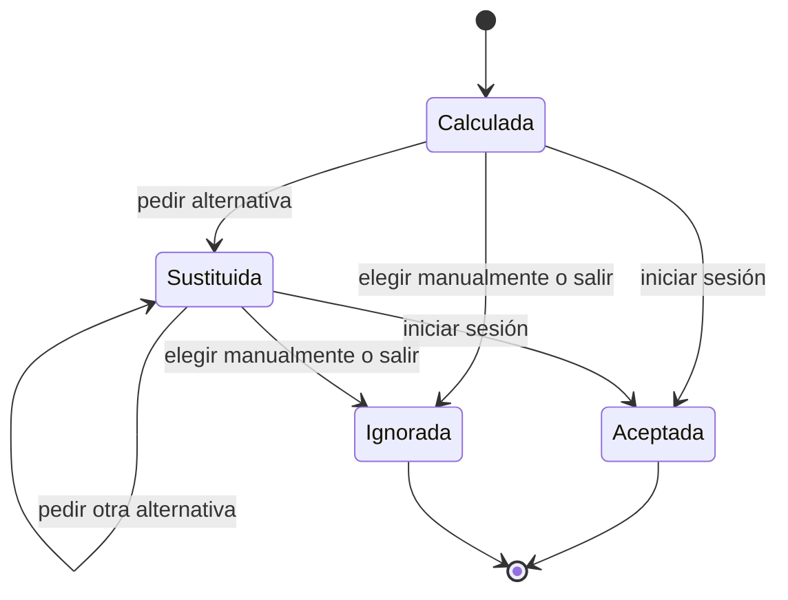

# PRD — Capítulo 04: Mapa funcional y arquitectura funcional

| Campo | Valor |
|---|---|
| Producto | Rally O Trainer |
| Estado del capítulo | Borrador para aprobación |
| Fecha | 5 de agosto de 2026 |
| Alcance | Capacidades, responsabilidades, dependencias, estados y contratos funcionales |
| Capítulo anterior | 03 — Usuarios, casos de uso e historias de usuario |
| Próximo capítulo | Modelo de navegación y flujos de usuario |

> Este capítulo describe cómo se organiza funcionalmente el producto. Sus módulos son límites de responsabilidad dentro de una aplicación local-first, no microservicios ni decisiones de despliegue.

---

## Análisis previo

### 1. Hipótesis sometidas a revisión

| Hipótesis | Punto débil | Resolución propuesta |
|---|---|---|
| La lista Inicio, Entrenamiento, Señales, Perros, Registro, Estadísticas y Configuración ya es una arquitectura. | Mezcla pantallas, navegación y responsabilidades. No explica dependencias ni propiedad de datos. | Derivar capacidades desde el ciclo del usuario y definir entradas, salidas, reglas y límites. |
| Cada pantalla necesita su propio módulo de negocio. | Duplicaría lógica; progreso y señales aparecerán en varias vistas. | Separar dominio y presentación. Una capacidad puede alimentar varias pantallas. |
| El estado de progreso debe guardarse como un valor editable. | Puede contradecir los intentos históricos y quedar obsoleto cuando cambie el algoritmo. | Conservar hechos de entrenamiento y calcular el progreso; permitir caché regenerable, nunca una segunda verdad. |
| La recomendación diaria es un dato permanente. | Cambia con perro, tiempo, contexto, material y nuevas ejecuciones. | Calcularla bajo demanda. Al iniciar una sesión se conservará el origen y la explicación utilizada para trazabilidad. |
| Para preparar sincronización futura conviene usar eventos y abstracciones distribuidas desde ahora. | Añade complejidad sin backend ni necesidad actual. | Aplicación modular local. Los eventos serán notificaciones internas de dominio, no una infraestructura de event sourcing. |
| Offline es un módulo aislado. | Todas las capacidades principales deben funcionar localmente; tratarlo como añadido produce dependencias ocultas de red. | Offline será una condición transversal de cada caso de uso y contrato funcional. |
| RSCE y FCI pueden identificarse mediante condiciones dentro de la interfaz. | Acoplaría reglas y contenido a pantallas, dificultando versiones y equivalencias. | Paquetes de contenido versionados consultados mediante un catálogo común. |
| El constructor futuro exige generalizar hoy todo entrenamiento. | Una abstracción prematura de señales, bloques, recorridos y vídeos complicaría el MVP. | Implementar señal individual como objetivo actual y documentar puntos de extensión mínimos sin crear entidades futuras innecesarias. |
| Varias sesiones activas aportan flexibilidad. | Aumentan el riesgo de registrar en el perro equivocado y complican recuperación, cronómetro y cierre. | Proponer una única sesión activa por instalación; varios perros conservan historiales independientes. |
| Un agregado 7/10 puede expandirse en diez intentos artificiales. | Inventaría orden, tiempo y tipo de ayuda que el usuario no registró. | Guardar el resumen como bloque agregado y usar sus conteos sin fabricar intentos individuales. |

### 2. Riesgos de arquitectura funcional detectados

1. **Estado duplicado.** Guardar progreso en perro, señal, sesión y estadísticas generaría divergencias.
2. **Contenido acoplado al entrenamiento.** Si una sesión consulta siempre la última definición, una actualización cambiaría el significado de registros antiguos.
3. **Planificador omnisciente.** Permitir que modifique sesiones, progreso y contenido directamente impediría explicar o probar sus decisiones.
4. **Módulo “Estadísticas” como cajón de sastre.** Las estadísticas deben ser proyecciones de hechos, no una base paralela.
5. **Configuración excesiva.** Convertir cada regla en una preferencia trasladaría decisiones de producto al usuario.
6. **Flujos destructivos sin frontera.** Borrado, restauración y actualización no deben modificar datos parcialmente.
7. **Dependencia circular.** El planificador usa progreso; el progreso no puede depender de recomendaciones del planificador para determinar hechos.
8. **Versionado insuficiente.** La identidad de una señal debe sobrevivir a cambios de nombre, texto o número.

### 3. Mejoras propuestas y justificación

#### 3.1 Separar hechos, contenido y proyecciones

- **Hechos:** perros, sesiones, bloques e intentos confirmados.
- **Contenido:** reglamentos, versiones, señales, requisitos y equivalencias.
- **Proyecciones:** progreso, próximo repaso, estadísticas y recomendación.

Esta separación permite corregir el algoritmo sin reescribir el historial y actualizar reglamentos sin reinterpretar silenciosamente una práctica anterior.

#### 3.2 Usar un núcleo modular único

Para un proyecto personal, local y sin presupuesto, una aplicación modular es más adecuada que servicios independientes. Los límites funcionales se conservarán mediante interfaces internas y pruebas. El capítulo técnico decidirá herramientas, pero no deberá convertir cada capacidad en un servicio desplegable.

#### 3.3 Hacer que cada módulo tenga una sola autoridad

Perros administra identidad; Contenido administra significado reglamentario; Sesiones administra hechos de práctica; Progreso interpreta esos hechos; Planificador propone; Datos protege y transporta. Ningún módulo asumirá responsabilidades ajenas por conveniencia de una pantalla.

#### 3.4 Registrar decisiones aceptadas, no impresiones pasivas

Mostrar una recomendación no debe llenar el historial. Solo al iniciar una sesión se guardará si la señal procedía del planificador, de una sustitución o de elección manual, junto con la explicación presentada.

---

## Versión definitiva

### 1. Principios de arquitectura funcional

1. **El entrenamiento es el núcleo.** Biblioteca, perros, progreso y datos existen para mejorar o proteger el ciclo de práctica.
2. **Una responsabilidad, una autoridad.** Cada tipo de dato tendrá un único propietario funcional.
3. **Los hechos no se recalculan.** Un intento confirmado permanece; las interpretaciones pueden evolucionar.
4. **Las proyecciones son reproducibles.** Progreso, repaso y estadísticas se podrán regenerar desde hechos y contenido.
5. **Contenido y código evolucionan separados.** Añadir un grado o versión no exige modificar flujos.
6. **Offline por defecto.** Ningún contrato principal requiere red después de la instalación y carga de contenido.
7. **La simplicidad visible nace de límites internos claros.** La interfaz no resolverá incoherencias del dominio mediante excepciones.
8. **No anticipar infraestructura.** Se dejan contratos limpios para evolucionar, pero no se construyen sincronización, cuentas ni servicios remotos.

### 2. Mapa funcional de alto nivel

Las flechas indican consumo de información o servicio, no propiedad compartida. Por ejemplo, Planificación consulta Progreso, pero no puede alterar manualmente un estado de dominio.

### 3. Capacidades funcionales

#### 3.1 Aplicación, instalación y offline

| Aspecto | Especificación |
|---|---|
| Responsabilidad | Arranque, ciclo de vida, detección de actualización, disponibilidad offline e instalación PWA. |
| Entradas | Estado de la instalación, conectividad, versión de aplicación y contenido local. |
| Salidas | Aplicación disponible, aviso de actualización, orientación de instalación y recuperación de sesión. |
| Posee | Metadatos técnicos de instalación y versiones, no datos deportivos. |
| No debe | Bloquear el uso por falta de red ni mezclar actualización con restauración de datos. |

Debe garantizar que abrir, consultar contenido cargado, iniciar sesión, registrar, finalizar, consultar progreso y crear una copia local funcionen sin conexión.

#### 3.2 Perros

| Aspecto | Especificación |
|---|---|
| Responsabilidad | Crear, identificar, seleccionar y administrar perros independientes. |
| Entradas | Nombre, raza y selección del guía. |
| Salidas | Perro creado, perro activo o lista de perros. |
| Posee | Identidad y datos mínimos del perro. |
| No debe | Guardar progreso, grado calculado, sesiones o recomendaciones como campos propios editables. |

Reglas:

- nombre y raza son los únicos campos solicitados;
- cada perro tiene un identificador estable no dependiente del nombre;
- pueden existir nombres repetidos, aunque la interfaz deberá ayudar a distinguirlos si ocurre;
- el perro activo es una preferencia de interfaz, no una propiedad del historial;
- borrar un perro es una operación destructiva que afecta a sus sesiones y requiere un flujo específico posterior.

#### 3.3 Contenido reglamentario

| Aspecto | Especificación |
|---|---|
| Responsabilidad | Mantener paquetes, autoridades, versiones, señales, descripciones, lados, material, ubicaciones, prerrequisitos y equivalencias. |
| Entradas | Paquetes editoriales validados. |
| Salidas | Señales y reglas consultables por identificador, autoridad, grado, versión o relación. |
| Posee | Definición y metadatos editoriales del contenido. |
| No debe | Conocer perros, resultados, recomendaciones individuales ni navegación. |

Reglas:

- RSCE y FCI son autoridades separadas;
- una señal posee identidad estable y puede tener revisiones;
- una revisión publicada no se edita destructivamente si ya tiene historial asociado;
- las equivalencias RSCE/FCI son relaciones explícitas, no coincidencias por nombre;
- solo contenido con revisión editorial aprobada puede recomendarse;
- contenido visible podrá marcarse como borrador únicamente en entornos de desarrollo.

#### 3.4 Biblioteca y consulta

| Aspecto | Especificación |
|---|---|
| Responsabilidad | Navegar, buscar, filtrar y presentar contenido reglamentario. |
| Entradas | Consultas del usuario y catálogo de contenido. |
| Salidas | Listas y detalles; posibilidad de iniciar selección manual. |
| Posee | Estado efímero de consulta y filtros. |
| No debe | Modificar progreso al abrir una señal ni duplicar contenido. |

La biblioteca deberá separar RSCE y FCI, mostrar grado, versión y estado recomendado por perro, y permitir consultar cualquier señal cargada.

#### 3.5 Planificación

| Aspecto | Especificación |
|---|---|
| Responsabilidad | Ordenar candidatos y proponer la siguiente señal viable. |
| Entradas | Perro, progreso, repasos, objetivo, ubicación, inventario y contenido elegible. |
| Salidas | Recomendación, motivo, ubicación, material y alternativas. |
| Posee | Reglas y versión del planificador; no posee hechos históricos. |
| No debe | Crear intentos, cambiar progreso, bloquear contenido o asumir material no disponible. |

Una recomendación será un resultado reproducible para un conjunto de entradas y una versión de reglas. Podrá cambiar cuando cambie cualquiera de esas entradas.

Estados de origen al iniciar una sesión:

- **recomendada:** primera propuesta aceptada;
- **sustituida:** alternativa ofrecida por el planificador;
- **manual:** señal elegida por el guía.

#### 3.6 Sesión de entrenamiento

| Aspecto | Especificación |
|---|---|
| Responsabilidad | Gestionar el ciclo de una práctica y persistir hechos confirmados. |
| Entradas | Perro, señal, versión, lado, contexto, objetivo, origen y registros. |
| Salidas | Sesión activa o cerrada, bloques, intentos y motivo de finalización. |
| Posee | Hechos de entrenamiento y estado de la sesión. |
| No debe | Decidir por sí misma si una señal está aprendida ni reescribir contenido. |

Reglas:

- solo existirá una sesión activa por instalación;
- cada sesión pertenece a un solo perro;
- el objetivo inicial del MVP es una señal individual;
- una sesión conservará una referencia inequívoca a la revisión de contenido practicada;
- cada intento confirmado se persistirá de inmediato;
- cerrar la aplicación no cambia una sesión activa a finalizada;
- cambiar de perro requiere cerrar o descartar la sesión activa;
- una sesión finalizada no vuelve a activa; una corrección posterior se tratará como edición auditada o nueva sesión según se defina en el modelo de datos.

#### 3.7 Progreso y repaso

| Aspecto | Especificación |
|---|---|
| Responsabilidad | Interpretar hechos y calcular estados, lados, deterioro y próximo repaso. |
| Entradas | Sesiones, intentos, bloques agregados, fechas y reglas de contenido. |
| Salidas | No iniciada, en aprendizaje, aprendida, consolidada o necesita repaso; explicación y fecha sugerida. |
| Posee | Versión de reglas y, opcionalmente, proyecciones regenerables. |
| No debe | Modificar intentos ni declarar resultados oficiales. |

El cálculo siempre podrá explicar:

- qué intentos se consideraron;
- qué lado y contexto se evaluaron;
- qué regla produjo el estado;
- qué falta para el estado siguiente;
- por qué se activó un repaso.

#### 3.8 Historial y estadísticas

| Aspecto | Especificación |
|---|---|
| Responsabilidad | Consultar y resumir hechos y proyecciones. |
| Entradas | Perro, sesiones, progreso, periodo, señal y lado. |
| Salidas | Cronología, resúmenes sencillos, puntos débiles y fechas. |
| Posee | Filtros y proyecciones regenerables; no hechos originales. |
| No debe | Crear una puntuación global opaca ni editar progreso directamente. |

El historial inicial priorizará respuestas accionables:

- última práctica;
- últimos resultados;
- estado por lado;
- fecha del próximo repaso;
- sesiones donde apareció la señal;
- razón de un cambio de estado.

#### 3.9 Preferencias y contexto

| Aspecto | Especificación |
|---|---|
| Responsabilidad | Recordar decisiones de conveniencia que reducen configuración. |
| Entradas | Perro activo, objetivo, ubicación, inventario, tema y opciones de interacción. |
| Salidas | Valores predeterminados para inicio, planificación y presentación. |
| Posee | Preferencias del usuario y contexto recordado. |
| No debe | Convertir reglas deportivas o criterios de dominio en preferencias arbitrarias. |

La duración de 15 minutos y los criterios principales de progreso serán reglas de producto, no controles visibles en el MVP.

#### 3.10 Portabilidad y ciclo de vida de datos

| Aspecto | Especificación |
|---|---|
| Responsabilidad | Exportar, validar, restaurar y borrar datos de forma coherente. |
| Entradas | Datos locales completos, archivo seleccionado y confirmaciones. |
| Salidas | Copia, restauración completa, informe de error o estado inicial tras borrado. |
| Posee | Formato de copia, versión y registro local de última copia. |
| No debe | Aplicar cambios parciales ni depender de servicios de nube. |

Las operaciones de restauración y borrado actuarán como unidades completas: o terminan correctamente o conservan el estado anterior.

### 4. Fuentes de verdad y datos derivados

| Información | Tipo | Autoridad funcional | Regla |
|---|---|---|---|
| Perfil de perro | Hecho editable | Perros | Se guarda directamente. |
| Paquete y revisión de señal | Contenido versionado | Contenido reglamentario | No se modifica destructivamente tras publicación. |
| Sesión y finalización | Hecho | Sesión | Se conserva incluso si cambia el algoritmo. |
| Intento individual | Hecho | Sesión | No se recalcula. |
| Resumen agregado | Hecho agregado | Sesión | No se expande en intentos ficticios. |
| Estado de progreso | Proyección | Progreso | Se deriva y puede almacenarse como caché invalidable. |
| Próximo repaso | Proyección | Progreso | Se recalcula ante nuevos hechos o nueva versión de reglas. |
| Recomendación | Proyección efímera | Planificación | Se calcula bajo demanda. |
| Origen de una sesión | Hecho contextual | Sesión | Se guarda al iniciar: recomendada, sustituida o manual. |
| Motivo mostrado | Instantánea contextual | Sesión | Se conserva para explicar qué aceptó el guía. |
| Estadística | Proyección | Historial | Se regenera desde hechos. |
| Perro activo | Preferencia | Preferencias | No altera la propiedad de datos históricos. |
| Última copia | Metadato | Portabilidad | Sirve para recordatorios, no garantiza que el archivo siga existiendo. |

### 5. Dependencias permitidas

Reglas de dependencia:

- Sesiones no depende de Historial.
- Contenido no depende de perros, sesiones ni progreso.
- Progreso no depende de Planificación.
- Planificación no modifica sus dependencias.
- Biblioteca no crea progreso por consultar.
- Historial no posee ni corrige hechos.
- Portabilidad puede leer y restaurar conjuntos completos, pero no aplicar lógica deportiva.
- La presentación invoca capacidades; no implementa reglas de dominio.

### 6. Contratos funcionales principales

Los contratos siguientes definen intención y resultado. No son todavía firmas de código.

| Operación | Entradas mínimas | Validaciones | Resultado |
|---|---|---|---|
| Crear perro | nombre, raza | nombre no vacío; raza válida según estrategia pendiente | perro estable y activo |
| Cambiar perro activo | identificador | existe; no hay cambio silencioso con sesión activa | contexto recalculado |
| Obtener recomendación | perro, ubicación, objetivo | contenido aprobado disponible | propuesta explicada o ausencia explicada |
| Sustituir recomendación | propuesta actual, motivo/contexto | alternativa distinta y viable | nueva propuesta |
| Elegir señal | perro, revisión de señal | señal consultable | preparación manual |
| Iniciar sesión | perro, señal, lado/contexto, origen | no existe otra activa; contenido disponible | sesión activa persistida |
| Registrar intento | sesión, resultado | sesión activa; resultado permitido | hecho guardado y progreso actualizado |
| Registrar agregado | sesión, totales | suma coherente; valores no negativos | bloque agregado guardado |
| Deshacer último | sesión | último registro reversible existe | hecho retirado y proyección recalculada |
| Finalizar sesión | sesión, motivo | sesión activa | sesión cerrada y resumen calculado |
| Continuar sesión | instalación | existe una activa | estado completo recuperado |
| Consultar progreso | perro, señal, lado | datos compatibles | estado y explicación |
| Crear copia | conjunto local | datos consistentes | archivo versionado |
| Restaurar copia | archivo, confirmación | formato, versión e integridad | sustitución completa o ningún cambio |
| Borrar datos | doble confirmación | confirmaciones válidas | retorno al estado inicial |

### 7. Comandos y eventos internos

Los eventos permiten que las capacidades reaccionen sin compartir propiedad. No implican un registro de eventos permanente ni mensajería remota.

| Comando | Evento resultante | Consumidores funcionales |
|---|---|---|
| CrearPerro | PerroCreado | Preferencias, Planificación |
| SeleccionarPerro | PerroActivoCambiado | Inicio, Planificación, Historial |
| IniciarSesion | SesionIniciada | Aplicación, Historial |
| RegistrarIntento | IntentoRegistrado | Progreso, Historial |
| RegistrarBloqueAgregado | BloqueAgregadoRegistrado | Progreso, Historial |
| DeshacerRegistro | RegistroDeshecho | Progreso, Historial |
| FinalizarSesion | SesionFinalizada | Progreso, Historial, Planificación |
| PublicarContenido | ContenidoPublicado | Biblioteca, Planificación, Progreso |
| RestaurarDatos | DatosRestaurados | Todas las proyecciones y preferencias |
| BorrarDatos | DatosBorrados | Aplicación e incorporación inicial |

Una reacción fallida no deberá borrar el hecho que la originó. Si una proyección no se actualiza, se marcará para regeneración.

### 8. Estados funcionales

#### 8.1 Sesión

“Interrumpida” no será inicialmente un estado almacenado: una sesión activa permanece activa aunque la aplicación no esté abierta. La interfaz podrá describirla como pendiente de continuar.

#### 8.2 Recomendación

Ignorar no se guarda como conducta negativa. Solo la sesión iniciada conserva su origen.

### 9. Mapa de preguntas de interfaz

La arquitectura funcional no fija navegación, pero identifica las preguntas que la experiencia deberá resolver:

| Contexto funcional | Pregunta única | Capacidades que colaboran |
|---|---|---|
| Inicio | ¿Qué entreno ahora con este perro? | Perros, Planificación, Progreso, Preferencias |
| Preparación | ¿Puedo hacer esta práctica aquí y ahora? | Contenido, Preferencias, Sesión |
| Detalle de señal | ¿Qué exige y cómo puedo entrenarla? | Biblioteca, Contenido, Progreso |
| Sesión activa | ¿Cómo ha salido este intento? | Sesión, Progreso |
| Finalización | ¿Por qué termina y qué queda guardado? | Sesión, Progreso |
| Resumen | ¿Qué ha cambiado y cuándo repito? | Progreso, Historial |
| Biblioteca | ¿Qué señal quiero consultar o elegir? | Biblioteca, Contenido |
| Historial | ¿Cómo evoluciona este perro o señal? | Historial, Progreso, Perros |
| Perros | ¿Con qué perro estoy trabajando? | Perros, Preferencias |
| Datos | ¿Cómo protejo, recupero o elimino mi información? | Portabilidad |
| Configuración | ¿Cómo quiero que se comporte y se vea la aplicación? | Preferencias, Aplicación |

Estas preguntas podrán resolverse en vistas, paneles o pasos distintos. No equivalen todavía a pestañas de navegación.

### 10. Matriz de capacidades y casos de uso

| Capacidad | UC-01 | UC-02 | UC-03 | UC-04 | UC-05 | UC-06 | UC-07 | UC-08 | UC-09 | UC-10 | UC-11 |
|---|:---:|:---:|:---:|:---:|:---:|:---:|:---:|:---:|:---:|:---:|:---:|
| Aplicación/offline | X | X | X | X | X | X | X | X | X | X | X |
| Perros | X | X | X |  | X | X | X | X | X | X | X |
| Contenido | X | X | X | X | X |  |  | X |  | X | X |
| Biblioteca |  |  | X | X |  |  |  | X |  |  |  |
| Planificación | X | X | X |  |  |  |  | X | X |  |  |
| Sesión |  | X | X |  | X | X | X | X | X | X | X |
| Progreso | X | X | X |  | X | X | X | X | X | X | X |
| Historial |  |  |  |  |  | X | X | X | X | X | X |
| Preferencias | X | X | X |  | X |  | X |  | X | X | X |
| Portabilidad |  |  |  |  |  |  |  |  |  | X | X |

Las marcas en UC-10 y UC-11 indican que la copia, restauración y borrado abarcan datos de esas capacidades, no que cada capacidad implemente el flujo destructivo.

### 11. Cortes funcionales de entrega

#### Corte A — Ciclo Debutante mínimo

- un perro;
- un paquete de contenido y una señal revisada;
- recomendación simple;
- sesión individual;
- registro de intentos;
- estado de progreso;
- persistencia tras cierre.

#### Corte B — Elección y variedad

- varias señales;
- biblioteca;
- sustitución;
- elección manual;
- ubicación y material;
- registro agregado.

#### Corte C — Producto personal completo

- varios perros;
- historial;
- repaso por tiempo y deterioro;
- copia, restauración y borrado;
- instalación y validación offline.

#### Corte D — Cobertura reglamentaria del MVP

- RSCE Debutante y Grados 1, 2 y 3;
- equivalencias FCI;
- bloque internacional;
- ilustraciones propias;
- revisión editorial completa.

Cada corte debe añadir contenido y capacidades sin sustituir las fuentes de verdad ni cambiar las dependencias permitidas.

### 12. Reglas para extensiones futuras

- Un bloque o recorrido futuro consumirá señales publicadas; no duplicará su definición.
- Una ejecución dentro de recorrido será un nuevo contexto de práctica y seguirá alimentando progreso por señal.
- El constructor de pistas usará reglas de contenido; no contendrá condicionales reglamentarios incrustados en el lienzo.
- La sincronización futura transportará hechos y resolverá conflictos; no convertirá proyecciones locales en autoridad remota por defecto.
- Un modo examen reutilizará contenido, pero mantendrá resultados teóricos separados de ejecuciones prácticas.
- Vídeos o notas ampliadas serán adjuntos de práctica, no requisitos para calcular dominio.

### 13. Criterios de aceptación del capítulo

- [ ] Cada capacidad tiene responsabilidad, entradas, salidas y exclusiones claras.
- [ ] Las pantallas no se utilizan como límites de dominio.
- [ ] Sesiones e intentos son fuente de verdad del entrenamiento.
- [ ] Progreso, repaso, recomendación y estadísticas son reproducibles.
- [ ] Un agregado no se transforma en intentos ficticios.
- [ ] Contenido RSCE y FCI permanece separado y versionado.
- [ ] La biblioteca no modifica el progreso por consulta.
- [ ] Planificación no modifica sesiones ni progreso.
- [ ] Solo existe una sesión activa por instalación.
- [ ] Una sesión activa sobrevive al cierre de la aplicación.
- [ ] Cada sesión conserva la revisión de señal y el origen de selección.
- [ ] Restauración y borrado son operaciones completas, no parciales.
- [ ] Las dependencias no forman ciclos de autoridad.
- [ ] Los cortes de entrega producen valor de extremo a extremo.
- [ ] Las extensiones futuras no obligan a implementar hoy sus entidades completas.

### 14. Registro de decisiones del capítulo

| ID | Decisión | Estado |
|---|---|---|
| DE-04-001 | La solución será una aplicación modular, no un conjunto de servicios. | Propuesta para aprobación técnica |
| DE-04-002 | Sesiones, intentos y bloques agregados serán hechos; progreso y estadísticas serán proyecciones. | Propuesta para aprobación |
| DE-04-003 | Solo habrá una sesión activa por instalación. | Propuesta para aprobación |
| DE-04-004 | El cierre de la aplicación no finaliza la sesión activa. | Propuesta para aprobación |
| DE-04-005 | Los agregados conservarán conteos sin inventar intentos. | Propuesta para aprobación |
| DE-04-006 | Una sesión guardará revisión de señal, origen y motivo de recomendación aceptada. | Propuesta para aprobación |
| DE-04-007 | Consultar contenido nunca altera hechos ni progreso. | Aprobada en capítulo 03 |
| DE-04-008 | Planificación solo propone; el guía inicia y confirma la práctica. | Aprobada por principios del producto |
| DE-04-009 | Restauración y borrado deberán ser atómicos desde la perspectiva del usuario. | Propuesta para aprobación técnica |
| DE-04-010 | El constructor futuro consumirá reglas y señales sin duplicarlas. | Propuesta para aprobación |

## Riesgos

| Riesgo | Impacto | Probabilidad | Mitigación |
|---|---|---:|---|
| Los módulos se convierten en capas ceremoniales sin límites reales | Medio | Media | Pruebas de dependencias y propiedad explícita por tipo de dato. |
| Recalcular progreso resulta costoso con mucho historial | Medio | Baja en MVP | Cachés regenerables e invalidación; medir antes de optimizar. |
| Una actualización de contenido rompe referencias históricas | Alto | Media | Identidades y revisiones inmutables para contenido publicado. |
| La única sesión activa impide un caso legítimo | Bajo | Baja | Permitir finalizar rápidamente; validar con usuarios antes de reconsiderar. |
| El modo agregado reduce precisión del algoritmo | Medio | Media | Conservar conteos reales, marcar el origen agregado y ajustar confianza. |
| Las equivalencias crean dependencias circulares entre señales | Alto | Media | Validar el grafo editorial y rechazar ciclos de prerrequisitos. |
| La restauración no puede revertirse por límites técnicos | Alto | Media | Validar en almacenamiento temporal y sustituir solo tras comprobar integridad. |
| El paquete exportado depende de contenido ya no instalado | Alto | Media | Incluir referencias y datos suficientes para interpretar el historial restaurado. |
| Preferencias terminan controlando reglas deportivas | Medio | Media | Distinguir configuración de conveniencia y reglas versionadas de dominio. |
| Se generaliza prematuramente para recorridos | Medio | Alta | Implementar solo señal individual y añadir extensiones cuando exista el caso real. |

## Mejoras posibles

- Añadir un validador automático de dependencias entre capacidades.
- Generar proyecciones de progreso en segundo plano cuando el historial crezca.
- Incorporar un diagnóstico local de integridad antes de crear copias.
- Mostrar al usuario la versión de reglas que calculó un estado cuando resulte relevante.
- Permitir reconstruir todas las proyecciones desde configuración avanzada.
- Añadir un registro técnico local de migraciones sin recopilar telemetría.
- Introducir adjuntos y recorridos mediante módulos independientes cuando entren en alcance.
- Preparar herramientas editoriales para validar relaciones y contenido antes de publicarlo.

## Decisiones pendientes

| ID | Decisión | Motivo | Momento límite |
|---|---|---|---|
| DP-04-001 | Lista o texto libre para raza | Afecta incorporación, validación y exportación. | Modelo de datos |
| DP-04-002 | Corrección de una sesión ya finalizada | Debe preservar hechos sin complicar el uso. | Modelo de datos y flujos |
| DP-04-003 | Confianza asignada a bloques agregados frente a intentos individuales | Influye en progreso y repaso. | Algoritmo de repaso |
| DP-04-004 | Datos exactos de contenido incluidos en la copia | Debe equilibrar tamaño y restauración histórica. | Importación/exportación |
| DP-04-005 | Estrategia para archivar o borrar un perro | El borrado completo puede afectar mucho historial. | Modelo de datos y flujos |
| DP-04-006 | Contenido mínimo del historial inicial | Debe ser accionable sin crear un panel complejo. | Navegación y wireframes |
| DP-04-007 | Comportamiento ante una actualización de contenido durante una sesión | La sesión debe mantener significado estable. | Arquitectura técnica |
| DP-04-008 | Política de regeneración de proyecciones | Depende del volumen y tecnología de persistencia. | Arquitectura técnica |
| DP-04-009 | Forma de validar integridad y ciclos editoriales | Requiere definir el formato de paquetes. | Base de señales y arquitectura técnica |
