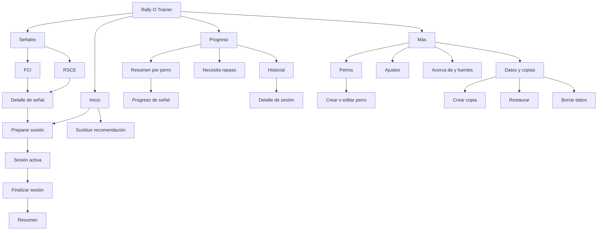
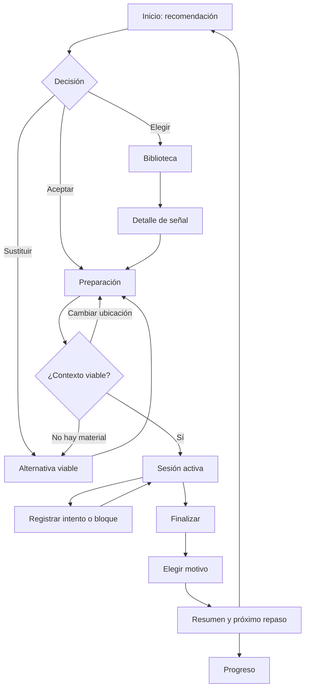
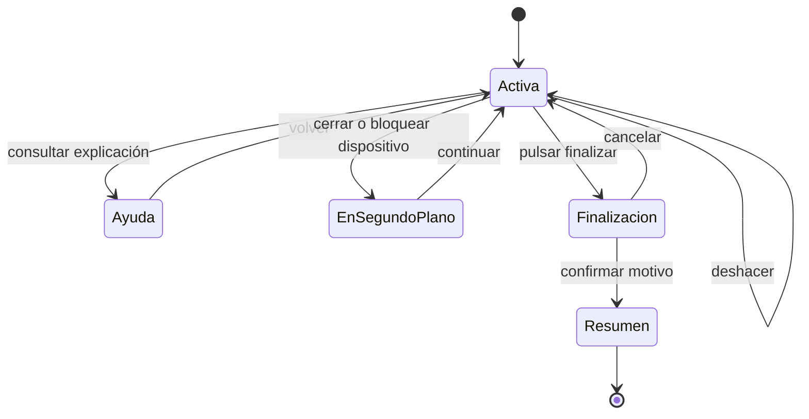
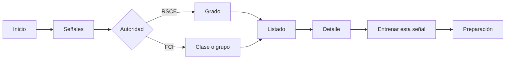
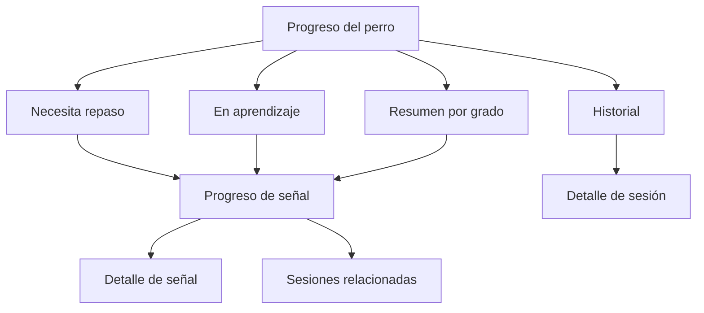
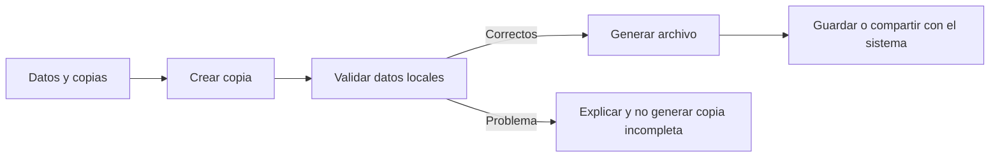

# PRD — Capítulo 05: Modelo de navegación y flujos de usuario

| Campo | Valor |
|---|---|
| Producto | Rally O Trainer |
| Estado del capítulo | Borrador para aprobación |
| Fecha | 5 de agosto de 2026 |
| Alcance | Arquitectura de información, navegación, rutas funcionales y flujos |
| Capítulo anterior | 04 — Mapa funcional y arquitectura funcional |
| Próximo capítulo | Arquitectura técnica |

> Este capítulo define cómo se desplaza el usuario por Rally O Trainer. No constituye todavía un wireframe ni fija dimensiones visuales, componentes o implementación de rutas.

---

## Análisis previo

### 1. Hipótesis sometidas a revisión

| Hipótesis | Punto débil | Resolución propuesta |
|---|---|---|
| Inicio, Entrenamiento, Señales, Perros, Registro, Estadísticas y Configuración deben ser siete pestañas. | Siete destinos persistentes son difíciles de alcanzar con una mano, compiten por atención y duplican conceptos. | Usar cuatro destinos principales: Inicio, Señales, Progreso y Más. Entrenamiento será un flujo contextual. |
| Entrenamiento necesita una pestaña permanente. | No existe nada que consultar allí cuando no hay una sesión activa; Inicio ya resuelve comenzar. | Iniciar desde recomendación o señal. Durante la sesión, ocultar navegación global y centrar la interfaz en registrar. |
| Perros necesita una pestaña principal. | La tarea frecuente es saber qué entrenar con el perro activo, no administrar perfiles. | Mostrar el perro activo en el contexto superior y guardar la administración completa en Más. |
| Registro y Estadísticas son destinos diferentes. | Ambos responden a “¿cómo evoluciona?” y separar hechos de interpretación obliga al usuario a decidir dónde buscar. | Reunir historial, estado y resúmenes bajo Progreso, con filtros por perro y señal. |
| FCI debe tener su propia pestaña global. | Convertiría una autoridad de contenido en navegación de primer nivel y rompería la progresión común. | Separar RSCE y FCI dentro de Señales mediante un selector visible. |
| “Menos de tres pulsaciones” significa que toda tarea debe completarse en tres pasos. | Acciones destructivas o complejas necesitan contexto y confirmación. | Aplicar el límite al acceso a funciones importantes y al inicio de entrenamiento, no a restaurar o borrar datos. |
| Un menú hamburguesa simplifica la pantalla. | Oculta destinos frecuentes y reduce descubribilidad, especialmente para principiantes. | Barra inferior en móvil y navegación lateral equivalente en pantallas grandes. |
| Volver siempre debe llevar a Inicio. | Destruiría filtros, posición y contexto, y haría difícil consultar una señal durante una sesión. | Mantener historial de navegación local y definir retornos específicos para flujos modales. |
| Reabrir la aplicación debe mostrar siempre Inicio. | Si existe una sesión activa, obliga a buscarla y aumenta riesgo de duplicarla. | Priorizar recuperación de sesión antes de la navegación normal. |
| Todas las pantallas necesitan todas las acciones globales. | Durante el entrenamiento distraen y facilitan cambios accidentales de perro. | Usar un modo de sesión enfocado sin barra inferior ni cambio de perro. |

### 2. Alternativas de navegación evaluadas

| Alternativa | Ventajas | Problemas | Decisión |
|---|---|---|---|
| Siete pestañas originales | Cada función parece visible. | Exceso de destinos, etiquetas pequeñas, duplicidad y mal alcance del pulgar. | Rechazada. |
| Inicio + Entrenar + Señales + Registro + Más | Expone la acción central. | “Entrenar” sin sesión repite Inicio; Registro separa progreso de interpretación. | Rechazada. |
| Inicio + Señales + Progreso + Más | Cuatro destinos estables, tareas agrupadas por pregunta. | Perros y datos son menos visibles. | Aprobación propuesta; perro activo y recordatorios compensan la menor visibilidad. |
| Navegación solo desde Inicio | Máxima limpieza. | Hace lenta la consulta libre y oculta historial/configuración. | Rechazada. |
| Menú hamburguesa | Mucho espacio disponible. | Destinos ocultos y peor uso con una mano. | Rechazada para navegación principal. |

### 3. Tensiones detectadas

#### 3.1 Simplicidad frente a acceso libre

La experiencia debe orientar al usuario hacia una recomendación sin impedir que explore. Inicio prioriza la acción recomendada; Señales mantiene la autonomía. Ninguna de las dos funciones deberá duplicar la otra.

#### 3.2 Recuperación frente a interrupción voluntaria

Una sesión activa necesita prioridad al reabrir, pero el usuario puede querer consultar algo antes de continuar. La recuperación mostrará una decisión clara: continuar o salir temporalmente al inicio; nunca creará otra sesión mientras la anterior permanezca activa.

#### 3.3 Contexto global frente a foco

El perro activo es contexto global, pero cambiarlo durante un registro sería peligroso. Será visible en sesión, pero no interactivo. Fuera de sesión podrá cambiarse desde un selector contextual.

#### 3.4 Profundidad reglamentaria frente a navegación cotidiana

Grados, autoridades, versiones y estados generan muchas dimensiones. Se organizarán dentro de Señales mediante jerarquía y filtros; no se convertirán en destinos globales.

### 4. Mejoras propuestas y justificación

#### 4.1 Navegación principal de cuatro destinos

Cuatro destinos permiten etiquetas completas, iconos comprensibles y áreas táctiles amplias. Inicio concentra la siguiente acción; Señales resuelve consulta; Progreso reúne historial e interpretación; Más contiene tareas ocasionales.

#### 4.2 Sesión como modo enfocado

Al comenzar, la navegación global se sustituye por controles de sesión. Esto reduce errores, evita cambio de perro y hace que los tres resultados ocupen la zona más accesible.

#### 4.3 Contexto recordado, no pasos repetidos

Perro, ubicación y objetivo anteriores se conservarán. Preparación mostrará esos valores y solo exigirá interacción si el usuario desea cambiarlos o falta material.

#### 4.4 Rutas funcionales estables

Cada vista tendrá un identificador y una pregunta, independientemente de la tecnología de enrutamiento. Esto permitirá diseñar wireframes y pruebas sin depender de URLs concretas.

---

## Versión definitiva

### 1. Objetivos del modelo de navegación

El modelo deberá:

- iniciar una recomendación desde Inicio en un máximo de tres pulsaciones;
- permitir elegir cualquier señal en un máximo de tres pulsaciones desde Inicio;
- mantener visible el perro activo fuera y dentro de la sesión;
- impedir cambios silenciosos de perro durante una sesión;
- preservar sesión, filtros y formularios ante interrupciones razonables;
- funcionar igual sin conexión;
- separar navegación global de flujos enfocados;
- ofrecer retornos predecibles;
- adaptarse a móvil, tableta y escritorio sin cambiar el modelo mental;
- mantener acciones destructivas lejos de la navegación cotidiana.

### 2. Arquitectura de información

### 3. Navegación global

#### 3.1 Destinos principales

| Destino | Pregunta que responde | Contenido principal | Acción primaria |
|---|---|---|---|
| Inicio | ¿Qué entreno ahora con este perro? | Recomendación, razón, ubicación y material | Empezar entrenamiento |
| Señales | ¿Qué señal quiero consultar o elegir? | Biblioteca separada por autoridad y grado | Abrir señal |
| Progreso | ¿Qué mejora y qué necesita repaso? | Estado, historial y próximos repasos | Abrir detalle |
| Más | ¿Dónde gestiono perro, datos y preferencias? | Accesos ocasionales | Elegir una función |

#### 3.2 Presentación por plataforma

| Plataforma | Patrón | Regla |
|---|---|---|
| Teléfono vertical | Barra inferior de cuatro destinos | Visible en vistas globales; oculta en sesión y confirmaciones destructivas. |
| Teléfono horizontal | Barra inferior o lateral compacta según espacio seguro | Mantiene orden y etiquetas. |
| Tableta | Barra lateral o inferior | No introduce destinos nuevos. |
| Escritorio | Navegación lateral | Misma jerarquía y nombres que móvil. |

Los iconos siempre tendrán etiqueta. No se dependerá exclusivamente de color, gesto o posición.

#### 3.3 Perro activo

Fuera de una sesión, el contexto superior mostrará el nombre del perro activo:

- si existe un perro, se muestra como contexto sin desplegable innecesario;
- si existen varios, se convierte en selector;
- seleccionar otro perro actualiza Inicio y Progreso;
- la biblioteca puede mostrar el estado del perro activo, pero su contenido no cambia;
- durante una sesión se muestra el nombre sin permitir cambiarlo.

#### 3.4 Inicio de aplicación

Orden de resolución al abrir:

1. comprobar si existe una migración o recuperación obligatoria;
2. comprobar si hay una sesión activa;
3. si no hay perro, iniciar incorporación;
4. si falta contenido mínimo, mostrar estado recuperable;
5. en cualquier otro caso, abrir Inicio.

### 4. Inventario de vistas funcionales

Los identificadores servirán para requisitos, wireframes y pruebas. No son URLs definitivas.

| ID | Vista | Pregunta única | Entrada principal | Salidas permitidas |
|---|---|---|---|---|
| V-ONB-01 | Crear primer perro | ¿Con qué perro empezamos? | Primera apertura | Inicio |
| V-HOM-01 | Inicio | ¿Qué entreno ahora? | Navegación o arranque | Preparar, sustituir, elegir señal |
| V-REC-01 | Alternativas | ¿Qué otra práctica es viable? | Sustituir | Preparar o volver |
| V-PRE-01 | Preparación | ¿Puedo realizar esta práctica ahora? | Recomendación o señal | Iniciar o volver |
| V-SES-01 | Sesión activa | ¿Cómo ha salido este intento? | Iniciar/continuar | Finalizar, consultar ayuda contextual |
| V-END-01 | Finalización | ¿Por qué termina la sesión? | Finalizar | Resumen o volver a sesión |
| V-SUM-01 | Resumen | ¿Qué ha cambiado y cuándo repito? | Sesión cerrada | Inicio, progreso o señal |
| V-SIG-01 | Biblioteca | ¿Qué señal busco? | Navegación | Detalle de señal |
| V-SIG-02 | Detalle de señal | ¿Qué exige y cómo se entrena? | Biblioteca, progreso o sesión | Preparar, volver |
| V-PRO-01 | Progreso | ¿Qué necesita atención? | Navegación | Señal, historial o repaso |
| V-PRO-02 | Progreso de señal | ¿Cómo evoluciona esta señal? | Progreso o detalle | Señal o sesión histórica |
| V-HIS-01 | Historial | ¿Qué se ha entrenado? | Progreso | Detalle de sesión |
| V-HIS-02 | Detalle de sesión | ¿Qué ocurrió en esta sesión? | Historial | Señales o volver |
| V-MOR-01 | Más | ¿Qué tarea ocasional necesito? | Navegación | Perros, datos, ajustes o acerca de |
| V-DOG-01 | Perros | ¿Qué perros gestiono? | Más o selector | Crear, editar, seleccionar |
| V-DOG-02 | Editar perro | ¿Qué nombre y raza tiene? | Perros | Guardar o cancelar |
| V-DAT-01 | Datos y copias | ¿Cómo protejo o elimino mis datos? | Más o recordatorio | Copiar, restaurar o borrar |
| V-DAT-02 | Restaurar | ¿Qué contiene esta copia? | Selección de archivo | Confirmar o cancelar |
| V-DAT-03 | Borrar datos | ¿Entiendo qué voy a eliminar? | Datos | Doble confirmación o cancelar |
| V-SET-01 | Ajustes | ¿Cómo quiero que se comporte la aplicación? | Más | Guardar automáticamente y volver |
| V-ABO-01 | Acerca de | ¿Qué producto y fuentes estoy usando? | Más o contenido | Fuentes, versiones y aviso de independencia |

### 5. Presupuesto de pulsaciones

Se cuenta desde la vista indicada y no incluye desbloquear el teléfono, abrir la PWA ni desplazamiento visual.

| Tarea | Punto inicial | Ruta mínima | Objetivo |
|---|---|---|---:|
| Iniciar recomendación | Inicio | Empezar → Iniciar | 2 |
| Sustituir e iniciar | Inicio | Sustituir → Elegir alternativa → Iniciar | 3 |
| Elegir cualquier señal | Inicio | Señales → Abrir señal → Entrenar | 3 |
| Registrar intento | Sesión | Resultado | 1 |
| Deshacer último | Sesión | Deshacer | 1 |
| Finalizar anticipadamente | Sesión | Finalizar → Motivo → Confirmar | 3 |
| Cambiar perro | Inicio | Perro activo → Seleccionar | 2 |
| Ver señales pendientes | Inicio | Progreso → Necesita repaso | 2 |
| Crear copia | Inicio | Más → Datos → Crear copia | 3, más selector del sistema |
| Borrar todos los datos | Inicio | Más → Datos → Borrar → Confirmar dos veces | Exento por seguridad |

La preparación no deberá añadir una confirmación innecesaria cuando perro, ubicación y material sean viables. El botón **Iniciar** podrá estar en la propia preparación y será la segunda pulsación del flujo recomendado.

### 6. Flujo principal de entrenamiento

#### 6.1 Reglas

- La recomendación no crea una sesión.
- La sesión se crea al pulsar **Iniciar**.
- Preparación conserva perro, señal, versión, lado, ubicación y origen.
- Si falta material, sustituir mantiene el contexto y no registra un fallo.
- El resumen no exige notas para poder salir.
- Volver desde Resumen no reabre la sesión finalizada.

### 7. Flujo de sesión activa

Durante la sesión:

- no habrá barra de navegación global;
- el encabezado mostrará perro, señal y tiempo orientativo;
- cambiar perro estará deshabilitado;
- la explicación se abrirá sin perder registros ni contexto;
- retroceder mediante el sistema no descartará la sesión;
- si el usuario intenta abandonar, podrá continuar, ir temporalmente a Inicio o finalizar;
- no se iniciará otra sesión hasta cerrar o descartar la activa.

### 8. Recuperación de sesión

Al reabrir con una sesión activa se mostrará una recuperación enfocada:

| Acción | Resultado |
|---|---|
| Continuar | Abre V-SES-01 con todos los registros confirmados. |
| Ver inicio | Permite consultar, pero mantiene un aviso persistente “Sesión en curso”. |
| Finalizar | Abre V-END-01 para elegir motivo. |

Mientras haya una sesión activa:

- Inicio sustituirá **Empezar entrenamiento** por **Continuar sesión**;
- otras señales podrán consultarse, pero no iniciar otra práctica;
- cambiar de perro solicitará cerrar primero la sesión;
- crear una copia incluirá la sesión activa marcada como tal;
- restaurar o borrar datos exigirá resolver la sesión antes.

### 9. Flujo de elección manual

Reglas:

- RSCE será el selector predeterminado;
- FCI será visible, aunque parte del contenido se etiquete como avanzado;
- cambiar de autoridad no mezclará resultados en un mismo listado;
- grado y estado recomendado serán filtros, no barreras;
- abrir una señal desde Progreso reutilizará el mismo detalle;
- **Entrenar esta señal** identificará el origen como manual.

### 10. Flujo de progreso

Progreso abrirá con el perro activo y priorizará:

1. señales que necesitan repaso;
2. señales en aprendizaje;
3. resumen por grado;
4. acceso al historial cronológico.

No habrá un panel de métricas genéricas como primera vista. Cada dato deberá ayudar a decidir qué entrenar o explicar una evolución.

### 11. Flujo de varios perros

| Situación | Comportamiento |
|---|---|
| Solo existe un perro | Se muestra su nombre sin añadir un selector prominente. |
| Se añade un segundo perro | El nombre pasa a ser selector accesible. |
| Se cambia desde Inicio | Recomendación y progreso se recalculan. |
| Se cambia desde Progreso | Se conserva la sección, pero cambian todos los datos. |
| Se intenta cambiar en sesión | Se bloquea y se ofrece finalizar o continuar. |
| Se consulta Biblioteca | Cambia únicamente el estado contextual mostrado, no el catálogo. |

Crear un perro nuevo estará disponible desde el selector y desde Más → Perros. Editar o borrar seguirá la ruta de administración, no el selector rápido.

### 12. Flujos de datos

#### 12.1 Crear copia

#### 12.2 Restaurar

1. Elegir archivo mediante el sistema.
2. Validar formato, versión e integridad sin modificar datos actuales.
3. Mostrar perros, sesiones, fecha de copia y advertencia de sustitución.
4. Confirmar explícitamente.
5. Restaurar de forma completa.
6. Mostrar éxito y volver a Inicio con el perro restaurado activo.
7. Si falla, conservar el estado anterior y explicar el problema.

#### 12.3 Borrar

1. Abrir Más → Datos → Borrar todos los datos.
2. Explicar que se eliminarán perros, sesiones, progreso y preferencias.
3. Ofrecer crear una copia.
4. Primera confirmación.
5. Segunda confirmación explícita distinta de la primera.
6. Borrar y volver a incorporación.

### 13. Comportamiento de retroceso y cancelación

| Contexto | Acción de volver | Resultado esperado |
|---|---|---|
| Biblioteca → detalle | Volver | Restaura autoridad, grado, filtros y posición. |
| Progreso → señal | Volver | Regresa a la sección y perro anteriores. |
| Preparación | Cancelar/volver | Regresa al origen: Inicio, alternativa o detalle. |
| Sesión activa | Volver del sistema | No descarta; muestra opciones seguras. |
| Ayuda durante sesión | Cerrar/volver | Retorna al mismo intento y estado. |
| Finalización | Cancelar | Regresa a sesión activa. |
| Resumen | Volver | Va a Inicio; la sesión permanece cerrada. |
| Restauración antes de confirmar | Cancelar | No modifica datos. |
| Borrado antes de segunda confirmación | Cancelar | No modifica datos. |

Los enlaces o vistas superpuestas no deberán crear bucles al volver.

### 14. Estados transversales de cada vista

Toda vista que dependa de datos deberá especificar:

| Estado | Tratamiento |
|---|---|
| Inicial | Contenido principal y acción disponible. |
| Vacío esperado | Explicación y una acción útil, no una pantalla muerta. |
| Cargando localmente | Solo si el trabajo supera el umbral perceptible; no mostrar animaciones innecesarias. |
| Offline | Indicador discreto únicamente cuando cambie una capacidad secundaria; el núcleo sigue activo. |
| Error recuperable | Explicar qué se conserva y ofrecer reintentar o volver. |
| Error de integridad | Bloquear modificación, proteger datos y orientar a copia/recuperación. |
| Actualización disponible | No interrumpir sesión; aplicar después de cerrarla. |

Ejemplos de vacíos:

- Progreso sin sesiones: “Todavía no hay prácticas” + **Empezar entrenamiento**.
- Necesita repaso vacío: “No hay señales pendientes” + **Ver señales en aprendizaje**.
- Historial vacío: explicación breve sin gráficos vacíos.
- Varios perros con uno solo: no mostrar un selector vacío.

### 15. Uso con una mano y accesibilidad de navegación

- Las acciones frecuentes estarán en la mitad inferior de la pantalla cuando el contexto lo permita.
- La barra inferior respetará áreas seguras de iPhone y Android.
- Los destinos tendrán etiqueta visible y área táctil suficiente.
- El orden será estable: Inicio, Señales, Progreso, Más.
- **Empezar**, los tres resultados, **Deshacer** y **Finalizar** no dependerán de gestos.
- Los gestos, si se añaden, tendrán alternativa visible.
- El foco seguirá el orden visual y se trasladará de forma predecible al abrir detalles o confirmaciones.
- Lectores de pantalla anunciarán perro, señal, lado y resultado antes de confirmar un intento.
- El estado activo de navegación no dependerá únicamente del color.
- El modo oscuro no cambiará jerarquía ni significado.

### 16. Reglas para tableta y escritorio

- Se conservarán los cuatro destinos y su orden.
- La barra inferior podrá transformarse en navegación lateral.
- El contenido podrá usar dos columnas para lista y detalle, pero seguirá teniendo rutas y títulos distinguibles.
- No se introducirán acciones solo disponibles con hover.
- Una ventana estrecha volverá al patrón móvil sin perder estado.
- El constructor de pistas futuro podrá usar un espacio de trabajo propio; no alterará la navegación del entrenamiento individual.

### 17. Matriz de trazabilidad con historias Must

| Flujo o vista | Historias cubiertas |
|---|---|
| Incorporación | US-ONB-01, US-DOG-01 |
| Inicio y preparación | US-REC-01, US-REC-02, US-SIG-02, US-SES-01 |
| Sustitución y biblioteca | US-REC-03, US-REC-04, US-LIB-01, US-SIG-01 |
| Sesión activa | US-SES-02, US-SES-03, US-SES-04, US-SES-06 |
| Finalización y resumen | US-SES-05, US-PRO-01, US-PRO-03 |
| Progreso e historial | US-PRO-01, US-PRO-02, US-PRO-03, US-HIS-01 |
| Cambio de perro | US-DOG-01, US-DOG-02 |
| Datos | US-DAT-01, US-DAT-02, US-DAT-03 |
| Arranque y navegación global | US-OFF-01, US-PWA-01 |

### 18. Criterios de aceptación del capítulo

- [ ] La navegación móvil tiene cuatro destinos persistentes como máximo.
- [ ] Entrenamiento no aparece como pestaña global.
- [ ] Perros se gestiona desde Más y se cambia desde el contexto superior.
- [ ] Registro y estadísticas se unifican bajo Progreso.
- [ ] RSCE y FCI se separan dentro de Señales.
- [ ] Toda señal disponible puede consultarse y seleccionarse.
- [ ] Iniciar la recomendación requiere como máximo tres pulsaciones.
- [ ] Registrar un intento requiere una pulsación.
- [ ] La sesión activa oculta navegación global.
- [ ] Reabrir recupera una sesión activa sin duplicarla.
- [ ] Cambiar de perro durante una sesión no es posible silenciosamente.
- [ ] Volver conserva filtros y contexto cuando procede.
- [ ] Restauración y borrado están fuera de rutas frecuentes y requieren confirmación.
- [ ] El modelo móvil se conserva en tableta y escritorio.
- [ ] Cada vista responde a una sola pregunta.
- [ ] Los estados vacío, offline, error y actualización están definidos.

### 19. Registro de decisiones del capítulo

| ID | Decisión | Estado |
|---|---|---|
| DE-05-001 | Navegación principal: Inicio, Señales, Progreso y Más. | Propuesta para aprobación |
| DE-05-002 | Entrenamiento será un flujo enfocado, no una pestaña. | Propuesta para aprobación |
| DE-05-003 | Perro activo aparecerá como contexto superior y selector cuando haya varios. | Propuesta para aprobación |
| DE-05-004 | Historial y estadísticas se agruparán bajo Progreso. | Propuesta para aprobación |
| DE-05-005 | RSCE y FCI se separarán dentro de Señales. | Propuesta para aprobación |
| DE-05-006 | La sesión activa ocultará la navegación global. | Propuesta para aprobación |
| DE-05-007 | Reabrir priorizará la recuperación de una sesión activa. | Propuesta para aprobación |
| DE-05-008 | Inicio mostrará “Continuar sesión” mientras exista una activa. | Propuesta para aprobación |
| DE-05-009 | Los cuatro destinos conservarán nombre y orden en todas las plataformas. | Propuesta para aprobación |
| DE-05-010 | Las acciones destructivas quedan exentas del límite de tres pulsaciones. | Aprobada en principios de diseño |

## Riesgos

| Riesgo | Impacto | Probabilidad | Mitigación |
|---|---|---:|---|
| “Más” oculta copias y gestión de perros | Medio | Media | Recordatorios contextuales y selector de perro desde Inicio. |
| Progreso acumula demasiada información | Alto | Media | Priorizar repaso, aprendizaje e historial; posponer paneles complejos. |
| El selector superior compite con el título | Medio | Media | Probar jerarquía y alcance en wireframes con uno y varios perros. |
| El modo enfocado hace sentir al usuario atrapado | Alto | Media | Salida visible con continuar, volver temporalmente o finalizar. |
| Consultar libremente contenido avanzado confunde al principiante | Medio | Media | Etiqueta de nivel y prerrequisitos, sin bloqueo. |
| La recuperación automática sorprende tras mucho tiempo | Medio | Media | Mostrar antigüedad y opciones antes de continuar una sesión antigua. |
| Demasiados estados de retorno generan inconsistencias | Medio | Media | Definir pila local y pruebas end-to-end por origen. |
| El presupuesto de pulsaciones lleva a omitir información importante | Alto | Baja | Contar acceso, no eliminar confirmaciones de seguridad ni contexto esencial. |
| Navegación lateral de escritorio diverge de móvil | Medio | Media | Conservar exactamente destinos, nombres y orden. |
| La barra inferior interfiere con áreas seguras o controles del navegador | Alto | Media | Probar PWA instalada y navegador en iPhone/Android reales. |

## Mejoras posibles

- Incorporar accesos rápidos configurados automáticamente por uso, sin permitir una navegación arbitraria.
- Añadir búsqueda global solo si las pruebas muestran que Señales no basta.
- Permitir abrir directamente una señal compartida mediante enlace cuando exista distribución pública.
- Ofrecer widgets o accesos del sistema a “Continuar sesión” en versiones futuras.
- Mantener una lista local de vistas recientes sin convertirla en historial de navegación complejo.
- Añadir atajos de teclado en escritorio conservando controles visibles.
- Permitir comparar dos perros únicamente desde Progreso y sin rankings.
- Adaptar el detalle de señal a dos columnas en tableta y escritorio.

## Decisiones pendientes

| ID | Decisión | Motivo | Momento límite |
|---|---|---|---|
| DP-05-001 | Iconos exactos de los cuatro destinos | Deben pertenecer al sistema visual y probarse con etiquetas. | Sistema de diseño |
| DP-05-002 | Patrón visual del selector de perro | Depende de número de perros, alcance del pulgar y espacio superior. | Wireframes |
| DP-05-003 | Presentación de RSCE/FCI: selector segmentado, pestañas locales o filtro | Debe evitar confusión con la navegación global. | Wireframes y pruebas |
| DP-05-004 | Antigüedad a partir de la cual una sesión activa se considera antigua | Afecta recuperación y recomendación de cierre. | Flujos detallados y algoritmo |
| DP-05-005 | Navegación temporal a Inicio durante una sesión | Debe equilibrar consulta libre y prevención de sesiones duplicadas. | Prototipo de sesión |
| DP-05-006 | Filtros mínimos de Señales | Dependen de volumen real de contenido y pruebas de búsqueda. | Base de señales y wireframes |
| DP-05-007 | Filtros mínimos de Progreso e Historial | Deben ser accionables sin añadir complejidad. | Wireframes |
| DP-05-008 | Comportamiento exacto del botón Atrás de Android y gesto de iOS | Requiere prototipo técnico en PWA instalada. | Arquitectura técnica y pruebas |
| DP-05-009 | Soporte de enlaces profundos | No es necesario para el MVP personal, pero afecta rutas públicas futuras. | Arquitectura técnica |
