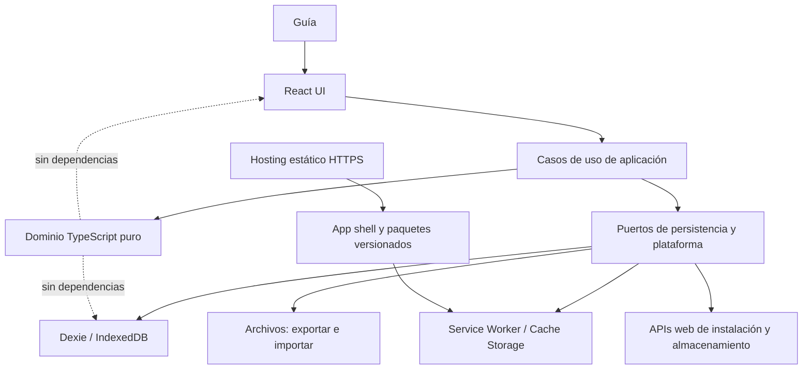
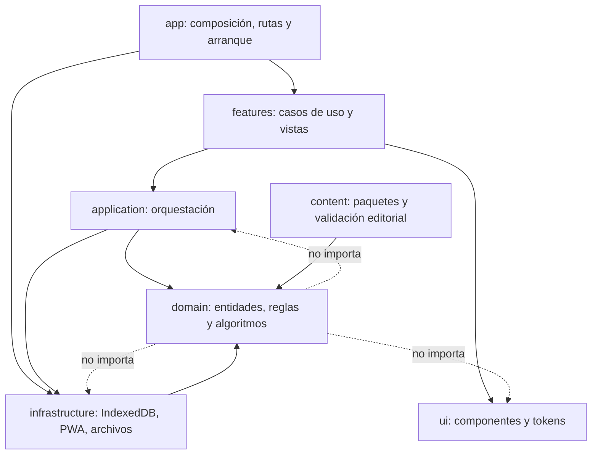
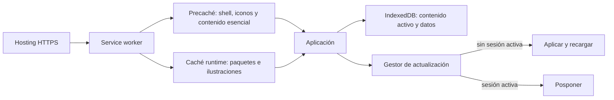
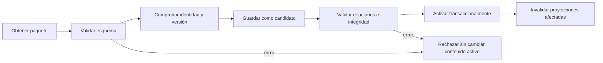
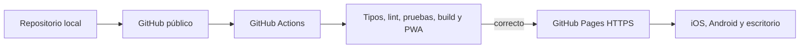

# PRD — Capítulo 06: Arquitectura técnica

| Campo | Valor |
|---|---|
| Producto | Rally O Trainer |
| Estado del capítulo | Borrador técnico para aprobación |
| Fecha | 5 de agosto de 2026 |
| Alcance | Stack, capas, persistencia, PWA, offline, actualizaciones, seguridad, pruebas y despliegue |
| Capítulo anterior | 05 — Modelo de navegación y flujos de usuario |
| Próximo capítulo | Modelo de datos |

> Este capítulo propone una arquitectura concreta para implementar el MVP a coste cero. Las versiones exactas de dependencias se fijarán en el archivo de bloqueo al crear el proyecto; el PRD fija responsabilidades y criterios de selección, no números que envejecen rápidamente.

---

## Análisis previo

### 1. Restricciones que gobiernan la decisión

| Restricción | Consecuencia técnica |
|---|---|
| Proyecto personal y sin presupuesto | Sin backend, base de datos remota, servicios de pago ni infraestructura operativa. |
| iPhone 16 Pro como dispositivo principal | Safari/WebKit e instalación en pantalla de inicio deben probarse desde el primer incremento. |
| Compatibilidad Android, iPad, Mac y PC | Una base web estándar y adaptable; pruebas Chromium y WebKit. |
| Funcionamiento principal offline | Aplicación, contenido y datos deben residir localmente después de la primera carga. |
| Sin cuenta | Identidad y autorización remotas quedan fuera. |
| Datos bajo control del usuario | Copia, restauración y borrado forman parte del núcleo técnico. |
| Evolución durante años | Esquemas, contenido y reglas necesitan versiones y migraciones. |
| Máxima sencillez | Pocas dependencias, SPA estática y lógica de dominio independiente de la interfaz. |
| Repositorio público aceptado | GitHub Pages y GitHub Actions son opciones gratuitas cuando se cree una cuenta. |

### 2. Alternativas de interfaz evaluadas

| Alternativa | Ventajas | Costes y riesgos | Evaluación |
|---|---|---|---|
| HTML y TypeScript sin framework | Dependencias mínimas y carga pequeña. | Estado, accesibilidad, composición y pruebas de 21 vistas requerirían construir convenciones propias. | Viable para prototipo, menos mantenible al crecer. |
| React + TypeScript + Vite | Ecosistema amplio, componentes probables, pruebas maduras y separación clara. | Añade runtime y exige disciplina para no introducir librerías innecesarias. | **Recomendada.** |
| Vue + TypeScript + Vite | Plantillas accesibles y curva razonable. | Menor ventaja práctica si no existe experiencia previa declarada; misma necesidad de arquitectura. | Alternativa válida, sin beneficio decisivo. |
| Svelte + TypeScript + Vite | Poco código y bundle competitivo. | Menor continuidad de patrones y ecosistema que React para un producto que puede mantenerse con ayuda diversa. | Alternativa válida, no preferida. |
| Framework full-stack | Routing, datos y despliegue integrados. | Introduce servidor, SSR y convenciones que una PWA local no necesita. | Rechazada para el MVP. |

La elección de React no se basa únicamente en popularidad. El producto tiene suficientes estados, rutas, recuperación y accesibilidad para beneficiarse de componentes y herramientas maduras, pero no necesita un framework con servidor.

### 3. Alternativas de persistencia evaluadas

| Alternativa | Ventajas | Problemas | Decisión |
|---|---|---|---|
| `localStorage` | Muy simple. | Síncrono, limitado, sin índices ni transacciones adecuadas. | Rechazada para datos de dominio. |
| IndexedDB directa | Estándar, asíncrona, transaccional y disponible en navegadores modernos. | API verbosa y propensa a errores de migración. | Base tecnológica elegida. |
| Dexie sobre IndexedDB | Reduce complejidad, tipa tablas, facilita transacciones, versiones y consultas React. | Dependencia adicional y sus migraciones deben seguir probándose. | **Recomendada.** |
| SQLite en WebAssembly/OPFS | Consultas potentes y modelo SQL. | Mayor bundle, compatibilidad y complejidad de persistencia; innecesario para el volumen previsto. | Rechazada para el MVP. |
| Base remota | Sincronización y copia central. | Coste, cuenta, red y conflicto con local-first. | Fuera de alcance. |

### 4. Alternativas de PWA evaluadas

| Alternativa | Ventajas | Problemas | Decisión |
|---|---|---|---|
| Service worker escrito completamente a mano | Control máximo. | Más superficie de error en cachés, revisiones y actualizaciones. | No justificado inicialmente. |
| `vite-plugin-pwa` con `generateSW` | Manifiesto y precaché con poca configuración; usa Workbox. | Menos control para comportamientos muy personalizados. | **Recomendada para el MVP.** |
| `vite-plugin-pwa` con `injectManifest` | Service worker personalizado. | Más código y pruebas; solo necesario si `generateSW` no cubre requisitos reales. | Ruta de evolución, no punto de partida. |
| Actualización automática inmediata | El usuario siempre recibe la última versión. | Recargar durante sesión puede interrumpir o mezclar código y esquema. | Rechazada. Se usará actualización solicitada. |

### 5. Debilidades y riesgos detectados

1. **IndexedDB no es una copia de seguridad.** Los navegadores pueden eliminar almacenamiento por presión o acción del usuario.
2. **Una PWA instalada no es idéntica en todas las plataformas.** iOS no ofrece el mismo evento de instalación que Chromium.
3. **El service worker puede servir código antiguo.** Una estrategia agresiva de caché puede dejar aplicación y esquema desalineados.
4. **Una SPA en GitHub Pages necesita resolver rutas.** El host no proporciona reescrituras arbitrarias por defecto.
5. **React puede invitar a añadir estado global innecesario.** El dominio debe permanecer fuera de componentes.
6. **Contenido y datos personales requieren ciclos distintos.** El primero se publica; los segundos solo existen localmente.
7. **Restaurar en la base activa sin validación puede destruir el historial.** La operación necesita prevalidación y transacción.
8. **Emular Mobile Safari no sustituye un iPhone real.** Playwright WebKit reduce riesgos, pero no prueba instalación, cuotas o integración exacta del sistema.

### 6. Mejoras propuestas y justificación

#### 6.1 SPA local-first con dominio puro

React representará la interfaz, no las reglas. Planificación, progreso y validación serán funciones TypeScript puras que reciben datos y producen resultados deterministas. Esto permite probar el núcleo sin navegador ni React.

#### 6.2 Dependencias mínimas y justificadas

Se admitirán inicialmente React, React Router, Dexie, validación de esquemas, herramientas PWA y herramientas de prueba. No se incorporarán Redux, Zustand, Tailwind, una biblioteca visual completa ni un cliente de servidor hasta demostrar una necesidad.

#### 6.3 Actualización bajo control del usuario

Una nueva versión se descargará en segundo plano, pero no tomará control ni recargará durante una sesión. La aplicación ofrecerá aplicar la actualización cuando no exista trabajo activo.

#### 6.4 Copia como defensa principal

Se solicitará almacenamiento persistente cuando la plataforma lo permita y se vigilará cuota, pero la defensa confiable seguirá siendo una copia exportada y restaurada en pruebas.

---

## Versión definitiva

### 1. Resumen de arquitectura

Rally O Trainer se implementará como una SPA estática y modular. Todo el dominio, contenido activo y datos del usuario funcionarán en el dispositivo. El alojamiento únicamente distribuirá archivos estáticos y paquetes de contenido; no procesará sesiones ni almacenará perfiles.



La flecha discontinua expresa una prohibición: el dominio no importará React, Dexie ni APIs del navegador.

### 2. Stack recomendado

| Área | Selección | Justificación |
|---|---|---|
| Lenguaje | TypeScript estricto | Modelos explícitos, refactor seguro y validación en compilación. |
| Interfaz | React | Componentes, accesibilidad y ecosistema de pruebas adecuados. |
| Construcción | Vite | Desarrollo rápido y salida estática optimizada. |
| Rutas | React Router, modo declarativo | Las rutas son locales y la aplicación tiene su propia capa de datos; no necesita loaders de servidor. |
| Persistencia | IndexedDB mediante Dexie | Transacciones, índices, migraciones y consultas reactivas sin SQL/WASM. |
| Validación runtime | Zod estable | Validar contenido, copias, límites de dominio y entradas no confiables. |
| PWA | `vite-plugin-pwa`, estrategia `generateSW` | Manifiesto, precaché y Workbox con configuración pequeña. |
| Estilos | CSS Modules + propiedades CSS globales | Encapsulación y tokens sin framework visual. |
| Unitarias | Vitest | Integración natural con Vite y TypeScript. |
| Componentes | React Testing Library | Pruebas orientadas al comportamiento accesible. |
| E2E | Playwright | Chromium, WebKit, Firefox y perfiles móviles. |
| Accesibilidad automática | axe-core integrado en pruebas | Detecta regresiones comunes; no sustituye pruebas manuales. |
| Formato y lint | ESLint + Prettier | Reglas reproducibles y revisiones pequeñas. |
| Paquetes | npm con archivo de bloqueo | Opción conocida y suficiente para un mantenedor. |
| Runtime de desarrollo | Node.js LTS compatible con la versión de Vite fijada | Evita versiones experimentales. |
| Repositorio futuro | GitHub público | Código versionado y coste cero. |
| CI/CD futuro | GitHub Actions + GitHub Pages | Gratuito para repositorio público y despliegue estático HTTPS. |

#### 2.1 Dependencias que no se introducirán inicialmente

- Redux, Zustand u otro almacén global;
- TanStack Query o cliente de red;
- framework full-stack o SSR;
- ORM SQL;
- biblioteca completa de componentes;
- Tailwind u otro sistema de utilidades;
- servicio de analítica;
- SDK de autenticación;
- SDK de sincronización;
- librería de fechas pesada si las APIs nativas cubren el caso;
- generador de formularios.

Una dependencia nueva deberá resolver un problema observado, tener licencia permisiva, mantenimiento activo, tamaño razonable y una estrategia de sustitución.

### 3. Modos de React Router y hosting

Se usará React Router en modo declarativo. Su documentación lo identifica como apropiado para aplicaciones con una capa de datos local-first propia. No se activarán modos Framework o Data mientras no exista un caso que justifique loaders, acciones o servidor.

Para conservar alojamiento estático simple se evaluarán dos opciones al crear el proyecto:

| Opción | Ventaja | Coste | Recomendación |
|---|---|---|---|
| Enrutamiento hash | Funciona en cualquier host estático sin reescrituras. | URLs con `#`; enlaces menos limpios. | **MVP recomendado.** La PWA instalada oculta normalmente la URL. |
| History API + `404.html` de recuperación | URLs limpias y mejores enlaces futuros. | Configuración específica de GitHub Pages y más casos de prueba. | Adoptar cuando los enlaces profundos sean una necesidad. |

Las rutas funcionales del capítulo 05 no cambiarán; solo cambia su representación en la URL.

### 4. Capas y reglas de dependencia



#### 4.1 Responsabilidades

| Capa | Responsabilidad | Puede importar | No puede importar |
|---|---|---|---|
| `domain` | Tipos, invariantes, progreso, repaso y planificación puros | Solo TypeScript estándar y utilidades puras internas | React, Dexie, DOM, archivos o service worker |
| `application` | Casos de uso, transacciones lógicas y puertos | `domain` | Componentes concretos o base de datos directa |
| `infrastructure` | Implementaciones de repositorios y APIs web | Contratos de `domain/application`, dependencias externas | Vistas o reglas duplicadas |
| `features` | Flujos y adaptadores de presentación por capacidad | `application`, `domain` de lectura y `ui` | Dexie directa o reglas deportivas nuevas |
| `ui` | Componentes accesibles sin lógica de dominio | Tokens y utilidades visuales | Repositorios, planificación o contenido concreto |
| `app` | Ensamblado, rutas, proveedores y errores globales | Todas mediante puntos de composición | Reglas deportivas propias |
| `content` | Datos editoriales y esquemas | Tipos/esquemas de contenido | Perros, sesiones o interfaz |

No se creará una interfaz de repositorio para cada tabla por rutina. Solo existirán puertos cuando separen de verdad el dominio de IndexedDB o permitan una operación atómica relevante.

### 5. Estructura de proyecto propuesta

```text
src/
  app/
    bootstrap/
    routing/
    providers/
    errors/
  domain/
    dogs/
    content/
    training/
    progress/
    planning/
    backup/
  application/
    commands/
    queries/
    ports/
  infrastructure/
    database/
    repositories/
    pwa/
    files/
    storage/
  features/
    onboarding/
    home/
    signals/
    session/
    progress/
    dogs/
    data-management/
    settings/
  ui/
    components/
    icons/
    styles/
  content/
    schemas/
    packages/
    validators/
  test/
    builders/
    fixtures/
    fakes/
```

Las carpetas podrán agruparse mientras el código sea pequeño. La estructura expresa límites; no obliga a crear archivos vacíos ni capas ceremoniales.

### 6. Estado de interfaz y datos

#### 6.1 Clasificación

| Estado | Ubicación | Ejemplos |
|---|---|---|
| Persistente de dominio | IndexedDB | perros, sesiones, intentos, paquetes, reglas activas |
| Derivado persistible | IndexedDB como caché regenerable | progreso, próximo repaso, resúmenes |
| Preferencia persistente | IndexedDB | perro activo, ubicación, tema, última copia |
| De ruta | URL/router | señal abierta, sección de Progreso |
| Efímero de vista | Estado local React | diálogo abierto, texto temporal, pestaña local |
| De sesión de entrenamiento | IndexedDB desde el inicio | sesión activa, bloques e intentos |

#### 6.2 Política

- React local state será la primera opción para estado visual.
- Context solo expondrá dependencias estables y contexto global pequeño, como tema o perro activo.
- Dexie y consultas de aplicación alimentarán datos persistentes.
- No se copiarán tablas completas a un almacén global.
- Los componentes no ejecutarán escrituras directas a IndexedDB.
- Cada comando crítico devolverá éxito o error tipado.

### 7. Persistencia local

#### 7.1 IndexedDB y Dexie

IndexedDB almacenará datos estructurados. Dexie proporcionará:

- apertura y versión de esquema;
- transacciones;
- índices;
- migraciones;
- consultas reactivas donde aporten valor;
- manejo tipado de tablas.

El modelo exacto se define en el capítulo 07. La arquitectura exige desde ahora:

- identificadores estables generados localmente;
- fechas guardadas en UTC y presentadas en hora local;
- versión de esquema de base de datos;
- versión de reglas del algoritmo;
- referencia a revisión de contenido en cada sesión;
- índices basados en consultas reales, no especulativos;
- ninguna dependencia de claves autoincrementales para intercambio entre instalaciones.

#### 7.2 Transacciones mínimas

| Operación | Tablas/conjuntos que deben cambiar juntos |
|---|---|
| Registrar intento | intento o bloque + sesión + invalidación de proyección |
| Deshacer | registro + sesión + invalidación de proyección |
| Finalizar sesión | sesión + motivo + invalidación de progreso/planificación |
| Publicar paquete | paquete + revisiones + relaciones + activación |
| Restaurar copia | todo el conjunto de usuario y preferencias |
| Borrar todos los datos | todo el conjunto personal y cachés derivadas |

#### 7.3 Migraciones

Cada cambio de esquema tendrá:

1. versión incremental;
2. función de migración idempotente dentro de lo posible;
3. fixture de base anterior;
4. prueba de migración;
5. comprobación posterior de integridad;
6. mensaje recuperable si no puede finalizar.

No se publicará una migración destructiva sin una ruta de copia o conservación.

#### 7.4 Persistencia y cuota

Después de la primera sesión guardada, la aplicación podrá solicitar `navigator.storage.persist()` cuando exista. También consultará `navigator.storage.estimate()` para diagnosticar falta de espacio antes de importar paquetes o restaurar copias.

El resultado de persistencia se tratará como capacidad, no como garantía. La documentación de almacenamiento web advierte que IndexedDB y Cache Storage pueden estar sujetos a expulsión, y WebKit mantiene políticas de cuota y borrado por origen. Por ello:

- no se ocultará el riesgo;
- se recordará la copia cada 30 días;
- una copia reciente seguirá siendo el mecanismo de recuperación;
- se probará el comportamiento instalado en el iPhone real.

### 8. Arquitectura PWA



#### 8.1 Manifiesto mínimo

| Campo | Valor o regla |
|---|---|
| `name` | Rally O Trainer |
| `short_name` | Rally O |
| `start_url` | Ruta base de la aplicación |
| `scope` | Raíz publicada del proyecto |
| `display` | `standalone` |
| `orientation` | No se forzará; se prioriza vertical mediante diseño |
| `theme_color` | Token verde principal definitivo |
| `background_color` | Token de superficie inicial definitivo |
| Iconos | 192×192, 512×512 y variantes `maskable` |
| `lang` | `es` |
| `description` | Descripción breve sin afirmar oficialidad |
| `prefer_related_applications` | `false` o ausente |

El icono PWA será una marca simplificada, no el logotipo horizontal completo.

#### 8.2 Instalación

- La web seguirá siendo utilizable sin instalar.
- Chromium podrá usar `beforeinstallprompt` cuando esté disponible.
- En iOS se mostrará una guía contextual para añadir a pantalla de inicio; no se fingirá que existe un botón programático equivalente.
- La invitación aparecerá después de demostrar valor, no en la primera pantalla.
- Instalar no será requisito para conservar datos, aunque se explicará su utilidad offline y de acceso.

#### 8.3 Estrategia de caché

| Recurso | Estrategia inicial | Motivo |
|---|---|---|
| HTML principal | Network first con fallback precacheado, o estrategia equivalente validada | Recibir actualizaciones sin perder arranque offline. |
| JS/CSS con hash | Precache/cache first | Son inmutables por nombre. |
| Manifiesto e iconos | Precache | Necesarios para instalación. |
| Paquete esencial Debutante | Precache y validación en IndexedDB | Primera experiencia offline completa. |
| Paquetes adicionales | Cache first tras descarga explícita, con validación | No inflar primera carga. |
| Ilustraciones esenciales | Precache o paquete asociado | Deben funcionar con su señal offline. |
| Fuentes tipográficas | No hay descarga externa; usar sistema | Reduce tamaño y fallos. |
| Datos personales | Nunca Cache Storage | Solo IndexedDB y archivos exportados. |

Se comenzará con `generateSW`. Se migrará a `injectManifest` únicamente si una prueba demuestra que el comportamiento requerido no puede expresarse de forma segura.

#### 8.4 Actualizaciones

- Comportamiento `prompt`, no recarga automática.
- Descargar nueva versión no cambia la sesión actual.
- Con sesión activa, mostrar aviso no intrusivo y posponer aplicación.
- Sin sesión activa, ofrecer **Actualizar ahora** y **Más tarde**.
- Antes de recargar, confirmar que las escrituras pendientes terminaron.
- Al arrancar la nueva versión, ejecutar migraciones antes de montar vistas de dominio.
- Si la migración falla, no continuar con escrituras y ofrecer exportar diagnóstico/copia cuando sea posible.

### 9. Paquetes de contenido

Contenido y aplicación tendrán ciclos separados aunque se distribuyan desde el mismo hosting.

#### 9.1 Estructura lógica

Cada paquete incluirá:

- identificador estable;
- autoridad: RSCE o FCI;
- versión del paquete;
- versión de esquema;
- fecha de publicación;
- idioma;
- fuentes y vigencia;
- señales y revisiones;
- relaciones, prerrequisitos y equivalencias;
- materiales y ubicaciones;
- inventario de ilustraciones;
- suma de comprobación;
- estado editorial.

#### 9.2 Activación



Una suma de comprobación detecta corrupción, pero no demuestra autoría. Como el MVP distribuye contenido desde el mismo origen controlado y no permite importar paquetes de terceros, no se implementará firma criptográfica inicialmente.

### 10. Lógica de dominio y algoritmos

Planificación y progreso serán módulos puros:

```text
calculateProgress(facts, contentRevision, rulesVersion, now) -> ProgressResult
recommendNext(dogContext, progress, eligibleSignals, plannerRules, now) -> Recommendation
```

Las firmas definitivas pueden cambiar, pero deberán mantener estas propiedades:

- entradas explícitas;
- sin lectura directa de IndexedDB;
- sin reloj global oculto: la fecha actual se pasa como dependencia;
- sin números aleatorios no controlados;
- salida serializable y explicable;
- versión de reglas incluida;
- pruebas de casos límite y propiedades.

El planificador no aprenderá mediante un modelo remoto ni cambiará reglas sin una versión publicada.

### 11. Importación, exportación y restauración

#### 11.1 Exportación

- Generar un objeto validado en memoria por partes si el tamaño lo requiere.
- Serializar a un paquete versionado.
- Crear un `Blob` y usar compartir/guardar/descargar según capacidades.
- No depender de File System Access API, porque su soporte no es uniforme.
- Registrar fecha y versión de la copia solo después de generar el archivo correctamente.

#### 11.2 Importación

- Usar selector de archivo estándar compatible con iOS y Android.
- Leer y validar antes de modificar la base.
- Rechazar archivos desconocidos, truncados o de versión no soportada.
- Mostrar resumen comprensible.
- Aplicar sustitución mediante una transacción o estrategia de staging equivalente.
- Regenerar proyecciones después de restaurar hechos.

#### 11.3 Privacidad

Las copias no estarán cifradas por decisión de simplicidad. La interfaz deberá advertir que contienen nombres de perros e historial y que el usuario controla dónde las guarda o comparte.

### 12. Seguridad

Aunque no exista servidor, se aplicarán:

- HTTPS obligatorio fuera de desarrollo;
- Content Security Policy restrictiva y sin scripts inline innecesarios;
- ninguna clave secreta en el repositorio o cliente;
- validación runtime de archivos y paquetes;
- renderizado de texto como texto, nunca HTML confiado;
- límites de tamaño y conteo antes de importar;
- protección frente a archivos comprimidos maliciosos si se adopta compresión;
- dependencias bloqueadas y auditoría periódica;
- permisos web solicitados solo en el momento de uso;
- doble confirmación para borrado;
- restauración no parcial;
- encabezados de seguridad compatibles con hosting estático cuando sea posible;
- ausencia de contenido remoto ejecutable.

No se prometerá cifrado local: el dispositivo y el navegador protegen el almacenamiento según su propio modelo. Si se necesita privacidad frente a otra persona con acceso al mismo dispositivo, deberá añadirse un requisito específico.

### 13. Rendimiento

#### 13.1 Presupuestos iniciales

| Métrica | Presupuesto |
|---|---:|
| JavaScript inicial comprimido | ≤ 180 KB |
| CSS inicial comprimido | ≤ 30 KB |
| Total inicial sin paquetes/ilustraciones diferidos | ≤ 300 KB |
| Inicio interactivo con contenido local | ≤ 1 segundo en iPhone 16 Pro |
| Primera carga en red móvil razonable | ≤ 2 segundos como objetivo de producto, bajo escenario documentado |
| Confirmación visual de un toque | ≤ 100 ms |
| Persistencia de un intento p95 | ≤ 150 ms |
| Consulta de recomendación local p95 | ≤ 200 ms con volumen del MVP |
| Cambio de perro p95 | ≤ 200 ms |

Los límites deberán medirse, no inferirse. Si React o una dependencia impide el presupuesto, se dividirán rutas o se sustituirá la dependencia antes de elevar el límite.

#### 13.2 Estrategias

- división de código por rutas ocasionales: Datos, Ajustes y Acerca de;
- precarga del núcleo de sesión después de Inicio;
- propiedades CSS y tipografía del sistema;
- SVG optimizado o imágenes dimensionadas;
- índices de IndexedDB basados en consultas;
- cálculos puros memoizados solo cuando la medición lo justifique;
- listas virtualizadas únicamente si el contenido real lo necesita;
- evitar animaciones que bloqueen interacción.

### 14. Compatibilidad

#### 14.1 Política de navegadores

| Plataforma | Objetivo |
|---|---|
| iPhone/iPad | Safari y PWA instalada en la versión actual y anterior mayor de iOS/iPadOS disponibles durante desarrollo |
| Android | Chrome actual y dos versiones mayores anteriores |
| macOS | Safari actual y anterior; Chrome actual |
| Windows | Chrome y Edge actuales y anteriores |
| Firefox escritorio | Uso web en versión actual y anterior; instalación PWA no garantizada |

Vite produce por defecto para navegadores modernos Baseline; la configuración final deberá cruzarse con esta política. No se añadirán polyfills para navegadores sin uso demostrado.

#### 14.2 Matriz de prueba

- iPhone 16 Pro físico: obligatoria;
- Android físico: obligatorio antes de distribución, modelo pendiente;
- Playwright WebKit móvil: cada cambio crítico;
- Playwright Chromium móvil: cada cambio crítico;
- Chromium, WebKit y Firefox de escritorio: CI;
- modo navegador y modo instalado: pruebas manuales de aceptación.

Playwright WebKit no es Safari de marca ni reproduce todas las integraciones del sistema; complementa, no sustituye, los dispositivos reales.

### 15. Estrategia de pruebas técnicas

| Nivel | Objetivo | Herramienta |
|---|---|---|
| Dominio unitario | Progreso, repaso, planificación, validación | Vitest |
| Propiedades | Invariantes, sumas, ausencia de ciclos, determinismo | Vitest + generadores si se justifican |
| Persistencia | Transacciones, migraciones, restauración | Vitest con IndexedDB de prueba + pruebas en navegador |
| Componentes | Interacción, foco, nombres accesibles, estados | React Testing Library |
| Integración | Caso de uso con repositorios reales locales | Vitest Browser o Playwright según necesidad |
| E2E | Flujos Must, offline, recuperación y navegación | Playwright |
| PWA | Manifiesto, service worker, actualización e instalación | Herramientas del navegador + dispositivo real |
| Accesibilidad | Auditoría automática y manual | axe-core, teclado, VoiceOver y TalkBack |
| Rendimiento | Presupuestos, consultas y arranque | Lighthouse/Performance APIs y medición propia |

Cada migración, formato de copia y versión de contenido tendrá fixtures de versiones anteriores.

### 16. Manejo de errores y recuperación

| Error | Respuesta técnica | Experiencia |
|---|---|---|
| Escritura de intento falla | No confirmar visualmente como guardado; reintento seguro | “No se pudo guardar” y acción inmediata |
| Cuota agotada | Detener escrituras grandes y conservar lo existente | Explicar, permitir copia y liberar contenido descargable |
| Paquete inválido | No activar | Mantener versión anterior y mostrar error editorial |
| Migración falla | Bloquear nuevas escrituras | Ofrecer recuperación/copia y no fingir éxito |
| Service worker desactualizado | Mantener sesión actual | Aplicar después de cerrar |
| Restauración inválida | No modificar base | Explicar incompatibilidad |
| Proyección corrupta | Invalidar y regenerar | Puede mostrar cálculo temporal, sin perder hechos |
| Sesión activa huérfana | Detectar al arrancar | Continuar, finalizar o descartar con confirmación |

Los errores técnicos podrán producir un informe local descargable sin nombres de perros ni historial, salvo consentimiento explícito.

### 17. Despliegue de coste cero



GitHub Pages queda elegido y activo como alojamiento desde la cuenta `Jquiigl`, por lo que:

1. el proyecto puede desarrollarse y probarse localmente;
2. el repositorio público conserva código y documentación;
3. cada envío a `main` activa el flujo de despliegue;
4. el build permanecerá portable a cualquier host estático HTTPS.

No se comprará dominio en el MVP. Si se adopta posteriormente, no cambiará arquitectura ni datos locales.

### 18. Integración y entrega continua

#### 18.1 Comprobaciones por cambio

1. instalación reproducible desde archivo de bloqueo;
2. TypeScript sin errores;
3. lint y formato;
4. pruebas de dominio;
5. pruebas de migración/contenido;
6. pruebas de componentes críticas;
7. build de producción;
8. validación de manifiesto y service worker;
9. E2E mínimo Chromium y WebKit;
10. presupuestos de bundle.

#### 18.2 Publicación

- versiones semánticas para aplicación;
- versión independiente para contenido y reglas;
- notas breves de cambios;
- despliegue solo desde rama principal protegida cuando exista GitHub;
- artefacto estático reproducible;
- prueba manual en iPhone antes de marcar una versión como distribuible;
- prueba Android física antes del MVP compartido con el club.

### 19. Observabilidad sin telemetría

No se enviarán eventos a un servidor. La aplicación podrá mantener localmente:

- versión de app, esquema, contenido y reglas;
- última migración completada;
- uso aproximado de almacenamiento;
- estado del service worker;
- errores técnicos recientes sin datos deportivos;
- resultado de la última validación de integridad.

El usuario podrá consultar y descargar este diagnóstico. Borrar datos lo eliminará también.

### 20. Internacionalización y tiempo

- Todos los textos de interfaz se centralizarán desde el inicio, aunque solo exista español.
- No se usarán textos de interfaz como identificadores de dominio.
- Fechas internas en UTC; presentación con `Intl.DateTimeFormat`.
- Cálculos de “día diferente” usarán la zona local registrada para el hecho o una regla documentada en el modelo de datos.
- El contenido tendrá idioma y autoridad explícitos.
- El español será el único paquete de interfaz del MVP.

### 21. Decisiones de arquitectura registradas

| ADR | Decisión | Estado |
|---|---|---|
| ADR-001 | SPA estática local-first sin backend. | Aprobada por alcance |
| ADR-002 | TypeScript estricto. | Propuesta para aprobación |
| ADR-003 | React + Vite para interfaz y build. | Propuesta para aprobación |
| ADR-004 | React Router declarativo con hash en el MVP. | Propuesta para aprobación |
| ADR-005 | IndexedDB mediante Dexie. | Propuesta para aprobación |
| ADR-006 | Dominio puro independiente de React y Dexie. | Propuesta para aprobación |
| ADR-007 | Sin gestor global de estado inicial. | Propuesta para aprobación |
| ADR-008 | `vite-plugin-pwa` con `generateSW` y actualización solicitada. | Propuesta para aprobación |
| ADR-009 | CSS Modules y tokens CSS, sin framework visual. | Propuesta para aprobación |
| ADR-010 | Zod para validación runtime. | Propuesta para aprobación |
| ADR-011 | Vitest, Testing Library y Playwright. | Propuesta para aprobación |
| ADR-012 | Repositorio público, GitHub Actions y GitHub Pages. | Aprobada por el propietario |
| ADR-013 | Copias sin cifrar, importación mediante archivos estándar. | Aprobada por decisión de producto |
| ADR-014 | Sin telemetría remota. | Aprobada por alcance |

### 22. Criterios de aceptación del capítulo

- [ ] La aplicación puede desplegarse como archivos estáticos HTTPS.
- [ ] Ninguna función principal requiere backend.
- [ ] El dominio no depende de React, IndexedDB ni APIs web.
- [ ] IndexedDB es la persistencia estructurada y Dexie su adaptador.
- [ ] Las escrituras críticas tienen límites transaccionales.
- [ ] Cada cambio de esquema incluye migración y prueba.
- [ ] El service worker no recarga durante una sesión.
- [ ] El contenido esencial está disponible offline.
- [ ] Los datos personales nunca se guardan en Cache Storage.
- [ ] La restauración valida antes de sustituir.
- [ ] Se solicita persistencia cuando esté disponible, sin tratarla como garantía.
- [ ] La copia periódica sigue siendo el mecanismo de recuperación.
- [ ] iOS recibe guía de instalación propia y no depende de `beforeinstallprompt`.
- [ ] La arquitectura cumple los presupuestos de rendimiento iniciales.
- [ ] El MVP se prueba en un iPhone 16 Pro real.
- [ ] Se exige un Android real antes de distribuir al club.
- [ ] Dependencias nuevas necesitan justificación explícita.
- [ ] El despliegue puede mantenerse a coste cero.
- [ ] No existe telemetría remota ni secretos en el cliente.

### 23. Fuentes técnicas verificadas

- [React: uso de TypeScript](https://react.dev/learn/typescript).
- [React Router: selección de modo](https://reactrouter.com/start/modes).
- [Vite: construcción para producción y compatibilidad](https://vite.dev/guide/build).
- [Dexie: integración con React e IndexedDB](https://dexie.org/docs/Tutorial/React).
- [Vite PWA: estrategias y comportamiento de actualización](https://vite-pwa-org.netlify.app/guide/service-worker-strategies-and-behaviors).
- [MDN: requisitos e instalación de PWA](https://developer.mozilla.org/en-US/docs/Web/Progressive_web_apps/Guides/Making_PWAs_installable).
- [WebKit: política de almacenamiento](https://webkit.org/blog/14403/updates-to-storage-policy/).
- [web.dev: almacenamiento persistente](https://web.dev/articles/persistent-storage).
- [Playwright: navegadores soportados](https://playwright.dev/docs/browsers).
- [GitHub Pages: disponibilidad](https://docs.github.com/en/pages/getting-started-with-github-pages).
- [GitHub Actions: uso gratuito en repositorios públicos](https://docs.github.com/en/actions/concepts/billing-and-usage).

## Riesgos

| Riesgo | Impacto | Probabilidad | Mitigación |
|---|---|---:|---|
| React resulta excesivo para el primer corte | Medio | Baja | Medir bundle y complejidad; dominio portable permite cambiar presentación si fuera necesario. |
| Dexie introduce dependencia difícil de migrar | Medio | Baja | Puertos en operaciones críticas, modelos propios y copias independientes del formato de Dexie. |
| IndexedDB es expulsada o borrada | Alto | Media | Persistencia solicitada, aviso claro, copia periódica y restauración probada. |
| Service worker deja clientes en versiones distintas | Alto | Media | Actualización solicitada, versión visible y recarga solo sin sesión activa. |
| GitHub Pages y hash routing limitan enlaces futuros | Bajo | Alta | Aceptar en MVP; migrar a History API/host con rewrites cuando los enlaces sean requisito. |
| El contenido completo aumenta demasiado el precaché | Medio | Media | Núcleo Debutante precacheado y paquetes adicionales descargables. |
| Un paquete nuevo cambia el significado histórico | Alto | Media | Revisiones inmutables y referencia exacta desde sesión. |
| Restauración grande agota memoria o cuota | Alto | Baja inicialmente | Límite previo, estimación, validación incremental y prueba con volumen superior al esperado. |
| Pruebas WebKit dan falsa confianza sobre Safari real | Alto | Alta | iPhone físico obligatorio para instalación, almacenamiento y offline. |
| No se consigue dispositivo Android | Alto | Media | No distribuir el MVP como compatible hasta completar prueba real. |
| Dependencias se actualizan sin control | Medio | Media | Archivo de bloqueo, actualizaciones pequeñas y CI completa. |
| CSP o GitHub Pages limitan una función futura | Bajo | Baja | Mantener hosting portable y evitar depender de características propietarias. |

## Mejoras posibles

- Migrar de `generateSW` a `injectManifest` si aparecen requisitos de caché no cubiertos.
- Cambiar de hash routing a History API cuando existan enlaces compartibles.
- Añadir un Web Worker para recalcular proyecciones si las mediciones muestran bloqueo.
- Firmar paquetes de contenido cuando se permita importación de terceros.
- Incorporar compresión de copias solo tras probar compatibilidad y límites.
- Ejecutar pruebas Playwright WebKit en macOS además de Linux.
- Automatizar auditorías de bundle, Lighthouse y accesibilidad en CI.
- Añadir un canal de previsualización antes de producción cuando exista repositorio.
- Explorar sincronización opcional mediante un adaptador separado sin cambiar el dominio local.

## Decisiones pendientes

| ID | Decisión | Motivo | Momento límite |
|---|---|---|---|
| DP-06-001 | Versión mínima exacta de iOS y Android | Debe confirmarse con dispositivos reales y audiencia del club. | Antes de configurar targets de producción |
| DP-06-002 | Hash routing adoptado para GitHub Pages; reconsiderar solo si se necesitan URL limpias | Resuelto para el MVP. | Antes del primer despliegue público |
| DP-06-003 | Esquema exacto y tablas de IndexedDB | Corresponde al modelo de datos. | Capítulo 07 |
| DP-06-004 | Formato canónico de paquetes y copias | Requiere definir entidades y compatibilidad. | Modelo de datos e importación/exportación |
| DP-06-005 | Límites máximos de archivo y almacenamiento | Deben derivarse de datos e ilustraciones reales. | Especificación PWA y pruebas |
| DP-06-006 | Estrategia final de ilustraciones: SVG, raster o combinación | Afecta precaché, accesibilidad y diseño. | Sistema de diseño y base de señales |
| DP-06-007 | GitHub Pages tiene cabeceras limitadas; mantener seguridad sin depender de CSP configurable | Resuelto para el MVP. | Antes del despliegue |
| DP-06-008 | Dispositivo Android físico | Sigue sin identificarse. | Antes de distribución al club |
| DP-06-009 | Despliegue del repositorio público `Jquiigl/rally-o-trainer` | Resuelto: publicado por GitHub Pages. | Completado |
| DP-06-010 | Umbral para introducir Web Worker o caché persistida de progreso | Debe basarse en mediciones, no anticipación. | Pruebas de rendimiento |
