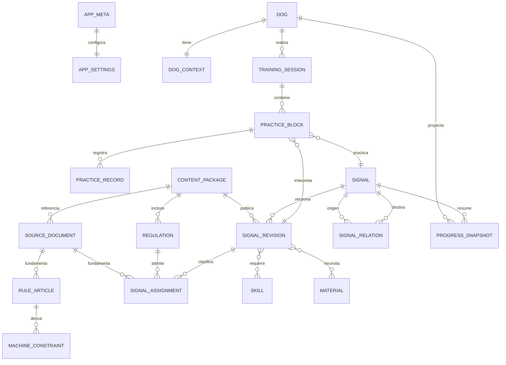
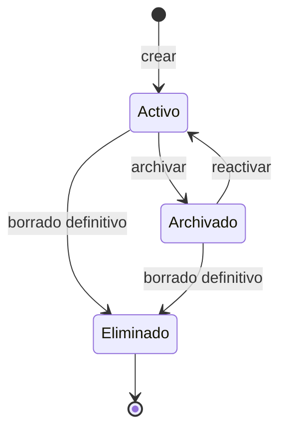

# PRD — Capítulo 07: Modelo de datos

| Campo | Valor |
|---|---|
| Producto | Rally O Trainer |
| Estado del capítulo | Borrador técnico para aprobación |
| Fecha | 5 de agosto de 2026 |
| Alcance | Entidades, relaciones, tablas, invariantes, índices, proyecciones, versiones y copias |
| Capítulo anterior | 06 — Arquitectura técnica |
| Próximo capítulo | Base reglamentaria y estructura de señales |

> Este capítulo define el modelo lógico y su representación prevista en IndexedDB/Dexie. Los nombres son contractuales para documentación y pruebas, pero pueden adaptarse durante implementación si se conserva su significado y trazabilidad.

---

## Análisis previo

### 1. Hipótesis sometidas a revisión

| Hipótesis | Punto débil | Resolución propuesta |
|---|---|---|
| El perro debe guardar su grado actual. | El grado depende de señales, lados y reglas; quedaría obsoleto y sería editable sin evidencia. | Calcular nivel recomendado como proyección. El perro solo guarda identidad mínima. |
| Una señal es una fila que se actualiza cuando cambia el reglamento. | Sobrescribirla modifica el significado de sesiones antiguas. | Separar identidad estable de señal y revisiones inmutables. |
| RSCE y FCI necesitan tablas independientes. | Duplicaría consultas y lógica; las diferencias son de autoridad, paquete y relaciones. | Modelo común con autoridad y nivel explícitos. |
| Un resultado agregado puede convertirse en varios intentos. | Inventaría orden, momento y ayudas no registrados. | Usar un registro discriminado de tipo agregado con conteos reales. |
| Progreso y próximo repaso deben ser campos de la señal o el perro. | Mezclarían contenido global con estado individual y producirían múltiples autoridades. | Proyecciones por perro, señal, lado y contexto, regenerables desde hechos. |
| Todas las listas de catálogo necesitan tablas. | Materiales, ubicaciones y estados pequeños pueden sobredimensionar el esquema. | Usar catálogos versionados solo cuando tengan identidad editorial; enums para estados técnicos cerrados. |
| La raza requiere un catálogo oficial. | No interviene inicialmente en el algoritmo y una lista crea problemas con cruces y denominaciones. | Texto libre normalizado, sin inferencias deportivas. |
| Una sesión solo necesita apuntar a la señal actual. | Las actualizaciones reglamentarias romperían el historial. | Cada bloque apunta a una revisión concreta; la sesión conserva además el contexto aceptado. |
| Deshacer debe conservar un evento de auditoría. | El toque deshecho es un error no confirmado como hecho válido y no existe requisito de auditoría. | Eliminar el último registro reversible dentro de la sesión activa y recalcular. |
| Las sesiones completadas deben poder editar cada intento. | Añade auditoría, conflictos y UI compleja para un caso no validado. | En el MVP, una sesión completada es inmutable; se puede eliminar completa con confirmación. |
| La copia debe incluir las proyecciones para restaurar rápido. | Puede restaurar cálculos obsoletos o incompatibles. | Exportar hechos, preferencias y contenido histórico mínimo; regenerar proyecciones. |

### 2. Tensiones de modelado

#### 2.1 Sencillez frente a evolución reglamentaria

Un esquema plano sería suficiente para una demostración de Debutante, pero no para cuatro grados, FCI y revisiones futuras. La complejidad necesaria se concentrará en contenido versionado; el perfil y la captura diaria permanecerán pequeños.

#### 2.2 Intento individual frente a bloque agregado

Ambos son evidencia válida, pero tienen diferente precisión. Se compartirán campos de contexto y se distinguirán mediante una unión discriminada. El algoritmo recibirá la procedencia y no asumirá una secuencia inexistente.

#### 2.3 Identidad estable frente a numeración oficial

El número o nombre de una señal puede cambiar. No será clave primaria. Cada señal tendrá un identificador interno estable y cada revisión conservará los datos visibles de su edición.

#### 2.4 Eliminación frente a trazabilidad

Eliminar un perro o sesión cambia progreso y recomendaciones. Archivar será la opción normal para perros; eliminar definitivamente será una operación separada y transaccional. Las sesiones erróneas podrán eliminarse completas, dejando que las proyecciones se reconstruyan.

#### 2.5 Días distintos y zona horaria

“Dos días diferentes” no se puede calcular de forma fiable únicamente con UTC. Cada sesión guardará instante UTC, fecha civil local y zona horaria cuando esté disponible. Los cálculos históricos usarán la fecha local registrada, no la zona actual del dispositivo.

### 3. Mejoras propuestas y justificación

#### 3.1 Identificadores locales intercambiables

Todas las entidades del usuario usarán UUID generados mediante `crypto.randomUUID()`. No se usarán claves autoincrementales, porque dificultarían restauración, combinación futura y referencias estables.

#### 3.2 Revisiones publicadas inmutables

Una corrección editorial crea una revisión nueva. La anterior puede quedar sustituida para nuevas recomendaciones, pero continúa disponible para interpretar sesiones históricas.

#### 3.3 Proyecciones con versión de reglas

Cada caché de progreso indicará qué versión del algoritmo la produjo y hasta qué hechos calculó. Si cambia la versión o se modifica el historial, la proyección se invalida.

#### 3.4 Copia independiente de la base física

El archivo de copia no reproducirá tablas Dexie sin contexto. Tendrá un contrato semántico propio, versionado y validable, para poder cambiar índices o tablas sin invalidar copias antiguas.

---

## Versión definitiva

### 1. Principios del modelo

1. **Identidad no es presentación.** Nombres, números y etiquetas no son claves.
2. **Hechos antes que cálculos.** Sesiones y registros son autoridad; progreso es derivado.
3. **Contenido publicado es inmutable.** Las correcciones crean revisiones.
4. **Toda referencia histórica debe sobrevivir.** Una actualización no rompe una sesión anterior.
5. **El contexto forma parte de la evidencia.** Perro, señal, revisión, lado, ubicación y modalidad no se infieren después.
6. **No inventar precisión.** Un agregado conserva conteos, no intentos ficticios.
7. **Eliminación explícita y completa.** Ningún borrado deja referencias huérfanas.
8. **Copias semánticas.** La portabilidad no depende del esquema físico de IndexedDB.
9. **Versiones en cada frontera.** Base, contenido, reglas y formato de copia evolucionan por separado.

### 2. Dominios de datos

| Dominio | Contenido | Naturaleza |
|---|---|---|
| Aplicación | Metadatos, versiones y diagnóstico local | Técnico persistente |
| Preferencias | Perro activo, tema, ubicación e inventario | Configuración local |
| Perros | Nombre, raza y ciclo de vida | Hecho editable |
| Contenido | Autoridades, paquetes, señales, revisiones y relaciones | Editorial versionado |
| Entrenamiento | Sesiones, bloques y registros | Hecho deportivo declarado |
| Progreso | Estados, repasos y resúmenes | Proyección regenerable |
| Portabilidad | Manifiesto y carga útil de copia | Contrato externo versionado |

No habrá tablas de usuarios, cuentas, clubes, instructores, competiciones, pagos, mensajes o telemetría.

### 3. Diagrama entidad-relación



Las relaciones muchos-a-muchos de habilidades y materiales se representarán inicialmente como arrays de identificadores dentro de `SignalRevision`. Solo se normalizarán en tablas de unión si las consultas reales lo requieren.

### 4. Convenciones comunes

#### 4.1 Identificadores

- Entidades creadas localmente: UUID v4 mediante Web Crypto.
- Entidades editoriales: identificadores estables legibles con espacio de nombres, por ejemplo `rsce:signal:001`.
- Revisiones: identificador propio, no una fecha usada como clave.
- Ninguna referencia usará el índice de una lista.

#### 4.2 Fechas

| Campo | Formato | Uso |
|---|---|---|
| Instante | entero epoch en milisegundos UTC | Orden, duración y comparación absoluta |
| Fecha civil | `YYYY-MM-DD` | Criterios de días distintos |
| Zona horaria | nombre IANA cuando esté disponible | Explicación y reconstrucción |
| Desfase | minutos respecto a UTC | Respaldo cuando no exista zona IANA |

No se almacenarán objetos `Date` en el formato de copia. La capa de aplicación podrá convertirlos al consultar.

#### 4.3 Texto

- Guardar Unicode sin transliteración.
- Conservar texto visible y una forma normalizada solo cuando sea necesaria para buscar.
- No usar texto traducido como enum o clave.
- Limitar notas y nombres mediante reglas explícitas para evitar archivos desproporcionados.

#### 4.4 Versiones

| Versión | Propósito |
|---|---|
| `databaseSchemaVersion` | Estructura física Dexie |
| `dataModelVersion` | Significado lógico del modelo |
| `contentSchemaVersion` | Forma de paquetes editoriales |
| `contentPackageVersion` | Edición concreta de contenido |
| `progressRulesVersion` | Cálculo de estados y repaso |
| `plannerRulesVersion` | Selección y explicación de recomendaciones |
| `backupFormatVersion` | Contrato del archivo exportado |

### 5. Entidades de aplicación y preferencias

#### 5.1 `AppMeta`

Registro único con clave `app`.

| Campo | Tipo | Obligatorio | Regla |
|---|---|:---:|---|
| `id` | literal `app` | Sí | Clave única |
| `instanceId` | UUID | Sí | Se crea una vez por instalación/restauración según política |
| `installedAt` | epoch ms | Sí | Primera inicialización |
| `updatedAt` | epoch ms | Sí | Último cambio técnico |
| `dataModelVersion` | entero | Sí | Versión lógica actual |
| `lastSuccessfulMigration` | entero | Sí | Última migración completada |
| `dataRevision` | entero creciente | Sí | Aumenta en cada transacción de hechos/preferencias |
| `lastIntegrityCheckAt` | epoch ms o `null` | No | Diagnóstico local |
| `lastIntegrityStatus` | enum o `null` | No | `ok`, `warning`, `error` |

`instanceId` no identifica a una persona ni se enviará a ningún servidor.

#### 5.2 `AppSettings`

Registro único con clave `settings`.

| Campo | Tipo | Obligatorio | Valor inicial |
|---|---|:---:|---|
| `id` | literal `settings` | Sí | `settings` |
| `activeDogId` | UUID o `null` | Sí | Primer perro creado |
| `theme` | enum | Sí | `system` |
| `locale` | string BCP 47 | Sí | `es-ES` |
| `lastBackupAt` | epoch ms o `null` | Sí | `null` |
| `backupReminderDismissedUntil` | epoch ms o `null` | No | `null` |
| `hapticsEnabled` | boolean | Sí | `false` |
| `installHintDismissedAt` | epoch ms o `null` | No | `null` |
| `updatedAt` | epoch ms | Sí | Creación |

No guardará duración máxima configurable; conserva tiempo activo y un ciclo fijo de recordatorio cada 15 minutos.

#### 5.3 `DogContext`

Preferencias recordadas por perro.

| Campo | Tipo | Obligatorio | Regla |
|---|---|:---:|---|
| `dogId` | UUID | Sí | Clave y referencia a perro |
| `preferredLocation` | enum | Sí | `home`, `outdoor-small`, `club` |
| `preferredObjective` | enum | Sí | Uno de los objetivos aprobados |
| `availableMaterialIds` | string[] | Sí | Vacío significa que no se presupone material especializado |
| `updatedAt` | epoch ms | Sí | Último cambio |

### 6. Perro

#### 6.1 `Dog`

| Campo | Tipo | Obligatorio | Regla |
|---|---|:---:|---|
| `id` | UUID | Sí | Estable |
| `name` | string | Sí | Recortado, 1–60 caracteres |
| `nameNormalized` | string | Sí | Búsqueda; no visible |
| `breed` | string | Sí | Texto libre, 1–100 caracteres |
| `archivedAt` | epoch ms o `null` | Sí | `null` para activo |
| `createdAt` | epoch ms | Sí | Inmutable |
| `updatedAt` | epoch ms | Sí | Cambia al editar/archivar |

No contiene:

- fotografía;
- grado actual;
- porcentaje de progreso;
- próxima recomendación;
- datos médicos;
- resultados de competición.

#### 6.2 Ciclo de vida



Archivar conserva todo y excluye al perro de selectores normales. El borrado definitivo elimina, en una transacción lógica, contexto, sesiones, bloques, registros y proyecciones del perro. El contenido reglamentario no se elimina.

### 7. Contenido reglamentario

#### 7.1 `ContentPackage`

| Campo | Tipo | Obligatorio | Regla |
|---|---|:---:|---|
| `id` | string estable | Sí | Ej. `rsce-rally-2026` |
| `authority` | enum | Sí | `RSCE`, `FCI` |
| `packageVersion` | semver/string versionada | Sí | No se sobrescribe |
| `schemaVersion` | entero | Sí | Valida estructura |
| `language` | BCP 47 | Sí | Inicialmente `es-ES` |
| `publishedAt` | epoch ms | Sí | Fecha editorial del paquete |
| `effectiveFrom` | fecha civil o `null` | Sí | Vigencia conocida |
| `effectiveTo` | fecha civil o `null` | Sí | `null` si vigente |
| `status` | enum | Sí | `candidate`, `active`, `superseded`, `rejected` |
| `sourceDocumentIds` | string[] | Sí | Al menos uno; referencias explícitas |
| `checksum` | string | Sí | Integridad del paquete serializado |
| `installedAt` | epoch ms | Sí | Momento local |

No se almacenará una copia completa del reglamento salvo que la política de contenido lo permita.

#### 7.1.1 `SourceDocument`

| Campo | Tipo | Obligatorio | Regla |
|---|---|:---:|---|
| `id` | string estable | Sí | No depende de la URL |
| `authority` | enum | Sí | `RSCE`, `FCI` |
| `publisher` | string | Sí | Publicador del recurso consultado |
| `title` | string | Sí | Título visible |
| `canonicalUrl` | URL HTTPS | Sí | Enlace directo a la fuente |
| `declaredVersion` | string o `null` | Sí | `null` si no se declara; no se infiere |
| `approvedAt` | fecha civil o `null` | Sí | Si la fuente la indica |
| `effectiveFrom` | fecha civil o `null` | Sí | Vigencia conocida |
| `lastModifiedAt` | fecha civil o `null` | Sí | Si está declarada |
| `retrievedAt` | epoch ms | Sí | Última comprobación editorial |
| `fileChecksum` | string o `null` | Sí | SHA-256 cuando se procese el archivo |
| `language` | BCP 47 | Sí | Idioma de la fuente |
| `status` | enum | Sí | `current`, `superseded`, `unknown` |

#### 7.2 `Regulation`

Representa una agrupación navegable dentro de una autoridad.

| Campo | Tipo | Obligatorio | Ejemplo |
|---|---|:---:|---|
| `id` | string estable | Sí | `rsce:grade:debutante` |
| `packageId` | string | Sí | Paquete que publica esta revisión |
| `authority` | enum | Sí | `RSCE` |
| `code` | string | Sí | `debutante`, `grade-1`, `grade-2`, `grade-3`, `international` |
| `name` | string | Sí | Nombre visible |
| `progressionOrder` | entero | Sí | Orden recomendado, no permiso |
| `description` | string | No | Explicación breve |
| `active` | boolean | Sí | Disponible para nueva práctica |

#### 7.2.1 `RuleArticle`

Representa un apartado consultable del reglamento. No se ejecuta como lógica de aplicación.

| Campo | Tipo | Obligatorio | Regla |
|---|---|:---:|---|
| `id` | string estable | Sí | Identidad editorial |
| `sourceDocumentId` | string | Sí | Fuente primaria |
| `parentId` | string o `null` | Sí | Jerarquía sin ciclos |
| `sourceLocator` | objeto | Sí | Página y epígrafe |
| `scope` | enum[] | Sí | Contextos donde aplica |
| `title` | string | Sí | Título navegable |
| `regulatorySummary` | string | Sí | Redacción propia fiel |
| `plainExplanation` | string | Sí | Lenguaje accesible |
| `editorialStatus` | enum | Sí | Flujo editorial común |

#### 7.2.2 `MachineConstraint`

Representa solo una regla determinista necesaria para planificar, validar un recorrido o preparar una sesión. No admite código arbitrario.

| Campo | Tipo | Obligatorio | Regla |
|---|---|:---:|---|
| `id` | string estable | Sí | Identidad versionada |
| `ruleArticleId` | string | Sí | Justificación humana |
| `context` | objeto validado | Sí | Autoridad, grado y edición |
| `kind` | enum cerrado | Sí | Tipo soportado por el dominio |
| `parameters` | objeto discriminado | Sí | Esquema dependiente de `kind` |
| `severity` | enum | Sí | `error`, `warning`, `information` |
| `testCaseIds` | string[] | Sí | Al menos una prueba al publicar |

#### 7.3 `Signal`

Identidad estable independiente de una edición.

| Campo | Tipo | Obligatorio | Regla |
|---|---|:---:|---|
| `id` | string estable | Sí | Con autoridad y espacio de nombres |
| `authority` | enum | Sí | RSCE o FCI |
| `canonicalKey` | string | Sí | Único dentro de autoridad |
| `createdAt` | epoch ms editorial | Sí | Primera incorporación |

No guarda nombre, número o descripción vigentes; pertenecen a la revisión.

#### 7.4 `SignalRevision`

| Campo | Tipo | Obligatorio | Regla |
|---|---|:---:|---|
| `id` | string estable de revisión | Sí | Inmutable tras publicación |
| `signalId` | string | Sí | Referencia a identidad |
| `packageId` | string | Sí | Paquete de origen |
| `revisionNumber` | entero | Sí | Creciente por señal |
| `officialNumber` | string o `null` | Sí | Valor visible, nunca clave |
| `name` | string | Sí | Denominación visible |
| `regulatoryDescription` | string | Sí | Redacción propia fiel |
| `plainExplanation` | string | Sí | Lenguaje accesible |
| `trainingAdvice` | string | Sí | Pauta en positivo |
| `sideMode` | enum | Sí | `not-applicable`, `left-only`, `right-only`, `both` |
| `skillIds` | string[] | Sí | Habilidades implicadas |
| `materialRequirements` | objeto[] | Sí | Material, `requiredForFinalExecution` y `usefulForLearning`; puede estar vacío |
| `locationIds` | enum[] | Sí | Una o más ubicaciones viables |
| `prerequisiteSignalIds` | string[] | Sí | Grafo dirigido sin ciclos |
| `illustration` | `AssetReference` o `null` | Sí | Solo recurso propio |
| `searchTerms` | string[] | Sí | Términos editoriales normalizados |
| `progressCompatibilityKey` | string | Sí | Define si evidencia anterior puede combinarse |
| `editorialStatus` | enum | Sí | `draft`, `reviewed`, `published`, `superseded` |
| `reviewedBy` | string | No | Identificador editorial local, no cuenta |
| `reviewedAt` | epoch ms o `null` | Sí | Requerido para publicar |

`progressCompatibilityKey` cambia cuando una revisión modifica de forma sustancial la ejecución evaluada. Una corrección de redacción que no cambia la habilidad podrá conservar la clave.

#### 7.4.1 `SignalAssignment`

Relaciona una revisión con todos los grados o clases en los que se admite. Evita duplicar señales de grupos inferiores que reaparecen en grados superiores.

| Campo | Tipo | Obligatorio | Regla |
|---|---|:---:|---|
| `id` | string estable | Sí | Único por revisión y contexto |
| `signalRevisionId` | string | Sí | Revisión exacta |
| `regulationId` | string | Sí | Grado o clase |
| `exerciseGroup` | enum | Sí | `1`, `2`, `3`, `4`, `national`, `system` |
| `role` | enum | Sí | `exercise`, `start`, `finish` |
| `availability` | enum | Sí | `included`, `excluded`, `conditional` |
| `effectiveFrom` | fecha civil o `null` | Sí | Inicio conocido |
| `effectiveTo` | fecha civil o `null` | Sí | Fin conocido |
| `sourceDocumentId` | string | Sí | Fuente de la asignación |
| `sourceLocator` | objeto | Sí | Página y epígrafe |

Las asignaciones con rol `start` o `finish` no generan progreso.

#### 7.5 `SignalRelation`

Relaciones que no pertenecen a una única revisión o necesitan metadatos.

| Campo | Tipo | Obligatorio | Regla |
|---|---|:---:|---|
| `id` | string estable | Sí | Único |
| `fromSignalId` | string | Sí | Origen |
| `toSignalId` | string | Sí | Destino |
| `type` | enum | Sí | `equivalent`, `related`, `progression`, `alternative` |
| `direction` | enum | Sí | `directed`, `bidirectional` |
| `strength` | enum | Sí | `exact`, `partial`, `supporting` |
| `notes` | string o `null` | Sí | Justificación editorial |
| `packageId` | string | Sí | Procedencia |

Las equivalencias RSCE/FCI no se deducirán por número o nombre.

#### 7.6 `Skill`

| Campo | Tipo | Obligatorio | Regla |
|---|---|:---:|---|
| `id` | string estable | Sí | Independiente de autoridad cuando sea transversal |
| `name` | string | Sí | Lenguaje accesible |
| `description` | string | Sí | Conducta observable |
| `category` | string | Sí | Clasificación editorial |
| `prerequisiteSkillIds` | string[] | Sí | Sin ciclos |
| `active` | boolean | Sí | Disponible |

Las habilidades permiten compartir prerrequisitos entre señales y autoridades. El progreso visible seguirá centrado en señales en el MVP; la habilidad podrá alimentar planificación sin crear otra navegación.

#### 7.7 `Material`

| Campo | Tipo | Obligatorio | Ejemplos |
|---|---|:---:|---|
| `id` | string estable | Sí | `cone`, `jump`, `sign-holder`, `natural-marker` |
| `name` | string | Sí | Cono, salto, soporte, elemento natural |
| `portable` | boolean | Sí | Ayuda a explicar ubicación |
| `specialized` | boolean | Sí | No se presupone si es `true` |
| `active` | boolean | Sí | Vigente en el catálogo |

La referencia desde `SignalRevision` distinguirá `requiredForFinalExecution` y `usefulForLearning`. Premios y correa podrán figurar como recomendaciones generales, pero no necesariamente como requisitos que bloqueen una señal.

### 8. Entrenamiento

#### 8.1 `TrainingSession`

| Campo | Tipo | Obligatorio | Regla |
|---|---|:---:|---|
| `id` | UUID | Sí | Estable |
| `dogId` | UUID | Sí | Un único perro |
| `status` | enum | Sí | `active`, `paused`, `completed`, `discarded` |
| `origin` | enum | Sí | `recommended`, `substituted`, `manual` |
| `objective` | enum | Sí | Objetivo aprobado |
| `location` | enum | Sí | Contexto de práctica |
| `trainingMode` | enum | Sí | `repetition`, `circuit` |
| `targetAttempts` | entero | Sí | `10` por señal |
| `breakCount` | entero | Sí | Descansos iniciados |
| `quickImpressions` | string[] | Sí | Selección opcional |
| `activeSince` | epoch ms o `null` | Sí | Inicio del tramo activo |
| `effectiveTrainingMs` | entero | Sí | Acumulado sin pausas |
| `restCycleStartedAt` | epoch ms o `null` | Sí | Base del aviso recurrente |
| `pausedAt` | epoch ms o `null` | Sí | Momento de pausa |
| `pauseKind` | enum o `null` | Sí | `manual`, `break` |
| `startedAt` | epoch ms | Sí | UTC |
| `startedLocalDate` | fecha civil | Sí | Días diferentes |
| `timeZone` | string o `null` | Sí | IANA si existe |
| `utcOffsetMinutes` | entero | Sí | Respaldo |
| `endedAt` | epoch ms o `null` | Sí | Requerido si completada |
| `endReason` | enum o `null` | Sí | Requerido si completada |
| `recommendationReasonCode` | string o `null` | Sí | `null` si manual |
| `recommendationReasonParams` | objeto JSON o `null` | Sí | Datos estructurados mínimos |
| `recommendationTextSnapshot` | string o `null` | Sí | Texto mostrado al aceptar |
| `plannerRulesVersion` | string | Sí | Versión que propuso |
| `progressRulesVersionAtStart` | string | Sí | Contexto inicial |
| `appVersion` | string | Sí | Diagnóstico |
| `notes` | string o `null` | Sí | Opcional, máximo definido |
| `createdAt` | epoch ms | Sí | Persistencia |
| `updatedAt` | epoch ms | Sí | Último cambio |

Motivos de finalización:

- `completed-goal`;
- `tiredness`;
- `distraction`;
- `time-limit`;
- `too-difficult`;
- `unwell`;
- `other`.

Una sesión completada puede tener menos de diez registros por señal. Una sesión descartada se conserva para trazabilidad, pero no aporta evidencia ni aparece en el historial normal.

#### 8.2 `PracticeBlock`

| Campo | Tipo | Obligatorio | Regla |
|---|---|:---:|---|
| `id` | UUID | Sí | Estable |
| `sessionId` | UUID | Sí | Sesión propietaria |
| `sequence` | entero | Sí | Único dentro de sesión |
| `signalId` | string | Sí | Identidad estable |
| `signalRevisionId` | string | Sí | Revisión practicada |
| `progressCompatibilityKey` | string | Sí | Instantánea de compatibilidad |
| `side` | enum | Sí | `not-applicable`, `left`, `right` |
| `practiceContext` | enum | Sí | `individual`, `course` |
| `inputMode` | enum | Sí | `attempt` |
| `startedAt` | epoch ms | Sí | Orden temporal |
| `endedAt` | epoch ms o `null` | Sí | Puede cerrarse con sesión |
| `notes` | string o `null` | Sí | Opcional |

Repetición usa `practiceContext = individual`; circuito usa `course`. La sesión crea un bloque por cada señal seleccionada.

#### 8.3 `PracticeRecord`

Registro individual almacenado en una sola tabla. El modelo agregado propuesto inicialmente no se implementa porque contradice el avance automático y no es necesario para el uso en pista.

Campos comunes:

| Campo | Tipo | Obligatorio | Regla |
|---|---|:---:|---|
| `id` | UUID | Sí | Estable |
| `blockId` | UUID | Sí | Bloque propietario |
| `sequence` | entero | Sí | Único dentro de bloque |
| `sessionSequence` | entero | No | Orden global de sesión para deshacer |
| `recordedAt` | epoch ms | Sí | Momento de registro |
| `repetitionNumber` | entero | No | 1–10 |
| `circuitRound` | entero | No | 1–10 en circuito |

Variante `attempt`:

| Campo | Tipo | Regla |
|---|---|---|
| `result` | enum | Nuevos: `incorrect`, `autonomous`; `assisted` solo histórico |

Tipos de ayuda:

- `extra-verbal-cue`;
- `extra-gesture`;
- `visible-lure`;
- `leash-guidance`;
- `body-help`;
- `reduced-distance`;
- `simplified-exercise`;
- `other`.

La interfaz presenta `autonomous` como **Correcta**. Se conserva el valor `assisted` para no destruir sesiones y copias anteriores; en resúmenes nuevos cuenta como no correcto.

Un bloque no mezclará registros `attempt` y `aggregate` en el MVP. Cambiar el modo después de registrar exigirá descartar los registros del bloque con confirmación.

### 9. Progreso y repaso

#### 9.1 Fuente de cálculo

El motor transforma registros en unidades de evidencia:

```text
PracticeRecord + PracticeBlock + TrainingSession + SignalRevision
    -> PracticeEvidence
    -> ProgressResult
```

`PracticeEvidence` es un tipo de dominio en memoria, no una tabla autoritativa.

#### 9.2 `ProgressSnapshot`

Caché regenerable.

| Campo | Tipo | Obligatorio | Regla |
|---|---|:---:|---|
| `id` | string compuesto estable | Sí | perro + señal + compatibilidad + lado + contexto |
| `dogId` | UUID | Sí | Partición principal |
| `signalId` | string | Sí | Señal |
| `progressCompatibilityKey` | string | Sí | Evidencia compatible |
| `side` | enum | Sí | Separado cuando aplica |
| `practiceContext` | enum | Sí | Individual/recorrido separado |
| `state` | enum | Sí | Estados aprobados |
| `autonomousCountInWindow` | entero | Sí | Explicación |
| `assistedCountInWindow` | entero | Sí | Explicación |
| `incorrectCountInWindow` | entero | Sí | Explicación |
| `evidenceCountInWindow` | entero | Sí | Denominador real |
| `distinctLocalDays` | entero | Sí | Consistencia |
| `lastPracticedAt` | epoch ms o `null` | Sí | Fecha más reciente |
| `lastIndividualAt` | epoch ms o `null` | Sí | Repaso individual |
| `lastCourseAt` | epoch ms o `null` | Sí | Futuro recorrido |
| `learnedAt` | epoch ms o `null` | Sí | Primer logro conservado |
| `consolidatedAt` | epoch ms o `null` | Sí | Primer logro conservado |
| `nextReviewAt` | epoch ms o `null` | Sí | Cola de repaso |
| `reviewReasonCodes` | string[] | Sí | Explicación |
| `calculatedAt` | epoch ms | Sí | Diagnóstico |
| `progressRulesVersion` | string | Sí | Invalida al cambiar |
| `sourceDataRevision` | entero | Sí | Invalida al cambiar hechos |

No se exportará como autoridad. Tras restaurar podrá omitirse o marcarse inválida y regenerarse.

#### 9.3 Estado global de una señal

Cuando una señal requiere ambos lados:

- existen proyecciones separadas izquierda y derecha;
- el estado global se calcula al consultar;
- no necesita una tabla adicional;
- el estado global será el menos avanzado de los lados requeridos;
- la explicación indicará el lado limitante.

Cuando una señal no aplica a lados, usa `side = not-applicable`.

#### 9.4 Cola de repaso

No habrá tabla `ReviewQueue`. Se consultarán `ProgressSnapshot` por:

- `dogId`;
- `state = needs-review`; o
- `nextReviewAt <= now`.

Esto evita duplicar fechas y estados. El planificador podrá combinar esa consulta con ubicación, material y objetivo.

### 10. Índices previstos para Dexie

La sintaxis definitiva se escribirá al implementar, pero se aprueban estas necesidades de consulta:

| Tabla | Clave primaria | Índices iniciales |
|---|---|---|
| `appMeta` | `id` | Ninguno |
| `appSettings` | `id` | Ninguno |
| `dogs` | `id` | `nameNormalized`, `archivedAt`, `updatedAt` |
| `dogContexts` | `dogId` | `preferredLocation`, multiEntry `availableMaterialIds` si se necesita |
| `contentPackages` | `id` | `[authority+packageVersion]`, `status`, `installedAt` |
| `sourceDocuments` | `id` | `authority`, `status`, `retrievedAt` |
| `regulations` | `id` | `[authority+progressionOrder]`, `packageId`, `active` |
| `ruleArticles` | `id` | `sourceDocumentId`, `parentId`, multiEntry `scope`, `editorialStatus` |
| `machineConstraints` | `id` | `ruleArticleId`, `kind`, `severity` |
| `signals` | `id` | `[authority+canonicalKey]` |
| `signalRevisions` | `id` | `signalId`, `packageId`, `[signalId+revisionNumber]`, `editorialStatus`, multiEntry `skillIds` |
| `signalAssignments` | `id` | `signalRevisionId`, `regulationId`, `[regulationId+exerciseGroup]`, `role`, `availability` |
| `signalRelations` | `id` | `fromSignalId`, `toSignalId`, `[fromSignalId+type]`, `packageId` |
| `skills` | `id` | `category`, `active` |
| `materials` | `id` | `specialized`, `active` |
| `trainingSessions` | `id` | `dogId`, `status`, `startedAt`, `[dogId+startedAt]`, `[dogId+status]` |
| `practiceBlocks` | `id` | `sessionId`, `signalId`, `signalRevisionId`, `[sessionId+sequence]`, `[signalId+side]` |
| `practiceRecords` | `id` | `blockId`, `kind`, `recordedAt`, `[blockId+sequence]` |
| `progressSnapshots` | `id` | `dogId`, `signalId`, `state`, `nextReviewAt`, `[dogId+state]`, `[dogId+nextReviewAt]`, `progressRulesVersion` |

No se indexarán notas ni descripciones completas. La búsqueda textual de señales podrá usar términos normalizados en memoria mientras el volumen lo permita; no se añadirá un motor de búsqueda anticipadamente.

### 11. Reglas de integridad

#### 11.1 Integridad referencial

IndexedDB no aplica claves foráneas; la capa de aplicación deberá garantizar:

- todo `DogContext` referencia un perro existente;
- toda sesión referencia un perro existente o incluido en la misma restauración;
- todo bloque referencia su sesión, señal y revisión;
- todo registro referencia su bloque;
- todo paquete referencia documentos fuente existentes;
- todo artículo referencia un documento fuente;
- toda restricción ejecutable referencia un artículo y al menos una prueba;
- toda revisión referencia un paquete;
- toda asignación referencia revisión, reglamento y documento fuente;
- toda relación referencia señales existentes;
- toda habilidad/material referenciado existe y está disponible en el paquete activo o archivo histórico;
- ninguna revisión histórica necesaria se elimina.

#### 11.2 Invariantes de sesión

- Como máximo una sesión con `status = active` por instalación.
- `endedAt` y `endReason` son `null` si está activa.
- Ambos son obligatorios si está completada.
- `endedAt >= startedAt`.
- Cada secuencia de bloque es única dentro de sesión.
- Cada secuencia de registro es única dentro de bloque.
- El lado debe ser compatible con `sideMode` de la revisión.
- Una sesión completada no acepta registros nuevos.

#### 11.3 Invariantes de contenido

- Una revisión `published` tiene revisor y fecha.
- No se recomienda contenido `draft`, `rejected` o `superseded`.
- El grafo de prerrequisitos de señales y habilidades no contiene ciclos.
- Una relación bidireccional no se duplica en dirección inversa.
- `progressCompatibilityKey` no queda vacío.
- Las ubicaciones no están vacías.
- Una revisión publicada tiene al menos una asignación vigente.
- Las señales de sistema con rol `start` o `finish` quedan excluidas de progreso.
- Ninguna restricción ejecutable contiene código arbitrario.
- Todo recurso de ilustración es propio y resoluble offline antes de publicar.

#### 11.4 Invariantes de progreso

- La proyección coincide con `sourceDataRevision` o se considera inválida.
- `learnedAt` no se borra al pasar a necesita repaso.
- `consolidatedAt` no precede a `learnedAt`.
- Los conteos nunca son negativos.
- El estado global no supera el estado del lado menos avanzado cuando se requieren ambos.

### 12. Operaciones y efectos

| Operación | Escrituras | Invalidaciones |
|---|---|---|
| Crear perro | `Dog`, `DogContext`, quizá `AppSettings.activeDogId` | Recomendación del perro |
| Editar perro | `Dog` | Presentaciones; no progreso |
| Archivar perro | `Dog.archivedAt`, posible perro activo | Inicio y selectores |
| Iniciar sesión | `TrainingSession`, todos los `PracticeBlock` seleccionados | Ninguna proyección hasta evidencia |
| Registrar intento | `PracticeRecord`, marcas temporales del bloque/sesión, `dataRevision` | Progreso y recomendación del perro/señal |
| Deshacer | Eliminar último `PracticeRecord`, `dataRevision` | Igual que registro |
| Pausar/reanudar | `TrainingSession` y acumulado temporal | Ninguna proyección |
| Finalizar | `TrainingSession`, `PracticeBlock`, `dataRevision` | Progreso, historial, recomendación |
| Eliminar sesión | Cascada bloques/registros, `dataRevision` | Todas las proyecciones afectadas |
| Activar contenido | Paquete y entidades editoriales | Progreso compatible, biblioteca y recomendación |
| Restaurar | Sustitución del conjunto importado | Todas las proyecciones |
| Borrar todo | Eliminar datos personales y preferencias | Reinicio completo |

### 13. Corrección y eliminación

#### 13.1 Durante sesión activa

- Deshacer elimina el último registro confirmado.
- Podrá descartarse un bloque completo con confirmación si se cambia el modo de entrada.
- Una sesión sin registros creada por error se elimina.

#### 13.2 Después de completar

Para mantener sencillez, el MVP no editará intentos individuales históricos. Desde el detalle podrá:

- añadir o modificar una nota de sesión, si se aprueba como excepción no deportiva;
- eliminar toda la sesión con confirmación;
- recalcular automáticamente progreso e historial.

Una futura edición parcial necesitaría guardar motivo, momento y valores anterior/nuevo. No se anticipará.

#### 13.3 Perros

- Archivar es la acción normal y reversible.
- Borrar definitivamente explica la cascada y ofrece copia.
- No se permite borrar al perro de una sesión activa.
- Si se borra el perro activo, se selecciona otro o se vuelve a incorporación.

### 14. Formato semántico de copia

#### 14.1 Sobre

```json
{
  "format": "rally-o-trainer-backup",
  "formatVersion": 1,
  "exportedAt": 0,
  "appVersion": "0.0.0",
  "dataModelVersion": 1,
  "sourceInstanceId": "uuid",
  "payloadChecksum": "sha256:...",
  "payload": {}
}
```

Los valores son ilustrativos; una copia real no usará instante `0` ni versión `0.0.0`.

#### 14.2 Carga útil

Incluirá:

- perros;
- contextos por perro;
- preferencias relevantes;
- sesiones;
- bloques;
- registros;
- metadatos de versiones de reglas;
- referencias a paquetes activos;
- revisiones mínimas de contenido necesarias para interpretar el historial;
- fecha de última copia previa, solo como información.

Excluirá:

- `ProgressSnapshot` como autoridad;
- cachés de archivos y service worker;
- diagnósticos innecesarios;
- estado de instalación;
- objetos o APIs específicos de Dexie;
- ilustraciones que puedan restaurarse desde el paquete, salvo necesidad de preservar contenido histórico.

#### 14.3 Restauración

1. validar sobre y tamaño;
2. comprobar suma de la carga útil;
3. validar esquema y referencias internas;
4. migrar el formato en memoria si está soportado;
5. mostrar resumen;
6. resolver una sesión activa local antes de continuar;
7. sustituir datos en transacción o staging seguro;
8. regenerar proyecciones;
9. ejecutar integridad;
10. confirmar éxito.

El MVP solo restaurará mediante sustitución completa. Combinar copias se pospone porque requiere resolución de identidad y conflictos.

### 15. Migraciones del modelo

#### 15.1 Tipos

| Tipo | Ejemplo | Tratamiento |
|---|---|---|
| Física | Añadir índice Dexie | Nueva versión de base y prueba |
| Lógica | Separar lado de bloque | Migrar valores y elevar `dataModelVersion` |
| Contenido | Nueva revisión RSCE | Instalar paquete, conservar anterior |
| Reglas | Cambiar umbral de repaso | Elevar versión e invalidar proyecciones |
| Copia | Añadir campo obligatorio | Adaptador desde formatos anteriores |

#### 15.2 Reglas

- Una migración nunca descarga datos de red como requisito.
- Se prueba con fixtures de cada versión soportada.
- No se elimina un campo hasta completar la transformación.
- Si falla, no se abre la aplicación en modo escritura normal.
- El historial se prioriza sobre la caché; una proyección se puede borrar y reconstruir.

### 16. Integridad y diagnóstico

La comprobación local verificará:

- sesión activa única;
- referencias huérfanas;
- sumas agregadas;
- secuencias duplicadas;
- estados de sesión coherentes;
- contenido publicado completo;
- ciclos de prerrequisitos;
- revisiones históricas disponibles;
- proyecciones desactualizadas;
- versión de esquema y reglas.

Los problemas se clasificarán:

| Nivel | Ejemplo | Acción |
|---|---|---|
| Informativo | Caché de progreso desactualizada | Regenerar |
| Advertencia | Ilustración opcional ausente | Mantener uso y registrar diagnóstico |
| Error recuperable | Índice/proyección inconsistente | Reconstruir sin alterar hechos |
| Error crítico | Registro huérfano o migración parcial | Bloquear escritura y ofrecer copia/recuperación |

### 17. Consultas críticas

El modelo debe resolver eficientemente:

1. obtener perro activo;
2. detectar sesión activa;
3. recuperar sesión, bloques y registros ordenados;
4. listar señales activas por autoridad y grado mediante asignaciones;
5. abrir revisión vigente de una señal;
6. conservar revisión histórica por identificador;
7. obtener señales pendientes de repaso por perro y fecha;
8. consultar últimas evidencias compatibles por perro, señal, lado y contexto;
9. listar sesiones de un perro por fecha descendente;
10. listar sesiones donde apareció una señal;
11. filtrar candidatos compatibles con ubicación/material;
12. exportar hechos en orden determinista.

No se optimizarán consultas de comparación social, competiciones, vídeos o sincronización porque están fuera del alcance.

### 18. Datos de ejemplo mínimos para pruebas

El conjunto de fixtures deberá incluir:

- un perro Debutante;
- dos perros con el mismo nombre;
- un perro archivado;
- señal sin lado;
- señal que requiere ambos lados;
- revisión sustituida compatible;
- revisión incompatible;
- relación RSCE/FCI parcial;
- una señal asignada a varios grados;
- señal de sistema excluida de progreso;
- artículo consultable con restricción ejecutable asociada;
- prerrequisitos de varias señales;
- sesión activa interrumpida;
- sesión completada con intentos;
- sesión con agregado 7/10;
- sesión finalizada por indisposición sin intentos;
- progreso aprendido y luego necesita repaso;
- copia válida, antigua, truncada y con referencia huérfana.

### 19. Matriz de trazabilidad

| Requisito | Entidades principales |
|---|---|
| Varios perros independientes | `Dog`, `DogContext`, `TrainingSession` |
| Contenido RSCE/FCI separado | `ContentPackage`, `SourceDocument`, `Regulation`, `Signal` |
| Historial reglamentario | `SignalRevision`, `PracticeBlock` |
| Señal presente en varios grados | `SignalAssignment` |
| Reglamento consultable | `RuleArticle` |
| Validación de recorridos | `MachineConstraint` |
| Recomendación explicable | `TrainingSession` y versiones de reglas |
| Registro rápido | `PracticeRecord: attempt` |
| Registro 7/10 agregado | `PracticeRecord: aggregate` |
| Progreso por lado | `PracticeBlock.side`, `ProgressSnapshot` |
| Repaso a 30 días | Fechas de sesión y `ProgressSnapshot.nextReviewAt` |
| Sesión recuperable | `TrainingSession.status = active` |
| Copia restaurable | Sobre semántico y entidades de hechos |
| Actualización de reglamento | Paquetes y revisiones inmutables |
| Futuro recorrido | `PracticeBlock.practiceContext` |

### 20. Registro de decisiones del capítulo

| ID | Decisión | Estado |
|---|---|---|
| DE-07-001 | UUID locales para entidades del usuario. | Propuesta para aprobación |
| DE-07-002 | Raza como texto libre normalizado. | Propuesta por simplicidad |
| DE-07-003 | Grado actual y progreso no se guardan en `Dog`. | Propuesta para aprobación |
| DE-07-004 | Identidad de señal separada de revisiones inmutables. | Propuesta para aprobación |
| DE-07-005 | Sesiones, bloques y registros son hechos autoritativos. | Derivada del capítulo 04 |
| DE-07-006 | Intentos y agregados comparten tabla mediante unión discriminada. | Propuesta para aprobación |
| DE-07-007 | Un agregado nunca genera intentos ficticios. | Derivada del capítulo 04 |
| DE-07-008 | Progreso se guarda solo como caché regenerable versionada. | Propuesta para aprobación |
| DE-07-009 | No habrá tabla independiente de cola de repaso. | Propuesta por simplicidad |
| DE-07-010 | Las sesiones completadas no se editan intento a intento en el MVP. | Propuesta para aprobación |
| DE-07-011 | Perros se archivan por defecto y se borran mediante flujo separado. | Propuesta para aprobación |
| DE-07-012 | Copias excluyen proyecciones y usan contrato semántico propio. | Propuesta para aprobación |
| DE-07-013 | Restauración MVP sustituye; no combina. | Propuesta por simplicidad |
| DE-07-014 | Fechas civiles locales se guardan junto al instante UTC. | Propuesta para aprobación |
| DE-07-015 | Habilidades modelan prerrequisitos transversales sin crear navegación propia. | Propuesta para aprobación |
| DE-07-016 | La pertenencia a grados se modela con `SignalAssignment`, no dentro de la revisión. | Corregida por capítulo 08 |
| DE-07-017 | Artículos consultables y restricciones ejecutables son estructuras distintas. | Corregida por capítulo 08 |
| DE-07-018 | Inicio y final son señales de sistema y no generan progreso. | Corregida por capítulo 08 |

### 21. Criterios de aceptación del capítulo

- [ ] Cada entidad tiene identificador estable y propietario funcional.
- [ ] El perro solo exige nombre y raza.
- [ ] No existe campo editable de grado o progreso en el perro.
- [ ] Una sesión siempre referencia un perro.
- [ ] Cada bloque referencia identidad y revisión de señal.
- [ ] Las revisiones publicadas no se sobrescriben.
- [ ] RSCE y FCI usan el mismo esquema sin perder autoridad.
- [ ] Una revisión puede asignarse a varios grados sin duplicarse.
- [ ] Todo artículo y restricción ejecutable conserva su fuente.
- [ ] Inicio y final están excluidos del progreso.
- [ ] Intentos y agregados conservan su distinta precisión.
- [ ] Los conteos agregados siempre cuadran con el total.
- [ ] Progreso puede regenerarse desde hechos.
- [ ] Los lados se calculan separadamente cuando procede.
- [ ] Los logros históricos sobreviven al estado necesita repaso.
- [ ] Solo puede existir una sesión activa.
- [ ] Las sesiones activas son persistentes y recuperables.
- [ ] El borrado de perro o sesión no deja referencias huérfanas.
- [ ] Una copia no depende del esquema físico Dexie.
- [ ] Restaurar valida antes de sustituir.
- [ ] Las migraciones conservan hechos aunque descarten proyecciones.
- [ ] El modelo admite futuro contexto de recorrido sin implementar constructor.
- [ ] Todas las consultas críticas tienen ruta de índice o volumen asumible.

## Riesgos

| Riesgo | Impacto | Probabilidad | Mitigación |
|---|---|---:|---|
| El modelo editorial resulta demasiado complejo para cargar contenido manualmente | Alto | Media | Plantillas, validadores y generación controlada desde archivos legibles. |
| `progressCompatibilityKey` se asigna incorrectamente | Alto | Media | Revisión editorial explícita y pruebas con revisiones compatibles/incompatibles. |
| La unión discriminada complica consultas Dexie | Medio | Baja | Índices comunes, validación Zod y repositorio específico de registros. |
| Resultados agregados hacen ambiguas las últimas 10 ejecuciones | Alto | Alta | Mantener procedencia y definir regla conservadora en el algoritmo de repaso. |
| Fechas locales cambian al viajar | Medio | Media | Usar fecha civil registrada y zona del hecho, no la actual. |
| Archivar y borrar se confunden | Alto | Media | Acciones separadas, lenguaje claro y copia previa opcional. |
| El contenido histórico aumenta almacenamiento | Medio | Media | Conservar solo revisiones referenciadas y activos; medir antes de purgar. |
| Una sesión sin intentos afecta indebidamente al algoritmo | Medio | Media | Motivo explícito; el progreso ignora ausencia de evidencia. |
| Eliminar sesión cambia estados de forma inesperada | Medio | Media | Mostrar impacto y recalcular con explicación. |
| Arrays de habilidades o requisitos de material dificultan consultas avanzadas | Bajo | Media | Índices solo donde aporten valor; normalizar si una consulta real lo exige. |
| Copia semántica diverge del modelo interno | Alto | Media | Tests de ida y vuelta y fixtures por versión. |
| Borrado parcial por límite de transacción | Alto | Baja | Operación controlada, integridad posterior y recuperación desde copia. |

## Mejoras posibles

- Añadir un generador de tipos y validadores desde una fuente de esquema única.
- Incorporar una herramienta editorial para revisar grafos y relaciones.
- Guardar motivos de corrección si se permite editar sesiones completadas.
- Normalizar habilidades o requisitos de material cuando el volumen o búsquedas lo justifiquen.
- Añadir firma criptográfica a paquetes externos futuros.
- Permitir combinación de copias mediante una fase explícita de resolución de conflictos.
- Guardar miniaturas o adjuntos locales como dominio separado.
- Crear proyecciones por habilidad cuando aporten valor visible.
- Implementar limpieza segura de revisiones no referenciadas.
- Añadir exportación CSV derivada sin convertirla en formato restaurable.

## Decisiones pendientes

| ID | Decisión | Motivo | Momento límite |
|---|---|---|---|
| DP-07-001 | Regla exacta para mezclar agregados e intentos en la ventana de últimas 10 | No debe inventar orden ni desviarse silenciosamente del criterio 7/10. | Algoritmo de repaso |
| DP-07-002 | Intervalo mínimo para consolidación | Falta concretar días antes de calcular `consolidatedAt`. | Algoritmo de repaso |
| DP-07-003 | Umbral de ayuda recurrente | Determina paso a necesita repaso. | Algoritmo de repaso |
| DP-07-004 | Límite máximo de repeticiones en un agregado | Debe evitar errores y archivos anómalos. | Wireframes y algoritmo |
| DP-07-005 | Lista definitiva de habilidades | El capítulo 08 fija una taxonomía inicial; requiere mapear todas las señales. | Biblioteca de señales |
| DP-07-006 | Compatibilidad de progreso entre revisiones reales | El capítulo 08 fija criterios; cada cambio real requiere decisión editorial. | Biblioteca de señales |
| DP-07-007 | Catálogo definitivo de materiales | El capítulo 08 fija un catálogo inicial; debe validarse señal por señal. | Biblioteca de señales |
| DP-07-008 | Edición de notas en sesiones completadas | Es inocua para progreso, pero rompe inmutabilidad estricta. | Flujos y wireframes |
| DP-07-009 | Tamaños máximos de nombre, raza, notas y copia | Necesitan pruebas con contenido real y UX. | Implementación y plan de pruebas |
| DP-07-010 | Conservación de `instanceId` al restaurar | Depende de futura estrategia de combinación/sincronización. | Importación/exportación |
