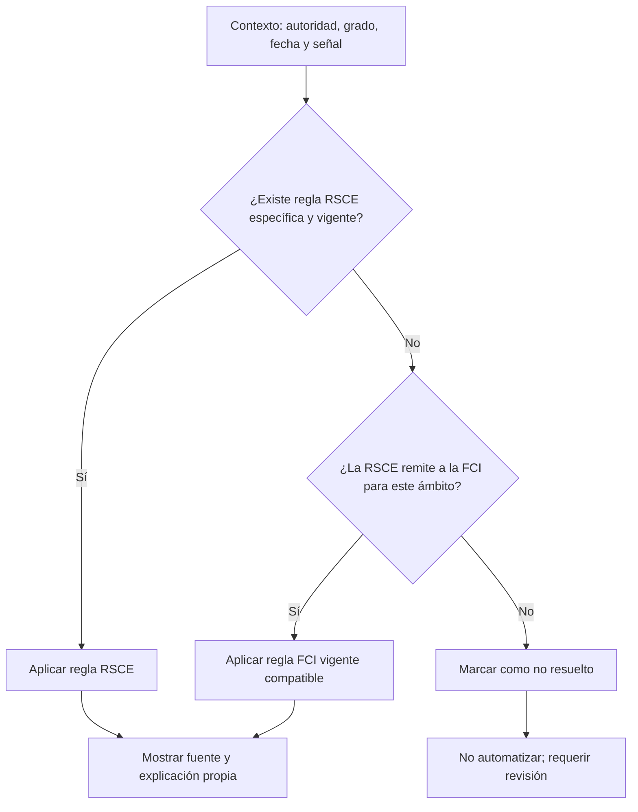
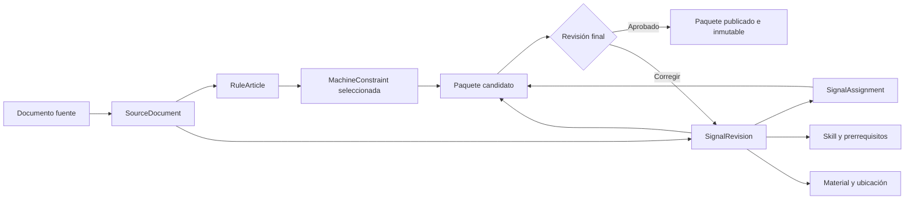
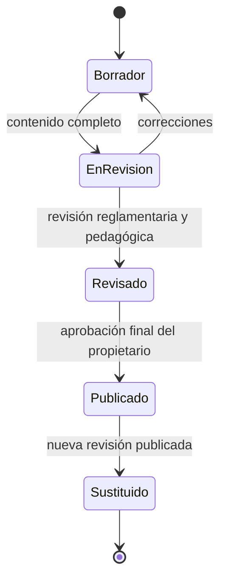

# PRD — Capítulo 08: Base reglamentaria y estructura de señales

| Campo | Valor |
|---|---|
| Producto | Rally O Trainer |
| Estado del capítulo | Borrador funcional y editorial para aprobación |
| Fecha | 5 de agosto de 2026 |
| Alcance | Fuentes, precedencia, cobertura, estructura de señales, reglas ejecutables, taxonomías y proceso editorial |
| Capítulo anterior | 07 — Modelo de datos |
| Próximo capítulo | Biblioteca de señales |

> Este capítulo define cómo convertir reglamentos oficiales en contenido propio, trazable y utilizable por la aplicación. No transcribe todavía la base completa de señales ni sustituye a los documentos de la RSCE o de la FCI.

---

## Análisis previo

### 1. Fuentes verificadas

La revisión se ha realizado sobre fuentes primarias consultadas el 5 de agosto de 2026:

| Código interno | Documento | Autoridad | Edición o vigencia visible | Uso previsto |
|---|---|---|---|---|
| `SRC-RSCE-RULES-2025-12-09` | [Reglamento de Rally Obedience de la RSCE](https://www.rsce.es/documentacion/reglamento-de-rally-obedience/) | RSCE | Aprobado el 17/10/2024; última modificación 09/12/2025 | Fuente prioritaria para España, grados nacionales, excepciones y criterios de ejecución |
| `SRC-RSCE-SIGNS-ES` | [Señales Rally Obedience FCI en español publicadas por la RSCE](https://www.rsce.es/documentacion/senales-rally-obediencia-fci-espanol/) | RSCE como publicador; contenido FCI | La página no muestra una fecha de edición inequívoca | Apoyo visual y terminológico; no será la única fuente para interpretar ejercicios |
| `SRC-FCI-RULES-2025-02-01` | [Reglamento y normas para pruebas internacionales FCI](https://www.fci.be/medias/FCI-ROB-REG-2025-en-19918.pdf) | FCI | 01/02/2025 | Fuente base para la clase internacional y para materias a las que remita la RSCE |
| `SRC-FCI-HUB` | [Página oficial de Rally Obedience de la FCI](https://www.fci.be/es/Rally-Obedience-4746.html) | FCI | Contenido web vigente en la fecha de consulta | Índice canónico para reglamento, señales, resumen y reglas de diseño de recorridos |
| `SRC-RSCE-HUB` | [Archivo oficial de reglamentos de Rally-Obediencia de la RSCE](https://www.rsce.es/tipo-de-reglamentos/rally-obediencia/) | RSCE | Contenido web vigente en la fecha de consulta | Punto de comprobación de nuevas publicaciones |

La aplicación nunca considerará suficiente una copia descargada sin metadatos. Cada publicación de contenido guardará URL, autoridad, título, fecha declarada, fecha de consulta y huella del archivo cuando sea posible.

### 2. Hipótesis sometidas a revisión

| Hipótesis | Debilidad detectada | Resolución |
|---|---|---|
| RSCE y FCI son dos catálogos independientes. | La RSCE incorpora grupos FCI en Debutante, RO1 y RO2, y remite a la FCI para RO3. | Mantener autoridades separadas, pero resolver la aplicación mediante una base FCI y asignaciones o excepciones RSCE explícitas. |
| Cada señal pertenece a un solo grado. | Las señales de grupos inferiores reaparecen en grados superiores. | Separar la revisión de la señal de su asignación a grados y clases. |
| El número oficial identifica una señal para siempre. | Puede cambiar entre ediciones y puede coincidir en ámbitos distintos. | Usar identificador interno estable; número, grupo y nombre pertenecen a una revisión. |
| “Texto oficial” puede copiarse directamente en la aplicación. | Aumenta el riesgo de desactualización, problemas de reproducción y lenguaje poco accesible. | Publicar una redacción reglamentaria propia y fiel, siempre enlazada a la fuente. |
| El reglamento completo debe transformarse en reglas de software. | Crearía un motor complejo y frágil para materias que la app solo necesita mostrar. | Separar artículos informativos de un conjunto pequeño de restricciones ejecutables. |
| Desbloquear significa impedir el acceso. | Contradice la consulta libre solicitada y puede frustrar a un guía que necesita anticipar contenido. | Todo será consultable; el progreso solo controla qué se recomienda. |
| Una equivalencia se puede deducir por nombre o número. | Dos ejercicios parecidos pueden diferir en posición inicial, lado, pausa o final. | Toda equivalencia RSCE–FCI requiere revisión manual y una justificación. |
| Una señal tiene una única forma de entrenarse. | El aprendizaje necesita aproximaciones, ayudas y retirada progresiva de ayuda. | Separar ejecución reglamentaria de explicación y progresión de entrenamiento. |

### 3. Puntos débiles de las fuentes

#### 3.1 Relación normativa no plana

El reglamento RSCE indica que los grados españoles se juzgan conforme a la normativa internacional salvo norma nacional específica. También define RO3 por remisión a la FCI. Una simple etiqueta de autoridad no permite resolver qué regla aplicar.

#### 3.2 Fechas no uniformes

El reglamento RSCE declara fecha de modificación y el reglamento FCI declara fecha de edición, pero el PDF español de señales no expone en su página una versión inequívoca. La ausencia de fecha no se rellenará por inferencia.

#### 3.3 PDF visual frente a dato estructurado

Los documentos de señales están diseñados para imprimir y mirar, no para importarse como datos. La extracción automática puede perder flechas, posiciones, pausas o secuencia. Ningún ejercicio se publicará basándose solo en OCR o texto extraído.

#### 3.4 Alcance mayor que el objetivo inmediato

El reglamento incluye organización de pruebas, licencias, jueces y administración. Convertirlo íntegramente en funcionalidad desviaría el producto de su finalidad: planificar y registrar entrenamiento.

#### 3.5 Lenguaje de competición frente a entrenamiento

Una descripción reglamentaria explica qué debe ejecutarse, pero no necesariamente cómo enseñarlo de forma segura y positiva. Mezclar ambos discursos haría ambiguo el criterio de éxito.

### 4. Mejoras propuestas y justificación

#### 4.1 Jerarquía de precedencia por ámbito

No se aplicará una prioridad global ciega. Para una práctica en España:

1. se aplica la regla RSCE específica cuando exista;
2. en ausencia de excepción nacional, se usa la regla FCI a la que remite la RSCE;
3. en contenido de clase internacional pura, se usa la FCI;
4. una explicación propia nunca prevalece sobre la fuente.

Esto respeta la prioridad solicitada para la RSCE sin falsear la remisión internacional.

#### 4.2 Tres capas editoriales visibles

Cada señal distinguirá:

- **Qué pide el reglamento:** redacción propia y fiel;
- **En palabras sencillas:** traducción pedagógica sin cambiar el criterio;
- **Cómo empezar a entrenarlo:** consejo positivo, gradual y no normativo.

La interfaz no llamará “texto oficial” a una paráfrasis. Usará “Descripción reglamentaria” y mostrará la fuente oficial aparte.

#### 4.3 Asignaciones independientes de señal y grado

Se introduce `SignalAssignment`. Así, una misma revisión puede estar disponible en varios grados sin duplicarse, y una actualización puede cambiar una asignación sin reescribir el ejercicio.

#### 4.4 Reglamento informativo y restricciones ejecutables

Se introducen dos estructuras distintas:

- `RuleArticle`, para consulta humana;
- `MachineConstraint`, solo para validaciones concretas del planificador, constructor de pistas o sesión.

Ningún texto se convertirá automáticamente en lógica. Cada restricción ejecutable tendrá prueba y referencia editorial.

#### 4.5 Publicación en lotes revisables

El contenido se incorporará por lotes pequeños: primero RSCE Debutante y fundamentos; después grupos y grados sucesivos. El usuario será el revisor final antes de marcar un lote como publicado.

---

## Versión definitiva

### 1. Propósito de la base reglamentaria

La base reglamentaria debe permitir que Rally O Trainer:

- explique cada señal con fidelidad y lenguaje comprensible;
- recomiende ejercicios adecuados al perro y su progreso;
- prepare sesiones con material y espacio conocidos;
- conserve el significado histórico de entrenamientos anteriores;
- construya recorridos válidos en una fase posterior;
- detecte y absorber futuras revisiones sin migraciones destructivas;
- mantenga separadas la fuente oficial y la interpretación editorial.

No debe:

- presentarse como publicación oficial;
- sustituir la consulta del reglamento vigente;
- emitir decisiones arbitrales;
- interpretar automáticamente ambigüedades reglamentarias;
- copiar o reutilizar las imágenes oficiales;
- convertir reglas administrativas en funciones sin valor para entrenar.

### 2. Declaración de independencia

La biblioteca, la pantalla de reglamento y la ficha de cada señal mostrarán, en un lugar accesible pero no intrusivo:

> Rally O Trainer es una herramienta independiente basada en fuentes oficiales de la RSCE y la FCI. No está afiliada ni sustituye al reglamento vigente. En caso de discrepancia, prevalece la fuente oficial.

Normas de presentación:

- no usar los logotipos de RSCE o FCI como marca propia;
- no emplear “oficial” para describir la aplicación, sus ilustraciones o su redacción;
- sí usar “Fuente oficial” en el enlace al documento de origen;
- mostrar autoridad y edición en cada ficha;
- avisar cuando el contenido esté pendiente de revisión o pueda haber quedado desactualizado.

### 3. Modelo de autoridad y precedencia

#### 3.1 Autoridades

| Autoridad | Función en el producto | Prioridad contextual |
|---|---|---|
| RSCE | Ruta principal, grados españoles y excepciones nacionales | Primera para entrenamiento orientado a competir en España |
| FCI | Base internacional, grupos de señales y clase internacional | Primera para contenido internacional; subsidiaria cuando la RSCE remite a ella |
| Rally O Trainer | Explicación pedagógica, entrenamiento y relaciones de aprendizaje | Nunca normativa |

#### 3.2 Resolución de una regla

#### 3.3 Prohibición de fusión silenciosa

Cuando una regla RSCE modifique una base FCI, la aplicación conservará:

- referencia a ambas fuentes;
- ámbito de la excepción;
- fecha de vigencia;
- explicación breve de qué cambia;
- resultado aplicable en el contexto seleccionado.

No se mostrará una mezcla sin identificar su procedencia.

### 4. Cobertura reglamentaria del producto

#### 4.1 Grados y grupos

La edición RSCE revisada define:

| Ruta | Señales admitidas | Regla de recorrido relevante |
|---|---|---|
| RSCE Debutante | Grupo 1 FCI (`101–122`) y nacionales `13, 14, 15, 16, 25, 26, 28, 33, 34, 35, 36` | 8–10 ejercicios, más inicio y final |
| RSCE Grado 1 | Grupos 1 y 2 FCI (`101–122`, `201–222`) y las mismas nacionales | 10–12 ejercicios; al menos 7 del Grupo 2 |
| RSCE Grado 2 | Grupos 1, 2 y 3 FCI (`101–122`, `201–222`, `301–323`) y las mismas nacionales | 13–16 ejercicios; al menos 7 del Grupo 3 y 5 del Grupo 2 |
| RSCE Grado 3 | Solo grupos FCI 1–4 (`101–422`) | 18–20 ejercicios; al menos 7 del Grupo 4 y 5 del Grupo 3 |

Inicio y final son elementos de recorrido, no habilidades entrenables ordinarias. Se modelarán como señales de sistema y quedarán fuera del cálculo 7/10.

#### 4.2 Inventario esperado para control

| Conjunto | Cantidad esperada | Tratamiento |
|---|---:|---|
| Grupo FCI 1 | 22 | Ejercicios `101–122` |
| Grupo FCI 2 | 22 | Ejercicios `201–222` |
| Grupo FCI 3 | 23 | Ejercicios `301–323` |
| Grupo FCI 4 | 22 | Ejercicios `401–422` |
| Señales nacionales RSCE adicionales | 11 | Numeración nacional independiente |
| Total esperado de ejercicios distintos | 100 | 89 FCI + 11 nacionales |
| Señales de sistema | 2 | Inicio y final; no cuentan como ejercicio entrenado |

Estas cantidades son una comprobación de completitud de la edición analizada, no una constante de código. Una edición futura podrá añadir, retirar o renumerar señales.

#### 4.3 Alcance temático del reglamento

| Nivel | Contenido | Producto |
|---|---|---|
| A — Esencial | Ejecución, posiciones, lados, ayudas, material, seguridad y bienestar | MVP; visible en señal y sesión |
| B — Recorridos | Grupos, cantidades, combinaciones, distancias y restricciones de diseño | Datos preparados; interfaz con constructor |
| C — Preparación competitiva | Entrada al ring, correa, premios, repeticiones, temporización y penalizaciones frecuentes | Consulta sencilla, sin registro de competiciones |
| D — Administración | Licencias, secretaría, jueces, clasificación y organización | Resumen mínimo o enlace externo; no funcionalidad |

### 5. Arquitectura editorial del contenido

### 6. Contratos de contenido

#### 6.1 `SourceDocument`

| Campo | Tipo | Regla |
|---|---|---|
| `id` | string estable | No depende de la URL |
| `authority` | `RSCE` o `FCI` | Autoridad que emite el contenido |
| `publisher` | string | Puede diferir de la autoridad del ejercicio |
| `title` | string | Título visible del documento |
| `canonicalUrl` | URL HTTPS | Debe abrir la fuente, no un resultado de búsqueda |
| `declaredVersion` | string o `null` | Nunca se inventa |
| `approvedAt` | fecha o `null` | Si el documento la declara |
| `effectiveFrom` | fecha o `null` | Si es conocida |
| `lastModifiedAt` | fecha o `null` | Si está declarada |
| `retrievedAt` | instante | Fecha real de comprobación |
| `fileChecksum` | string o `null` | SHA-256 cuando se conserve o procese el archivo |
| `language` | BCP 47 | Idioma del documento |
| `status` | enum | `current`, `superseded`, `unknown` |

#### 6.2 `RuleArticle`

Representa contenido consultable, no lógica automática.

| Campo | Tipo | Regla |
|---|---|---|
| `id` | string estable | Identidad editorial |
| `sourceDocumentId` | string | Fuente obligatoria |
| `parentId` | string o `null` | Permite índice jerárquico |
| `sourceLocator` | objeto | Página y epígrafe; nunca solo número de línea extraída |
| `scope` | enum[] | Grado, autoridad, ring, señal, recorrido o general |
| `title` | string | Redacción navegable |
| `regulatorySummary` | string | Paráfrasis fiel |
| `plainExplanation` | string | Lenguaje accesible |
| `editorialStatus` | enum | Flujo de revisión |

No se almacenará por defecto la reproducción completa del apartado oficial.

#### 6.3 `SignalAssignment`

Corrige el supuesto de pertenencia única del capítulo 7.

| Campo | Tipo | Regla |
|---|---|---|
| `id` | string estable | Único por revisión y contexto |
| `signalRevisionId` | string | Revisión exacta asignada |
| `regulationId` | string | Debutante, RO1, RO2, RO3 o clase FCI |
| `exerciseGroup` | `1`, `2`, `3`, `4`, `national` o `system` | Grupo en esa edición |
| `role` | enum | `exercise`, `start`, `finish` |
| `availability` | enum | `included`, `excluded`, `conditional` |
| `effectiveFrom` | fecha o `null` | Vigencia de la asignación |
| `effectiveTo` | fecha o `null` | Fin de vigencia |
| `sourceDocumentId` | string | Evidencia obligatoria |
| `sourceLocator` | objeto | Página y epígrafe |

Una señal puede tener muchas asignaciones. El progreso se calcula por identidad y compatibilidad de ejecución, no se duplica por cada grado.

#### 6.4 `MachineConstraint`

Solo se creará cuando una función necesite validar una regla de forma determinista.

| Campo | Tipo | Ejemplo |
|---|---|---|
| `id` | string estable | `rsce:ro1:min-group-2` |
| `context` | objeto cerrado | Autoridad, grado y edición |
| `kind` | enum | `min-count`, `max-count`, `requires-pair`, `start-side`, `equipment`, `sequence` |
| `parameters` | objeto validado por `kind` | Grupo 2, mínimo 7 |
| `severity` | enum | `error`, `warning`, `information` |
| `sourceDocumentId` | string | Fuente obligatoria |
| `sourceLocator` | objeto | Página y apartado |
| `reviewedAt` | instante | Revisión humana requerida |
| `testCaseIds` | string[] | Al menos una prueba al publicar |

No se admite una restricción expresada como código arbitrario o `eval`. Los tipos válidos serán cerrados y ampliables mediante versión de esquema.

### 7. Estructura definitiva de una señal

#### 7.1 Bloques obligatorios

| Bloque | Pregunta que responde | Naturaleza |
|---|---|---|
| Identidad | ¿Qué señal es? | Estable |
| Clasificación | ¿Dónde aparece? | Reglamentaria y versionada |
| Descripción reglamentaria | ¿Qué ejecución se exige? | Paráfrasis fiel |
| Explicación sencilla | ¿Qué tengo que hacer realmente? | Pedagógica |
| Consejo de entrenamiento | ¿Cómo puedo empezar a enseñarla? | No normativo, positivo |
| Criterios observables | ¿Qué debo mirar para marcar el resultado? | Puente hacia registro rápido |
| Lados | ¿Se entrena a izquierda, derecha o ambos? | Progreso por contexto |
| Preparación | ¿Qué espacio y material necesito? | Operativa |
| Prerrequisitos | ¿Qué debería dominar antes? | Planificación |
| Fuente y edición | ¿De dónde procede y cuándo se revisó? | Trazabilidad |

#### 7.2 Reglas de redacción

**Descripción reglamentaria**

- conserva posición inicial, secuencia, pausas, desplazamientos y posición final;
- diferencia obligación, permiso y penalización;
- no añade consejos ni interpreta intenciones;
- evita copiar párrafos extensos;
- usa terminología consistente definida en glosario.

**Explicación sencilla**

- frases cortas y orden cronológico;
- identifica claramente qué hace el guía y qué hace el perro;
- explica términos como posición base o pausa la primera vez;
- no elimina un detalle que afecte a la validez;
- puede usar pasos numerados si hay más de dos acciones.

**Consejo de entrenamiento**

- siempre compatible con adiestramiento en positivo;
- divide la conducta cuando sea necesario;
- permite ayudas iniciales, pero explica cómo retirarlas;
- prioriza pocas repeticiones de calidad y cierre positivo;
- no recomienda dolor, miedo, intimidación, castigo físico ni equipo aversivo;
- diferencia práctica de habilidad y simulación de competición.

#### 7.3 Criterios observables

Para mantener el registro en tres botones, la ficha no pedirá puntuar dimensiones por separado durante cada intento. Mostrará como máximo tres criterios prioritarios y una lista ampliable.

Taxonomía de observación:

- posición inicial correcta;
- trayectoria o giro;
- posición final;
- sincronización con el guía;
- distancia y alineación;
- pausa o inmovilidad;
- lado correcto;
- autonomía respecto de ayudas;
- fluidez y control.

Estos criterios ayudan a decidir entre `incorrecto`, `correcto con ayuda` y `correcto autónomo`; no crean nueve campos de captura.

### 8. Lados, variantes y compatibilidad de progreso

#### 8.1 Regla de lados

| `sideMode` | Uso |
|---|---|
| `not-applicable` | La ejecución no depende del lado |
| `left-only` | Solo se evalúa a la izquierda en ese contexto |
| `right-only` | Solo se evalúa a la derecha |
| `both` | El dominio requiere progreso separado a izquierda y derecha |

El objetivo de producto es dominio bilateral cuando la habilidad lo permita, aunque un grado inicial solo la exija a la izquierda. La interfaz distinguirá:

- **exigencia reglamentaria del grado**;
- **objetivo de entrenamiento recomendado**.

No se afirmará que el reglamento exige ambos lados cuando no sea así.

#### 8.2 Variantes

Se creará una señal diferente cuando cambie la conducta evaluada de forma sustancial. Se usará una variante dentro de la misma señal cuando solo cambie:

- el lado;
- la ubicación;
- el material equivalente;
- el nivel de ayuda;
- una progresión pedagógica que no representa ejecución final.

#### 8.3 `progressCompatibilityKey`

| Cambio editorial | ¿Conserva clave? |
|---|:---:|
| Ortografía, claridad o terminología sin alterar conducta | Sí |
| Nuevo enlace o metadato de fuente | Sí |
| Consejo de entrenamiento mejorado | Sí |
| Cambio de número sin cambio de ejecución | Sí |
| Cambio de posición inicial, secuencia, lado obligatorio o posición final | No, salvo revisión explícita que demuestre equivalencia |
| División de una señal en dos ejercicios distintos | No |
| Cambio solo en asignación de grado | Sí para la habilidad; cambia la asignación, no la revisión |

La compatibilidad se decide manualmente y queda registrada en una nota de cambio.

### 9. Taxonomía inicial de habilidades

Esta taxonomía es de producto, no oficial. Se utilizará para prerrequisitos y planificación, no como navegación principal del MVP.

| Categoría | Habilidades iniciales |
|---|---|
| Conexión y junto | atención al guía, posición base, junto recto, arranque, parada, ritmos |
| Posiciones | sentado, tumbado, de pie, transiciones, mantenimiento de posición |
| Frente y retorno | llamada al frente, retorno por izquierda, retorno rodeando al guía |
| Giros | 90°, 180°, 270°, 360°, giro interior, giro simultáneo |
| Figuras | espiral, slalom, ocho, bucles |
| Lateralidad | trabajo a izquierda, trabajo a derecha, cambio por delante, por detrás o entre piernas |
| Distancia | quieto con alejamiento, llamada, envío, trabajo separado del guía |
| Desplazamientos | pasos hacia delante, atrás y laterales |
| Objetos | rodear cono, envío a cono, salto, llamada a través de salto |
| Secuencias | conservar posición o ritmo entre señales, encadenar dos o más habilidades |
| Regulación emocional | espera breve, tolerancia a distracción, reinicio y cierre positivo |

Reglas del grafo:

- cada habilidad tendrá una conducta observable;
- un prerrequisito expresa utilidad pedagógica, no prohibición;
- el grafo no tendrá ciclos;
- no se crearán habilidades específicas por raza;
- la progresión se podrá adaptar por perro sin cambiar el reglamento.

La lista definitiva se validará durante la estructuración individual de las 100 señales esperadas.

### 10. Catálogo inicial de materiales

| ID | Nombre | ¿Especializado? | Alternativas permitidas |
|---|---|:---:|---|
| `none` | Sin material específico | No | — |
| `rewards` | Recompensas | No | Comida o refuerzo adecuado al perro |
| `lead` | Correa | No | Solo según fase de entrenamiento y reglas aplicables |
| `cone` | Cono | No | Elemento natural o marcador seguro si el ejercicio de práctica lo permite |
| `natural-marker` | Referencia natural | No | Árbol, poste u objeto estable y seguro |
| `ground-marker` | Marca de suelo | No | Tiza, cinta o marcador visible y seguro |
| `sign` | Señal de práctica propia | No | Vista de la aplicación o tarjeta original imprimible |
| `sign-holder` | Soporte para señal | Sí | Cono o apoyo estable durante práctica informal |
| `jump` | Salto regulable y seguro | Sí | Sin sustitución para una simulación reglamentaria |
| `distraction-objects` | Objetos de distracción controlada | No | Objetos seguros y conocidos |

El material tendrá dos propiedades independientes:

- `requiredForFinalExecution`: necesario para reproducir el ejercicio;
- `usefulForLearning`: ayuda pedagógica opcional.

La falta de material útil no bloqueará la señal. La falta de material requerido hará que el planificador proponga una variante de habilidad o una señal distinta.

### 11. Ubicación y espacio

| Ubicación | Condición editorial |
|---|---|
| Casa | Conducta realizable con seguridad en espacio muy reducido y sin desplazamiento amplio |
| Exterior reducido | Espacio corto y controlado; admite conos o referencias naturales |
| Club o pista | Necesario para saltos, distancias, figuras amplias o simulación reglamentaria |

Cada señal indicará:

- ubicación mínima viable;
- superficie o seguridad relevante;
- huella espacial aproximada: `estática`, `corta`, `media`, `pista`;
- si la variante en casa entrena toda la señal o solo un prerrequisito.

No se llamará “señal completa” a una adaptación que omita una parte reglamentaria.

### 12. Ayudas y adiestramiento en positivo

#### 12.1 Taxonomía de ayudas

| Código | Ayuda | Registro |
|---|---|---|
| `verbal-extra` | Orden verbal adicional | Correcto con ayuda |
| `gesture-extra` | Gesto corporal o manual adicional | Correcto con ayuda |
| `visible-lure` | Señuelo visible | Correcto con ayuda |
| `lead-guidance` | Orientación no aversiva con correa | Correcto con ayuda |
| `target` | Diana de mano, suelo u objeto | Correcto con ayuda |
| `environment` | Barrera, pared, cono o disposición que facilita | Correcto con ayuda |
| `reduced-criteria` | Distancia, duración o secuencia reducida | Correcto con ayuda |
| `none` | Sin ayuda adicional | Correcto autónomo |

Una repetición no puede ser autónoma si usa una ayuda adicional no admitida en la ejecución final elegida.

#### 12.2 Límites de bienestar

El contenido editorial rechazará:

- dolor o intimidación;
- tirones de correa;
- collares de púas, eléctricos o herramientas aversivas;
- forzar físicamente posiciones;
- repetir cuando el perro muestre estrés, dolor o desconexión persistente;
- instrucciones que prioricen completar la sesión sobre el bienestar.

La sesión de 15 minutos es un máximo, no una obligación. El consejo puede indicar detenerse antes y cerrar con una actividad sencilla y positiva.

### 13. Progresión RSCE–FCI

#### 13.1 Consulta y recomendación

| Estado | Efecto |
|---|---|
| Consultable | Siempre, si el contenido está instalado y publicado |
| Recomendable | Depende del perro, prerrequisitos, repaso, lado, ubicación y material |
| No recomendable aún | Se puede abrir y elegir manualmente; se explica el motivo |

#### 13.2 Relaciones entre señales

| Relación | Significado | Uso del planificador |
|---|---|---|
| `equivalent/exact` | Misma conducta evaluable en ambos contextos | Puede compartir progreso si la clave es compatible |
| `equivalent/partial` | Solapamiento con diferencias relevantes | Usa progreso como evidencia auxiliar, no como dominio automático |
| `progression` | Una prepara la siguiente | Prioriza orden recomendado |
| `supporting` | Habilidad útil pero no necesaria | Desempate o alternativa |
| `alternative` | Dos maneras de practicar un objetivo | Sustitución por espacio o material |

Cada relación RSCE–FCI incluirá una justificación breve y revisión manual. El algoritmo no las inferirá por similitud textual.

#### 13.3 Criterio de acceso progresivo FCI

- Las señales FCI relacionadas con habilidades RSCE ya comprendidas pueden recomendarse antes de completar RO3.
- El bloque internacional avanzado se recomienda cuando el perro domina las habilidades fundamentales definidas para RSCE RO3.
- La progresión se calcula por perro.
- Ninguna pestaña ni ficha queda físicamente bloqueada.
- La elección manual del usuario prevalece sobre la recomendación.

### 14. Flujo editorial

#### 14.1 Estados

Solo `published` se mostrará en el producto normal. Un modo de revisión local podrá mostrar candidatos con una marca inequívoca.

#### 14.2 Proceso por lote

1. Registrar documentos fuente y sus metadatos.
2. Crear inventario de señales y comprobar rangos y cantidades.
3. Revisar visualmente cada página relevante del PDF.
4. Redactar la descripción reglamentaria propia.
5. Redactar explicación sencilla sin alterar criterios.
6. Añadir consejo positivo y progresión de ayudas.
7. Asignar habilidades, lados, material, espacio y prerrequisitos.
8. Registrar grados, grupos, relaciones y fuentes.
9. Validar esquemas y restricciones automáticas.
10. Revisar el lote en una vista comparativa.
11. Obtener aprobación final del propietario.
12. Publicar un paquete inmutable con checksum y registro de cambios.

#### 14.3 Revisión a cargo de una sola persona

El usuario será autor y revisor final, por lo que no existe una separación real de funciones. Para reducir errores:

- la revisión se hará en un momento distinto de la redacción cuando sea posible;
- la vista mostrará fuente, paráfrasis y explicación en columnas separadas;
- se exigirá checklist completo;
- el paquete candidato generará un informe de diferencias;
- las dudas se marcarán y no se publicarán como hechos resueltos.

### 15. Controles de calidad

#### 15.1 Checklist por señal

- [ ] Identificador interno estable.
- [ ] Número, nombre, grupo y asignaciones comprobados.
- [ ] Fuente, página, epígrafe y edición registrados.
- [ ] Posición inicial inequívoca.
- [ ] Secuencia completa y ordenada.
- [ ] Pausas y posición final inequívocas.
- [ ] Lado reglamentario separado del objetivo bilateral.
- [ ] Descripción reglamentaria fiel y de redacción propia.
- [ ] Explicación sencilla sin pérdida de criterio.
- [ ] Consejo compatible con adiestramiento en positivo.
- [ ] Hasta tres criterios principales observables.
- [ ] Material requerido y útil diferenciados.
- [ ] Ubicación y espacio realistas.
- [ ] Prerrequisitos sin ciclos.
- [ ] Compatibilidad de progreso decidida.
- [ ] Ilustración propia o ausencia explícita.
- [ ] Revisión final aprobada.

#### 15.2 Validaciones automáticas del paquete

- identificadores y revisiones únicos;
- referencias existentes;
- ninguna señal publicada sin fuente;
- ninguna asignación sin vigencia y contexto;
- rangos y cantidades esperadas informados, no codificados de forma rígida;
- grafo de prerrequisitos acíclico;
- relaciones exactas bidireccionales coherentes;
- `progressCompatibilityKey` presente;
- señal de sistema excluida de progreso;
- toda restricción ejecutable tiene fuente y pruebas;
- ningún activo apunta a imagen oficial;
- textos no vacíos y dentro de límites definidos.

#### 15.3 Muestreo visual

La extracción textual servirá para localizar contenido, pero la revisión final contrastará la página renderizada. Se comprobarán especialmente:

- flechas y sentido de giro;
- posición relativa de perro y guía;
- iconos de pausa;
- número de pasos;
- lado de ejecución;
- obstáculos y distancias;
- secuencias que ocupan varias viñetas.

### 16. Actualización reglamentaria

#### 16.1 Detección

La aplicación no consultará internet en segundo plano durante el MVP. La comprobación editorial será manual:

1. abrir los índices oficiales RSCE y FCI;
2. comparar fecha, nombre, URL y checksum;
3. registrar el resultado, incluso si no hay cambios;
4. crear un paquete candidato si existe una diferencia.

Periodicidad recomendada: antes de una nueva publicación de la aplicación y, mientras esté en uso activo, al menos cada tres meses.

#### 16.2 Clasificación del cambio

| Tipo | Ejemplo | Acción |
|---|---|---|
| Metadato | URL o fecha corregida | Nueva versión de paquete; progreso compatible |
| Editorial | Redacción aclarada sin cambiar conducta | Nueva revisión; misma clave compatible |
| Reglamentario | Cambia secuencia, lado o criterio | Nueva revisión; evaluar nueva clave |
| Clasificación | Señal cambia de grupo o grado | Nueva asignación; conservar identidad si procede |
| Alta o retirada | Nueva señal o deja de estar vigente | Crear o cerrar asignación; nunca borrar historial |
| Conflicto RSCE–FCI | Nueva excepción nacional | Registrar precedencia y pruebas por contexto |

#### 16.3 Activación local

- validar el paquete candidato antes de escribir;
- instalarlo sin desactivar el vigente;
- mostrar resumen de cambios;
- activarlo en transacción;
- conservar revisiones necesarias para interpretar sesiones;
- regenerar proyecciones solo cuando cambie compatibilidad o reglas;
- permitir recuperar el paquete anterior si falla la activación.

### 17. Ilustraciones propias

Las ilustraciones tendrán función didáctica, no identidad reglamentaria.

Requisitos:

- diseño original, esquemático y coherente con Rally O Trainer;
- perro y guía distinguibles sin detalles innecesarios;
- flechas con dirección clara;
- lado izquierdo y derecho no dependientes solo del color;
- versión clara y oscura cuando sea necesario;
- texto alternativo que describa la secuencia;
- SVG preferido para nitidez y tamaño, sanitizado antes de incluirlo;
- sin escudos, logotipos ni composición que pueda confundirse con la señal oficial.

La ausencia de ilustración nunca impedirá consultar o practicar una señal revisada.

### 18. Presentación en la interfaz

#### 18.1 Ficha resumida

Mostrará:

- número y nombre;
- autoridad y grado o grupo;
- miniatura propia si existe;
- estado del perro por lado;
- material principal;
- acción `Practicar`.

#### 18.2 Ficha completa

Orden recomendado:

1. nombre, número y contexto;
2. explicación sencilla;
3. descripción reglamentaria;
4. criterios principales;
5. consejo de entrenamiento;
6. material, espacio y lados;
7. prerrequisitos y señales relacionadas;
8. fuente, edición y fecha de revisión.

La explicación sencilla aparece primero por utilidad en pista, pero la descripción reglamentaria queda a una pulsación o desplazamiento corto, no escondida en configuración.

#### 18.3 Estados de confianza editorial

| Estado | Presentación |
|---|---|
| Publicado y vigente | Sin alerta; fuente visible |
| Fuente sin versión declarada | Nota “versión no indicada por el publicador” |
| Posible actualización | Aviso y enlace; no se reemplaza automáticamente |
| Duda editorial | No se publica en uso normal |
| Sustituido | Solo historial; indica la revisión vigente |

### 19. Paquetes de entrega de contenido

| Lote | Contenido | Criterio de salida |
|---|---|---|
| C0 | Glosario, fuentes, habilidades y materiales mínimos | Esquemas válidos y terminología aprobada |
| C1 | RSCE Debutante y Grupo FCI 1 | Todas las señales revisadas y aptas para sesiones individuales |
| C2 | RSCE RO1 y Grupo FCI 2 | Asignaciones, relaciones y prerrequisitos revisados |
| C3 | RSCE RO2 y Grupo FCI 3 | Lados, cambios y material comprobados |
| C4 | RSCE RO3 y Grupo FCI 4 | Cobertura internacional completa del alcance |
| C5 | Reglas de recorridos | Restricciones ejecutables probadas para el constructor |

Cada lote debe poder instalarse sobre el anterior sin alterar identificadores ni perder registros.

### 20. Impacto sobre el modelo de datos del capítulo 7

Se aprueban conceptualmente estas correcciones:

1. retirar `regulationId` único de `SignalRevision`;
2. añadir `SignalAssignment` para la relación muchos-a-muchos con grados y clases;
3. añadir `SourceDocument` como entidad editorial explícita, no solo objeto embebido;
4. añadir `RuleArticle` para el reglamento consultable;
5. añadir `MachineConstraint` únicamente para reglas usadas por funciones;
6. distinguir material requerido de material útil para aprender;
7. excluir señales `start` y `finish` del progreso.

Estas correcciones no cambian IndexedDB del producto porque todavía no existe implementación. Sí deberán reflejarse en una revisión documental del capítulo 7 antes de crear el esquema físico.

### 21. Registro de decisiones del capítulo

| ID | Decisión | Estado |
|---|---|---|
| ADR-08-001 | RSCE es la ruta prioritaria para España; FCI actúa como base cuando exista remisión y como autoridad de la clase internacional. | Aprobada por contexto y fuentes |
| ADR-08-002 | Todo contenido es consultable; la progresión controla recomendaciones, no acceso. | Aprobada previamente |
| ADR-08-003 | La aplicación usa redacción reglamentaria propia, explicación sencilla y consejo positivo separados. | Aprobada previamente |
| ADR-08-004 | Las señales oficiales no se reutilizan como imágenes; se crearán recursos originales. | Aprobada previamente |
| ADR-08-005 | Señal y asignación a grado son entidades distintas. | Aprobada en este capítulo |
| ADR-08-006 | Reglamento consultable y restricciones ejecutables son estructuras distintas. | Aprobada en este capítulo |
| ADR-08-007 | La equivalencia RSCE–FCI siempre se revisa manualmente. | Aprobada en este capítulo |
| ADR-08-008 | Inicio y final no generan progreso 7/10. | Aprobada en este capítulo |
| ADR-08-009 | El usuario es el aprobador final de cada lote editorial. | Aprobada previamente |
| ADR-08-010 | La extracción de PDF nunca sustituye la comprobación visual. | Aprobada en este capítulo |

### 22. Criterios de aceptación del capítulo

- [ ] Existe un registro de fuentes primarias con fecha y edición conocidas.
- [ ] La precedencia RSCE–FCI se resuelve por contexto y no por una prioridad global simplista.
- [ ] Una señal puede pertenecer a varios grados sin duplicación.
- [ ] La consulta del reglamento no depende de lógica ejecutable.
- [ ] Toda regla automática tiene fuente, tipo cerrado y prueba.
- [ ] La cobertura esperada identifica 89 ejercicios FCI y 11 nacionales RSCE para la edición revisada.
- [ ] Inicio y final están excluidos del progreso.
- [ ] Cada señal separa descripción reglamentaria, explicación y entrenamiento.
- [ ] El lado reglamentario no se confunde con el objetivo de dominio bilateral.
- [ ] Material requerido y apoyo pedagógico están diferenciados.
- [ ] Todo consejo respeta el adiestramiento en positivo y el fin anticipado por bienestar.
- [ ] Las relaciones RSCE–FCI no se infieren automáticamente.
- [ ] El flujo de publicación exige revisión final del propietario.
- [ ] Las actualizaciones conservan historial y compatibilidad de progreso explícita.
- [ ] Las ilustraciones son propias y accesibles.

## Riesgos

| Riesgo | Probabilidad | Impacto | Mitigación |
|---|---:|---:|---|
| Interpretación incorrecta de una secuencia visual | Media | Alta | Contraste de PDF renderizado, texto, resumen y revisión manual |
| Fuente oficial actualizada sin aviso | Media | Alta | Comprobación trimestral y antes de publicar; fecha de revisión visible |
| Exceso de contenido para una sola persona | Alta | Alta | Lotes C0–C5 y publicación incremental |
| Confundir paráfrasis con texto oficial | Media | Alta | Etiquetas precisas, declaración de independencia y enlace cercano |
| Equivalencias RSCE–FCI demasiado optimistas | Media | Alta | Relación manual con fuerza y justificación; progreso no compartido por defecto |
| Taxonomía de habilidades excesivamente compleja | Media | Media | No exponerla como navegación principal y validar utilidad por señal |
| Consejos pedagógicos contradictorios entre señales | Media | Media | Guía editorial común, glosario y revisión por lotes |
| Imágenes propias poco claras | Media | Media | Pruebas con usuarios y texto alternativo; la imagen nunca es única explicación |
| Dependencia de URLs que cambien | Media | Media | Metadatos, checksum y punto de entrada oficial; no usar URL como identidad |
| Codificar reglas que requieren juicio humano | Media | Alta | Lista cerrada de `MachineConstraint` y estado “no resuelto” |

## Mejoras posibles

- Crear una herramienta local de edición que muestre fuente, paráfrasis y explicación en paralelo.
- Generar automáticamente informes de cobertura, referencias rotas, ciclos y diferencias entre paquetes.
- Añadir pruebas visuales específicas para flechas, lados y secuencias de las ilustraciones.
- Incorporar un glosario enlazado para términos como posición base, pausa, junto y frente.
- Mantener un registro de revisión periódica aunque no se detecten cambios.
- Solicitar en el futuro una revisión externa puntual a una persona con experiencia en Rally Obedience, sin convertir el producto en herramienta de instructores.
- Añadir paquetes de idioma sin duplicar identidades ni reglas.
- Exportar fichas propias imprimibles cuando el sistema visual esté definido.

## Decisiones pendientes

| ID | Decisión | Motivo | Momento límite |
|---|---|---|---|
| DP-08-001 | Validar el inventario individual y los nombres de las 100 señales esperadas | Los rangos están verificados, pero cada ficha requiere comprobación visual y editorial. | Biblioteca de señales |
| DP-08-002 | Cerrar el glosario de términos en español | Debe ser consistente entre descripción, explicación e interfaz. | Antes del lote C1 |
| DP-08-003 | Aprobar la taxonomía definitiva de habilidades y su grafo | Solo puede validarse al mapear todas las señales. | Lotes C1–C4 |
| DP-08-004 | Aprobar el catálogo definitivo de materiales | Puede aparecer equipamiento adicional al estructurar cada ejercicio. | Lotes C1–C4 |
| DP-08-005 | Definir qué reglas de competición de nivel C se muestran en el MVP | Debe ayudar sin convertir la app en manual arbitral. | Wireframes de biblioteca y reglamento |
| DP-08-006 | Determinar la regla exacta de “habilidades fundamentales de RO3” | Controla la recomendación del bloque internacional avanzado por perro. | Algoritmo de planificación |
| DP-08-007 | Decidir si se conserva una copia local de los PDFs fuente | Facilita auditoría offline, pero aumenta tamaño y exige revisar derechos de redistribución. | Implementación del editor de contenido |
| DP-08-008 | Definir límites de longitud por bloque editorial | Necesita contenido real y pruebas en iPhone 16 Pro. | Sistema de diseño y lote C1 |
| DP-08-009 | Revisar externamente al menos una muestra antes de uso compartido | Reduce errores de una única persona autora y revisora. | Antes de prueba con el club |
