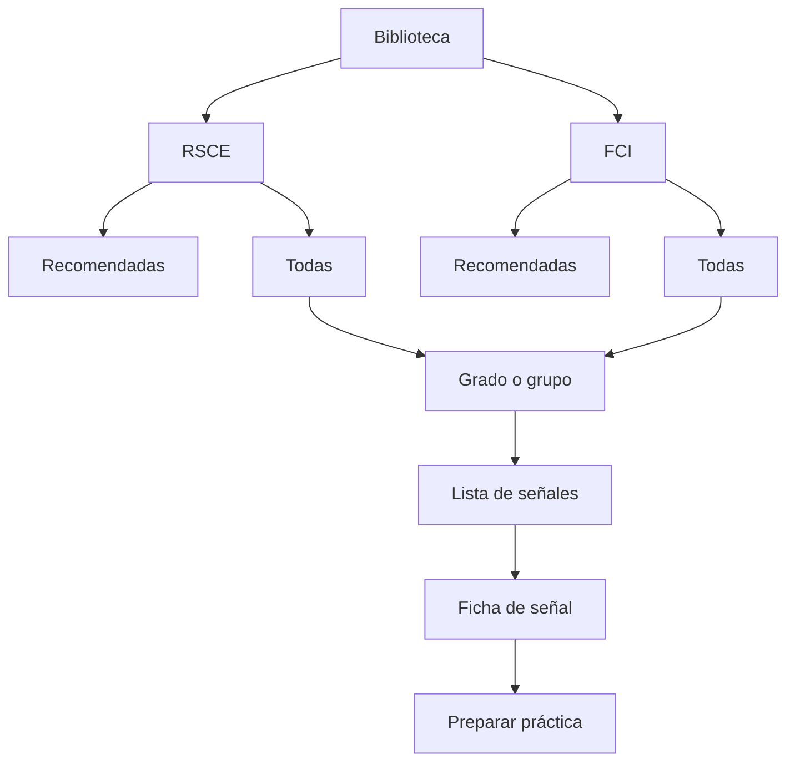

# PRD — Capítulo 09: Biblioteca de señales

| Campo | Valor |
|---|---|
| Producto | Rally O Trainer |
| Estado | Especificación funcional |
| Fecha | 5 de agosto de 2026 |
| Dependencias | Capítulos 05, 07 y 08 |
| Próximo capítulo | Entrenamientos |

---

## Análisis previo

### Hipótesis revisadas

| Hipótesis | Problema | Resolución |
|---|---|---|
| La biblioteca debe imitar un catálogo oficial | Favorece la consulta pasiva y puede confundirse con una publicación oficial | Organizarla alrededor de “qué puedo practicar ahora”, manteniendo fuente y estructura reglamentaria |
| RSCE y FCI necesitan árboles completamente separados | Duplicaría señales compartidas y ocultaría relaciones | Dos pestañas visibles y un único núcleo de señales con asignaciones múltiples |
| Los grados deben estar bloqueados | Impide anticipar información | Consulta libre; indicadores de progresión solo orientativos |
| Cada ficha debe mostrarlo todo al abrirse | Una ficha larga es poco útil en pista | Resumen accionable primero y detalle desplegable después |
| Muchos filtros mejoran la búsqueda | En móvil añaden fricción | Búsqueda simple y cuatro filtros realmente útiles |
| El progreso puede resumirse en un porcentaje | Oculta lado, ayudas y antigüedad | Estado nominal y detalle por lado bajo demanda |

### Puntos débiles detectados

- Cien ejercicios más inicio y final pueden producir una lista difícil de recorrer.
- Una misma señal aparece en varios grados y no debe duplicar progreso.
- Los nombres reglamentarios no siempre coinciden con las palabras que buscará un principiante.
- La ficha debe ser útil tanto para aprender como para iniciar entrenamiento con una mano.
- El modo offline debe incluir textos, relaciones e ilustraciones propias.
- Mostrar demasiados estados editoriales puede confundir al usuario normal.

### Mejoras propuestas

1. **Entrada dual:** “Recomendadas” para actuar y “Todas” para consultar.
2. **Pestañas RSCE/FCI:** prioridad visual RSCE, sin ocultar FCI.
3. **Una ficha, tres niveles de lectura:** explicación, reglamento y entrenamiento.
4. **Acción persistente:** botón `Practicar esta señal` accesible sin volver a la lista.
5. **Búsqueda tolerante:** número, nombre, sinónimos y habilidad, sin motor externo.
6. **Estado explicable:** mostrar por qué se recomienda o necesita repaso.

---

## Versión definitiva

### 1. Objetivo

La biblioteca responde a una sola pregunta principal:

> ¿Qué es esta señal y cómo puedo practicarla correctamente?

No sustituye al planificador. Permite consultar cualquier señal y elegirla manualmente.

### 2. Arquitectura de información

### 3. Entrada y pestañas

La pantalla conserva, por perro activo:

- autoridad seleccionada;
- vista `Recomendadas` o `Todas`;
- último grado consultado;
- término de búsqueda mientras la pantalla siga montada.

Orden inicial:

1. RSCE.
2. Recomendadas.
3. Grado recomendado del perro.

La pestaña FCI nunca estará bloqueada. Cuando todavía no sea recomendable mostrará una explicación breve, no un candado.

### 4. Grados y grupos

#### 4.1 RSCE

- Debutante.
- Grado 1.
- Grado 2.
- Grado 3.

#### 4.2 FCI

- Grupo 1.
- Grupo 2.
- Grupo 3.
- Grupo 4.
- Clase internacional, como vista transversal futura.

Una señal asignada a varios grados aparece en cada contexto reglamentario, pero abre la misma identidad y el mismo progreso compatible.

### 5. Búsqueda

La búsqueda local admite:

- número exacto: `101`;
- nombre completo o parcial;
- texto sin distinguir mayúsculas, tildes o guiones;
- sinónimos editoriales: `quieto`, `junto`, `cono`, `salto`;
- habilidad accesible: `giro`, `frente`, `lado derecho`.

Reglas:

- comienza a filtrar desde el primer carácter;
- no consulta red;
- responde en menos de 100 ms para el inventario previsto;
- resalta la coincidencia sin depender solo del color;
- si no hay resultados propone limpiar filtros o cambiar de autoridad.

### 6. Filtros

Solo se ofrecen inicialmente:

| Filtro | Valores |
|---|---|
| Grado/grupo | Según autoridad |
| Estado | Sin practicar, en progreso, aprendida, consolidada, necesita repaso |
| Lado | Izquierda, derecha, ambos, no aplicable |
| Contexto | Casa, exterior reducido, club/pista |

Material no será un filtro principal; el planificador ya usa el inventario. Podrá añadirse si las pruebas muestran necesidad real.

Un botón `Limpiar` aparece cuando existe algún filtro no predeterminado.

### 7. Tarjeta de señal

Contenido máximo:

- número y nombre;
- autoridad y grupo/grado;
- ilustración propia opcional;
- estado del perro;
- lado pendiente, si procede;
- icono de material especializado, si es necesario;
- motivo breve cuando está recomendada.

Toda la tarjeta es pulsable. El objetivo táctil mínimo será de 44 × 44 CSS px.

No mostrará párrafos, porcentajes, penalizaciones ni todos los grados asociados.

### 8. Ficha de señal

#### 8.1 Cabecera

- volver;
- número y nombre;
- insignia RSCE o FCI en texto;
- grado o grupo desde el que se abrió;
- estado del perro activo;
- selector de perro si hay más de uno.

#### 8.2 Orden del contenido

1. **En pocas palabras.** Explicación accesible.
2. **Qué debes observar.** Hasta tres criterios principales.
3. **Cómo entrenarla.** Consejo positivo y progresión breve.
4. **Descripción reglamentaria.** Redacción propia fiel.
5. **Preparación.** Lado, espacio y material.
6. **Progreso.** Resultado por lado y última práctica.
7. **Antes de esta señal.** Prerrequisitos y alternativas.
8. **Fuente.** Autoridad, edición, revisión y enlace oficial.

#### 8.3 Acción primaria

`Practicar esta señal` permanece accesible al final de la pantalla mediante barra fija respetando el área segura del dispositivo.

Al pulsarlo:

- conserva perro y señal;
- solicita ubicación solo si no existe preferencia válida;
- muestra preparación y material;
- permite comenzar en un máximo de dos pulsaciones adicionales.

### 9. Presentación del progreso

| Caso | Presentación principal | Detalle opcional |
|---|---|---|
| Sin evidencia | Sin practicar | “Todavía no hay resultados” |
| Evidencia insuficiente | En progreso | Repeticiones comparables disponibles |
| 7/10 en dos días | Aprendida | Lado y fecha de logro |
| Criterio de consolidación | Consolidada | Mantenimiento y última práctica |
| Repaso activado | Necesita repaso | Motivo: tiempo, fallos o ayudas |

Para señales bilaterales se muestran dos filas: izquierda y derecha. El estado global usa el lado menos avanzado.

### 10. Recomendaciones dentro de la biblioteca

Una tarjeta recomendada incluye un solo motivo principal, por ejemplo:

- “Toca repasarla: 31 días sin practicar”.
- “Siguiente paso después de posición base”.
- “Puedes hacerla en casa sin material”.
- “Falta consolidar el lado derecho”.

Si existen varios motivos, el detalle los muestra ordenados. El usuario puede practicar otra señal sin confirmar que ignora la recomendación.

### 11. Estados de interfaz

| Estado | Comportamiento |
|---|---|
| Cargando contenido local | Esqueleto breve; no más de 300 ms antes de mostrar estado real |
| Sin perro | Acción `Añadir perro` y biblioteca consultable sin progreso |
| Sin señales recomendadas | Celebración sobria y acceso a todas las señales |
| Sin resultados de búsqueda | Explicación y limpieza de filtros |
| Contenido pendiente de revisión | Oculto en uso normal |
| Fuente posiblemente desactualizada | Aviso no bloqueante en la ficha |
| Sin conexión | Sin aviso intrusivo porque la función es local |
| Error de contenido | Identifica lote afectado y ofrece diagnóstico; no inventa datos |

### 12. Accesibilidad

- navegación completa con teclado;
- orden de foco equivalente al visual;
- pestañas con semántica y estado anunciable;
- estados con texto e icono, nunca solo color;
- ilustraciones con texto alternativo de la secuencia;
- controles inferiores fuera de zonas ocupadas por gestos del sistema;
- soporte de ampliación hasta 200 % sin pérdida de contenido;
- ningún gesto complejo como única vía de acción.

### 13. Rendimiento y offline

- textos, índices e ilustraciones propias forman parte del paquete local;
- primera lista visible en menos de 500 ms con base inicializada;
- cambio de filtro perceptualmente inmediato;
- imágenes perezosas y con dimensiones reservadas;
- no descargar fuentes, iconos o analítica desde terceros;
- búsqueda por términos normalizados en memoria para el volumen previsto.

### 14. Eventos de dominio

| Evento | Datos mínimos |
|---|---|
| `SignalLibraryOpened` | autoridad, perro o `null` |
| `SignalSearchChanged` | consulta local; no persistida ni enviada |
| `SignalViewed` | señal, revisión, contexto |
| `ManualPracticeRequested` | perro, señal, revisión, lado sugerido |

Son eventos internos para coordinación, no telemetría.

### 15. Criterios de aceptación

- [ ] Cualquier señal publicada se alcanza en menos de tres pulsaciones desde Inicio.
- [ ] RSCE aparece antes que FCI.
- [ ] FCI es siempre consultable.
- [ ] Una señal compartida no duplica progreso.
- [ ] La búsqueda funciona completamente offline.
- [ ] La ficha distingue los tres bloques editoriales.
- [ ] La fuente y edición son accesibles.
- [ ] Se puede iniciar práctica manual desde la ficha.
- [ ] Los lados se muestran separadamente cuando corresponde.
- [ ] Inicio y final no muestran estado 7/10.
- [ ] Ninguna ilustración oficial forma parte del producto.
- [ ] Todos los estados vacíos ofrecen una salida útil.

## Riesgos

| Riesgo | Mitigación |
|---|---|
| Lista demasiado densa | Tarjetas compactas, grados y búsqueda local |
| Confusión entre grado y grupo | Etiquetas completas y ayuda contextual |
| Ficha excesivamente larga | Orden por utilidad y secciones plegables secundarias |
| Estado global oculta un lado débil | Mostrar el lado limitante junto al estado |
| Búsqueda con sinónimos incorrectos | Términos editoriales revisados por señal |

## Mejoras posibles

- Favoritos, solo si las elecciones manuales frecuentes lo justifican.
- Vista de comparación RSCE–FCI para señales relacionadas.
- Fichas imprimibles propias.
- Búsqueda por voz como mejora de accesibilidad, sin depender de ella.
- Historial breve de señales consultadas.

## Decisiones pendientes

| ID | Decisión | Momento límite |
|---|---|---|
| DP-09-001 | Determinar si el selector de grado será chips horizontales o desplegable en pantallas estrechas | Wireframes y prueba en iPhone |
| DP-09-002 | Longitud máxima visible antes de plegar descripción y consejo | Sistema de diseño |
| DP-09-003 | Mostrar o no penalizaciones frecuentes en cada ficha | Contenido reglamentario nivel C |
| DP-09-004 | Terminología final del estado anterior a “aprendida” | Pruebas con usuarios |
