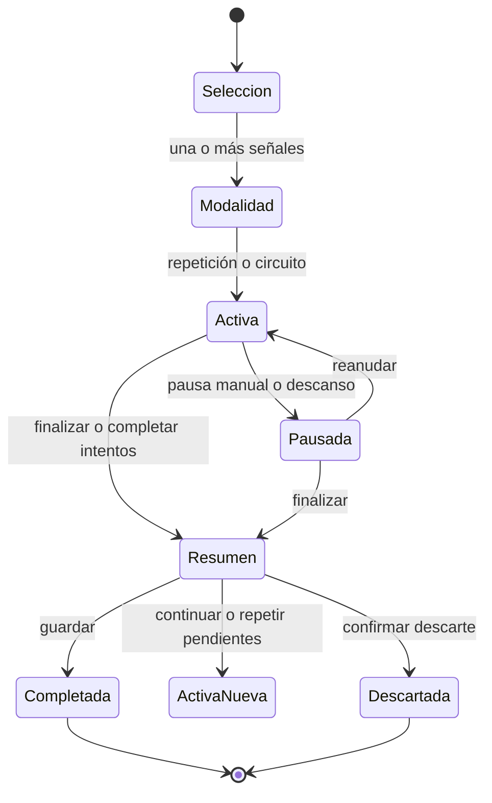

# PRD — Capítulo 10: Entrenamientos multiseñal

| Campo | Valor |
|---|---|
| Producto | Rally O Trainer |
| Estado | Aprobado e implementado |
| Fecha | 6 de agosto de 2026 |
| Dependencias | Capítulos 02, 04, 05, 07 y 09 |

---

## Análisis previo

### Hipótesis revisadas

| Hipótesis anterior | Debilidad | Decisión vigente |
|---|---|---|
| Una sesión trabaja una única señal | Obliga a crear varias sesiones y no representa un entrenamiento real | Selección de una o varias señales |
| Quince minutos es el máximo de sesión | Confunde bienestar con un límite arbitrario y corta sesiones válidas | Recordatorio de descanso recurrente cada 15 minutos activos |
| Tres resultados producen mejor diagnóstico | Exige decidir el tipo de ayuda durante la práctica | Captura binaria: Correcta o Incorrecta |
| El usuario debe decidir manualmente el siguiente ejercicio | Añade fricción con el perro esperando | Avance automático según modalidad |
| Una sesión incompleta no es válida | Favorece completar repeticiones aunque no convenga | Finalización y guardado disponibles en todo momento |
| El historial de circuito no sirve para aprender | Desaprovecha ejecuciones reales de una señal | Repetición y circuito aportan evidencia; aprendizaje estable exige dos días |

### Puntos débiles detectados

- Una selección sin búsqueda o filtros sería lenta con 100 señales.
- Una lista demasiado grande puede generar sesiones poco realistas.
- Guardar un índice actual separado de los resultados puede desincronizarse tras recarga o deshacer.
- Contar el tiempo de pausa como entrenamiento distorsiona el resumen.
- Un toque accidental necesita corrección inmediata.
- El resumen debe diferenciar “superada en esta sesión” de “aprendida de forma estable”.

### Mejoras adoptadas

1. Selector con imagen oficial, número, nombre, grado, categoría, búsqueda y filtros.
2. Aviso no bloqueante al seleccionar más de diez señales.
3. Dos modalidades explícitas: repetición y circuito.
4. Siguiente paso derivado de bloques y registros persistidos.
5. Guardado después de cada resultado, impresión, nota o cambio de estado.
6. Tiempo activo acumulado separado de duración total.
7. Resumen accionable con continuar, repetir pendientes, guardar o descartar.

---

## Versión definitiva

### 1. Objetivo

La función responde a cuatro preguntas en secuencia:

1. ¿Qué señales quiero practicar?
2. ¿Quiero repetir cada una o combinarlas en circuito?
3. ¿El intento ha sido correcto o incorrecto?
4. ¿Qué conviene guardar o repetir al terminar?

### 2. Flujo general



### 3. Selección de señales

Cada elemento seleccionable muestra:

- señal gráfica oficial RSCE o FCI;
- número y nombre;
- grado de entrada;
- categoría o área;
- indicador seleccionado.

Controles:

- búsqueda por número o nombre;
- filtro por RSCE Debutante, grados 1–3 o FCI Internacional;
- filtro por categoría;
- seleccionar o quitar todas las señales visibles;
- contador persistente durante el filtrado;
- acción `Continuar con N` desactivada cuando `N = 0`.

La selección manual siempre prevalece sobre el planificador. Más de diez señales genera una advertencia sobre duración, pero no bloquea la decisión.

### 4. Modalidades

#### 4.1 Por repetición

- diez intentos consecutivos por señal;
- al registrar el décimo, avanza a la siguiente;
- contadores: `Señal X de N` e `Intento Y de 10`.

#### 4.2 En circuito

- cada vuelta contiene todas las señales una vez y en el orden seleccionado;
- se realizan diez vueltas;
- contadores: `Vuelta Y de 10` y `Señal X de N`.

Ambas modalidades producen exactamente diez resultados por señal al completarse. La preparación permite elegir izquierda o derecha para cada señal que admita ambos lados; el lado queda fijado en su bloque y nunca se mezcla en un mismo resultado 7/10.

### 5. Pantalla activa

La pantalla elimina la navegación global y contiene únicamente:

- modalidad;
- acción `Pausar`;
- acción `Finalizar`;
- contadores y barra de progreso;
- número, nombre e imagen oficial de la señal actual;
- descripción reglamentaria;
- botones grandes `Incorrecta` y `Correcta`;
- contador local de ambos resultados;
- `Deshacer último resultado`;
- panel opcional de impresiones y notas.

La imagen debe ser legible en un iPhone 16 Pro sin ampliar. Los botones binarios ocupan el ancho disponible, mantienen posición y tienen un área táctil superior a 44 × 44 puntos.

### 6. Registro y avance

Cada pulsación crea inmediatamente un registro local con:

- identificador de sesión y bloque;
- secuencia dentro del bloque;
- secuencia global de sesión;
- resultado interno `autonomous` para Correcta o `incorrect` para Incorrecta;
- fecha y hora local;
- número de repetición;
- vuelta si la modalidad es circuito.

No se guarda un índice actual duplicado. El siguiente paso se calcula con datos persistidos:

```text
repetición: primer bloque con menos de 10 registros
circuito: records.length módulo blocks.length
vuelta: floor(records.length / blocks.length) + 1
```

Esto permite recuperar el estado exacto tras cierre, suspensión, recarga o deshacer.

### 7. Deshacer

- elimina únicamente el último registro global de la sesión;
- utiliza `sessionSequence` para resolver registros con la misma marca temporal;
- recalcula señal, vuelta, intento, contadores y progreso;
- queda desactivado si no existen registros.

### 8. Criterio 7/10

Una señal queda **Superada en la sesión** cuando:

```text
total de intentos >= 10 AND correctas >= 7
```

Con menos de diez intentos figura **Pendiente**, aunque el porcentaje sea alto. El estado estable **Aprendida** conserva el requisito de 7/10 en una ventana comparable y al menos dos fechas locales distintas.

### 9. Pausas y tiempo

La sesión guarda:

- hora de inicio total;
- tiempo activo acumulado;
- inicio del tramo activo actual;
- número de descansos;
- estado `active` o `paused`;
- tipo de pausa manual o descanso.

`Pausar` detiene el tiempo activo. Al reanudar empieza un tramo nuevo. La duración total incluye pausas; la duración de entrenamiento no.

### 10. Recordatorio de descanso

Tras 15 minutos desde el comienzo del tramo de descanso vigente se muestra una pantalla completa:

- identifica al perro;
- explica que una pausa protege motivación y calidad;
- `Iniciar descanso` pausa y aumenta el contador;
- `Continuar sin descanso` reinicia el intervalo sin aumentar el contador.

El aviso vuelve a aparecer tras otros 15 minutos activos. No cierra ni invalida la sesión.

### 11. Impresiones y notas

Etiquetas rápidas:

- Muy concentrado;
- Buena motivación;
- Se distrae;
- Necesita ayuda;
- Responde con fluidez;
- Dificultad con la posición;
- Dificultad con el guía;
- Entorno con distracciones;
- Fatiga;
- Mejor que la sesión anterior.

Se admiten una nota general y una nota opcional por señal. Ningún campo es obligatorio ni interrumpe la captura principal.

### 12. Resumen

El resumen muestra:

- perro, fecha y hora;
- modalidad;
- duración total y activa;
- número de descansos;
- porcentaje global;
- por señal: miniatura oficial, correctas, incorrectas, porcentaje, nota y estado;
- impresiones y nota general.

Acciones:

| Acción | Resultado |
|---|---|
| Guardar sesión | Marca `completed`, incorpora evidencia y abre historial |
| Continuar entrenando | Completa la actual y crea otra con las mismas señales y modalidad |
| Repetir pendientes | Completa la actual y crea otra solo con señales no superadas |
| Descartar sesión | Solicita confirmación, marca `discarded` y excluye sus resultados |

### 13. Recuperación desde Inicio

Con una sesión `active` o `paused`, Inicio muestra:

- señal de referencia y modalidad;
- número de resultados guardados;
- `Continuar sesión`;
- `Finalizar y guardar`;
- `Descartar sesión` con confirmación.

No puede iniciarse otra sesión abierta ni cambiar de perro hasta cerrar la existente.

### 14. Historial

Solo muestra sesiones completadas. Cada tarjeta contiene:

- fecha;
- modalidad y número de señales;
- nombres de señales;
- porcentaje global;
- correctas e incorrectas;
- señales superadas;
- impresiones y nota, si existen.

Las sesiones descartadas permanecen en almacenamiento para trazabilidad, pero no aparecen ni aportan evidencia.

### 15. Compatibilidad

- las sesiones antiguas se migran como modalidad `repetition`;
- sus bloques y registros no se eliminan;
- `assisted` se conserva y se interpreta como no correcto en el nuevo resumen;
- las copias JSON v1 se aceptan y normalizan al formato actual;
- las nuevas copias utilizan esquema 2;
- las 100 señales y sus imágenes oficiales no se regeneran ni sustituyen.

### 16. Criterios de aceptación

- [x] Se puede elegir una o varias señales entre las 100 publicadas.
- [x] Búsqueda, grado, categoría, selección visible y contador funcionan juntos.
- [x] Repetición completa diez intentos antes de avanzar y conserva el lado elegido.
- [x] Circuito recorre todas las señales durante diez vueltas.
- [x] Correcta e Incorrecta guardan y avanzan con un toque.
- [x] Deshacer recupera el paso global anterior.
- [x] 7/10 marca Superada; 6/10 no.
- [x] Se puede finalizar con intentos incompletos.
- [x] Pausa y reanudación excluyen el descanso del tiempo activo.
- [x] El aviso de 15 minutos es recurrente y no bloqueante.
- [x] La sesión se recupera desde Inicio.
- [x] Resumen, historial, impresiones y notas reflejan varias señales.
- [x] Copias v1 e historial anterior siguen siendo válidos.
- [x] La imagen oficial aparece durante la ejecución.
- [x] El flujo funciona sin red una vez instalada la PWA.

## Riesgos

| Riesgo | Mitigación |
|---|---|
| Seleccionar demasiadas señales | Contador y aviso a partir de once |
| Fatiga por diez intentos | Pausa siempre visible, aviso recurrente y finalización anticipada |
| Pulsación accidental | Botones separados y deshacer global |
| Pérdida tras suspensión de iOS | Persistencia por acción y paso derivado |
| Confundir Superada con Aprendida | Etiquetas y criterios separados |
| Historial heredado con tres resultados | Mantener enum interno y adaptar solo la presentación |

## Mejoras posibles

- Reordenar las señales seleccionadas antes de iniciar.
- Elegir lado por señal en la preparación avanzada.
- Permitir guardar conjuntos personales sin convertirlos en una red social.
- Aviso háptico opcional tras registro si iOS y Android lo soportan de forma consistente.

## Decisiones pendientes

- Validar el recordatorio de descanso en una sesión física superior a 15 minutos.
- Validar el flujo completo en un Android real del club.
- Decidir si la selección debe limitar visualmente las señales según espacio y material sin bloquear consulta.
