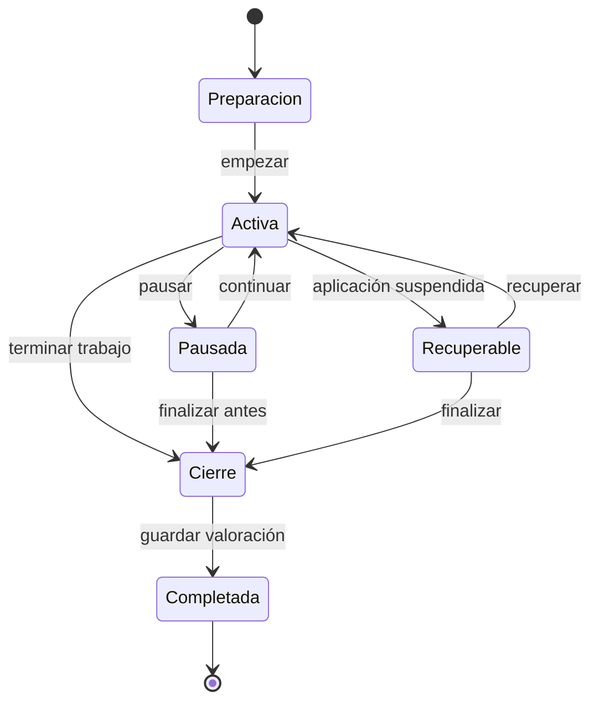

# PRD — Capítulo 10: Entrenamientos

| Campo | Valor |
|---|---|
| Producto | Rally O Trainer |
| Estado | Especificación funcional |
| Fecha | 5 de agosto de 2026 |
| Dependencias | Capítulos 02, 04, 05, 07 y 09 |
| Próximo capítulo | Planificador y repaso inteligente |

---

## Análisis previo

### Hipótesis revisadas

| Hipótesis | Problema | Decisión |
|---|---|---|
| Una sesión debe durar exactamente 15 minutos | Puede perjudicar bienestar o no encajar en la situación real | Quince minutos es máximo y estructura orientativa; finalizar antes es normal |
| Registrar más dimensiones produce mejores datos | El guía tiene una mano y el perro espera | Tres resultados rápidos; las dimensiones solo orientan la decisión |
| La sesión inicial debe mezclar ejercicios | Aumenta carga cognitiva y dificulta atribuir progreso | MVP centrado en una señal; secuencias preparadas para después |
| Un temporizador debe forzar fases | Interrumpe la práctica y puede premiar el reloj sobre el perro | Temporización suave con avisos opcionales, nunca bloqueo |
| Toda ayuda debe detallarse en cada intento | Excesiva fricción | Resultado “con ayuda”; tipo de ayuda opcional por bloque |
| La ausencia de resultados es un fracaso | Una interrupción puede ser la decisión correcta | Registrar motivo de finalización sin afectar progreso |

### Debilidades detectadas

- Un toque accidental altera estadísticas si no existe deshacer inmediato.
- La pantalla activa debe evitar navegación y contenido distractorios.
- iOS puede suspender la PWA o cerrarla; la sesión debe recuperarse.
- Diez repeticiones no siempre son adecuadas en una única sesión.
- Practicar lados alternos sin indicación puede mezclar evidencias.
- El temporizador y botones deben funcionar sin precisión motora fina.

### Mejoras propuestas

1. Preparación breve antes de iniciar, con material y espacio visibles.
2. Bloque activo centrado en una señal y un lado.
3. Tres botones grandes y deshacer el último registro.
4. Intentos individuales por defecto y agregado como alternativa explícita.
5. Guardado transaccional después de cada acción.
6. Cierre positivo guiado, incluso al finalizar anticipadamente.

---

## Versión definitiva

### 1. Objetivo

Una sesión responde:

> ¿Qué practico ahora y cómo registro el resultado sin dejar de atender a mi perro?

### 2. Estructura temporal

| Fase | Duración orientativa | Finalidad |
|---|---:|---|
| Activación | 2 min | Conexión, movimiento suave y conducta fácil |
| Trabajo | 10–11 min | Señal elegida, pausas incluidas |
| Cierre | 2–3 min | Ejercicio sencillo, juego o refuerzo positivo |
| Total máximo | 15 min | Puede finalizar antes por cualquier motivo |

Los tiempos no son cuotas de trabajo continuo. El guía decide descansos, número de intentos y fin.

### 3. Preparación

Antes de comenzar se muestra una sola pantalla con:

- perro;
- señal y lado;
- objetivo de la sesión;
- ubicación;
- duración máxima;
- material requerido;
- material útil opcional;
- hasta tres criterios observables;
- propuesta de activación y cierre;
- botones `Empezar` y `Cambiar señal`.

Si falta material requerido, `Empezar` no desaparece: se ofrece practicar un prerrequisito compatible o confirmar una adaptación que no contará como ejecución completa.

### 4. Objetivos de sesión

| Objetivo | Uso |
|---|---|
| Aprender | Introducir o construir la conducta con ayudas |
| Mejorar autonomía | Retirar ayudas y buscar respuesta final |
| Mejorar precisión | Afinar criterios de una conducta conocida |
| Repasar | Verificar mantenimiento tras intervalo |
| Practicar lado | Trabajar específicamente izquierda o derecha |

El planificador propone uno. El usuario puede cambiarlo.

### 5. Flujo

### 6. Pantalla activa

Solo muestra:

- nombre corto de la señal;
- perro y lado;
- fase y tiempo transcurrido;
- criterio principal desplegable;
- `Incorrecto`;
- `Correcto con ayuda`;
- `Correcto autónomo`;
- contador por resultado;
- `Deshacer`;
- `Pausar/Finalizar`.

No muestra navegación inferior, estadísticas, reglamento completo ni recomendaciones nuevas.

### 7. Registro individual

Cada pulsación guarda inmediatamente:

- sesión y bloque;
- secuencia;
- instante;
- resultado;
- lado y contexto ya fijados en el bloque.

Interacción:

- confirmación visual breve;
- vibración opcional y diferente solo si el dispositivo la permite;
- no abrir diálogos;
- botón pulsado mantiene posición;
- `Deshacer` elimina únicamente el último registro del bloque activo.

### 8. Registro agregado

Disponible desde preparación o antes del primer intento.

El usuario introduce:

- total;
- incorrectas;
- correctas con ayuda;
- correctas autónomas.

La suma debe coincidir. Un bloque no mezcla modos. Cambiar después de registrar exige descartar el bloque con confirmación.

El agregado no inventa orden ni marcas temporales y se identifica como evidencia menos precisa.

### 9. Ayudas

El resultado `Correcto con ayuda` es suficiente durante la captura. Opcionalmente, antes del bloque se puede elegir una ayuda predominante:

- verbal adicional;
- gesto adicional;
- señuelo visible;
- guía suave con correa;
- diana;
- apoyo del entorno;
- criterio reducido;
- otra nota breve.

No se exige seleccionar ayuda después de cada repetición.

### 10. Cambio de lado

- un bloque solo tiene un lado;
- cambiar de lado crea otro bloque;
- los contadores se reinician visualmente para el nuevo bloque;
- la sesión puede incluir ambos lados de la misma señal;
- el planificador puede proponer empezar por el lado más débil;
- nunca se mezclan ambos lados en un único resultado 7/10.

### 11. Pausas

Pausar:

- detiene el tiempo activo mostrado;
- conserva todo;
- muestra `Continuar` y `Finalizar sesión`;
- no registra un resultado;
- no necesita motivo.

El tiempo de pared y el tiempo activo se conservan por separado para diagnóstico, pero ninguna estadística penaliza las pausas.

### 12. Avisos temporales

- al terminar activación: aviso suave y descartable;
- al llegar al minuto 12: sugerencia de cierre;
- al minuto 15: indicar que se alcanzó el máximo recomendado;
- nunca bloquear botones ni cerrar automáticamente;
- respetar reducción de movimiento y preferencias hápticas;
- no usar sonidos por defecto.

### 13. Finalización anticipada

Motivos rápidos opcionales:

- perro cansado o desconectado;
- entorno o distracción;
- falta de tiempo;
- material o espacio inadecuado;
- objetivo conseguido antes;
- otro;
- sin indicar motivo.

El motivo pertenece a la sesión, no convierte intentos previos en inválidos. Una sesión sin evidencias no modifica progreso.

### 14. Cierre y valoración

La pantalla de cierre propone una acción breve positiva y pregunta:

> ¿Cómo ha ido la sesión en general?

Respuesta opcional de un toque:

- Difícil.
- Adecuada.
- Fácil.

Además:

- nota opcional;
- resumen de conteos por bloque y lado;
- duración;
- motivo de fin, si existe;
- `Guardar y terminar`.

La valoración general no sustituye resultados ni modifica directamente el estado de una señal. Puede ayudar al futuro planificador como evidencia secundaria cuando se defina.

### 15. Recuperación

Después de cada cambio se persiste la sesión. Al abrir la aplicación con una sesión activa:

- Inicio muestra `Continuar sesión` como acción principal;
- se recuperan fase, bloques, resultados y tiempo registrado;
- el tiempo en segundo plano no se suma como actividad;
- se ofrece continuar o finalizar;
- nunca se inicia otra sesión simultánea.

### 16. Corrección y eliminación

- durante el bloque: deshacer último registro;
- durante la preparación: cambiar cualquier dato;
- tras completar: no editar intentos individuales en el MVP;
- se puede eliminar la sesión completa con confirmación;
- eliminar recalcula progreso;
- la nota posterior queda pendiente de decisión del capítulo 7.

### 17. Historial inmediato

Al finalizar se muestra:

- resultado resumido;
- cambio de estado si lo hubo;
- próximo paso recomendado;
- `Volver a Inicio`;
- `Ver detalle`.

No se propone comenzar otra sesión automáticamente.

### 18. Bienestar y seguridad

- detenerse siempre está disponible;
- ninguna meta exige terminar diez repeticiones seguidas;
- se sugieren descansos y sesiones cortas;
- las ayudas aversivas están excluidas;
- una caída de rendimiento sostenida propone bajar criterio o cerrar;
- el lenguaje evita culpa y competición contra otros perros;
- material y superficie deben ser seguros;
- la aplicación no sustituye valoración veterinaria o profesional.

### 19. Reglas de dominio

1. Máximo una sesión activa por instalación.
2. Una sesión pertenece a un perro.
3. Un bloque usa una señal, revisión, lado, modalidad y contexto.
4. Un bloque no mezcla intento y agregado.
5. Un intento tiene exactamente un resultado.
6. Un agregado cumple la suma invariante.
7. Una sesión sin evidencia no cambia progreso.
8. Finalizar nunca borra intentos válidos.
9. El tiempo no determina éxito.
10. Quince minutos es máximo recomendado, no restricción técnica destructiva.

### 20. Criterios de aceptación

- [ ] Se inicia una recomendación desde Inicio en menos de tres pulsaciones.
- [ ] Material y espacio se conocen antes de empezar.
- [ ] La pantalla activa se usa con una mano.
- [ ] Cada resultado se guarda sin diálogo adicional.
- [ ] Deshacer corrige el último toque.
- [ ] Los lados nunca se mezclan.
- [ ] Se puede finalizar antes sin perder datos.
- [ ] La sesión se recupera tras recarga o suspensión.
- [ ] No puede existir una segunda sesión activa.
- [ ] Una sesión sin intentos no afecta al progreso.
- [ ] El cierre positivo está disponible.
- [ ] Todo funciona offline.

## Riesgos

| Riesgo | Mitigación |
|---|---|
| Pulsaciones accidentales | Botones separados, confirmación breve y deshacer |
| Obsesión con completar 10 intentos | No mostrar objetivo obligatorio; lenguaje de calidad y bienestar |
| Suspensión de iOS | Persistencia por acción y flujo de recuperación |
| Demasiadas opciones antes de empezar | Valores recordados y preparación en una sola pantalla |
| Temporizador distrae | Avisos suaves y tiempo secundario |
| Tipo de ayuda demasiado impreciso | Selección opcional por bloque, no por intento |

## Mejoras posibles

- Control por voz o auriculares después de validar privacidad y fiabilidad.
- Modo pantalla bloqueada, si las capacidades web lo permiten de forma consistente.
- Secuencias de varias señales y recorridos completos.
- Plantillas personales de activación y cierre.
- Detección de fatiga basada en patrones, siempre explicable y desactivable.

## Decisiones pendientes

| ID | Decisión | Momento límite |
|---|---|---|
| DP-10-001 | Límite máximo de intentos de un agregado | Algoritmo y pruebas de entrada |
| DP-10-002 | Edición posterior de notas | Wireframes de historial |
| DP-10-003 | Uso de vibración por defecto en Android y disponibilidad efectiva en iOS | Pruebas de dispositivos |
| DP-10-004 | Influencia exacta de la valoración general en planificación | Planificador inteligente |
