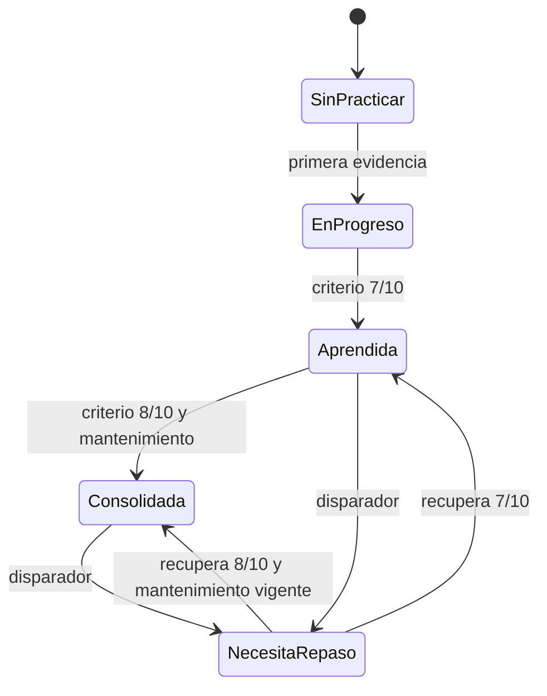

# PRD — Capítulo 11: Planificador y repaso inteligente

| Campo | Valor |
|---|---|
| Producto | Rally O Trainer |
| Estado | Especificación algorítmica v1 |
| Fecha | 5 de agosto de 2026 |
| Dependencias | Capítulos 07–10 |
| Próximo capítulo | Perfil, historial y estadísticas |

---

## Análisis previo

### Hipótesis revisadas

| Hipótesis | Problema | Resolución |
|---|---|---|
| “Inteligente” requiere inteligencia artificial | Añadiría coste, opacidad, red y datos externos | Motor determinista local, explicable y versionado |
| Una puntuación global del perro basta | Mezcla señales, lados y contextos | Progreso por perro, señal, compatibilidad, lado y modalidad |
| El último resultado representa dominio | Es demasiado sensible a azar o fatiga | Ventanas de evidencia y días distintos |
| Intentos y agregados pueden mezclarse como si fueran iguales | El agregado carece de orden | Dos vías de cualificación independientes y conservadoras |
| Repasar cada señal a intervalos crecientes fijos | Ignora fallos, ayudas y uso real | Intervalos por estado con disparadores inmediatos |
| El planificador debe imponer la elección | Contradice autonomía | Recomienda una opción, explica y permite elegir cualquiera |

### Puntos débiles detectados

- El criterio 7/10 necesita una definición inequívoca de ventana.
- “Dos días diferentes” no debe depender de la zona horaria actual.
- Un resultado con ayuda no equivale a ejecución reglamentaria autónoma.
- Ambos lados deben mantenerse separados sin duplicar innecesariamente señales.
- La variedad puede competir con la urgencia de repaso.
- Una sesión difícil no siempre significa que la señal sea demasiado avanzada.

### Mejoras propuestas

1. Mantener hechos y cálculos separados.
2. Publicar versiones de reglas y explicaciones de cada decisión.
3. Usar una máquina de estados pequeña.
4. Separar vía individual y vía agregada.
5. Resolver primero urgencias y después puntuar candidatos.
6. No depender de fechas de competición ni perfiles de raza.

---

## Versión definitiva

### 1. Objetivo

El sistema responde:

> ¿Qué señal merece más la pena practicar ahora con este perro, en este lugar y con este material?

Debe producir:

- una recomendación principal;
- hasta dos alternativas;
- objetivo, lado, material y estructura de sesión;
- explicación legible;
- versión de reglas usada.

### 2. Principios

1. Local y determinista.
2. Mismo conjunto de hechos y versión produce el mismo resultado.
3. Toda recomendación tiene códigos de motivo traducibles.
4. No se usa raza para dificultad o capacidad.
5. No se usa una fecha de competición.
6. El usuario puede elegir otra señal.
7. Bienestar y disponibilidad prevalecen sobre progreso.
8. Una ausencia de datos se declara; no se rellena por inferencia.

### 3. Unidad de progreso

```text
dogId
+ signalId
+ progressCompatibilityKey
+ side
+ practiceContext
= progressKey
```

`practiceContext` será inicialmente:

- `individual`;
- `course` preparado para constructor y práctica posterior.

Una ejecución en recorrido no reemplaza automáticamente la necesidad de comprobar la señal individualmente, y viceversa.

### 4. Evidencia comparable

Una evidencia entra en el cálculo si:

- pertenece al mismo perro;
- usa la misma identidad y clave de compatibilidad;
- coincide en lado;
- coincide en modalidad individual/recorrido;
- la sesión está completada;
- no fue eliminada;
- el bloque representa la ejecución completa, no solo un prerrequisito;
- la fecha civil local es válida.

### 5. Resultados

Orden de autonomía:

```text
incorrect < assisted < autonomous
```

- `incorrect`: no cumple el criterio final elegido.
- `assisted`: cumple con una ayuda adicional o criterio reducido.
- `autonomous`: cumple sin ayuda adicional y con criterio final.

Solo `autonomous` cuenta para 7/10 y 8/10. Las ayudas sí cuentan como práctica y alimentan motivos del planificador.

### 6. Estados



Estados visibles:

- `not-started` — Sin practicar.
- `in-progress` — En progreso.
- `learned` — Aprendida.
- `consolidated` — Consolidada.
- `needs-review` — Necesita repaso.

### 7. Criterio de aprendida

#### 7.1 Vía de intentos individuales

Se cumplen todas:

1. existen al menos 10 intentos comparables;
2. se toman los 10 más recientes;
3. al menos 7 son autónomos;
4. esos 10 proceden de al menos dos fechas civiles diferentes.

#### 7.2 Vía agregada

Para evitar inventar orden, se cumplen todas:

1. existen al menos dos agregados comparables;
2. pertenecen a fechas civiles diferentes;
3. cada agregado contiene exactamente 10 repeticiones;
4. cada uno tiene al menos 7 autónomas.

Es un criterio deliberadamente conservador. Un agregado de tamaño distinto informa al planificador, pero no concede por sí solo el estado `learned`.

#### 7.3 Datos mixtos

Intentos y agregados no se mezclan para construir una ventana 7/10. La señal queda aprendida si cualquiera de las dos vías se cumple. Se registra `qualificationMethod`.

### 8. Criterio de consolidada

#### 8.1 Vía individual

Se cumplen todas:

1. los 10 intentos comparables más recientes incluyen al menos 8 autónomos;
2. proceden de al menos tres fechas diferentes;
3. existe al menos una ejecución autónoma 14 días o más después de `learnedAt`;
4. no existe un disparador de repaso posterior.

#### 8.2 Vía agregada

Se cumplen todas:

1. existen tres agregados de 10 en fechas diferentes;
2. cada uno incluye al menos 8 autónomas;
3. el último ocurre al menos 14 días después del primer logro de aprendida;
4. no existe disparador posterior.

El intervalo de 14 días es versión v1 y debe validarse con uso real.

### 9. Dominio bilateral

Cuando la habilidad admite o requiere ambos lados:

- cada lado tiene estado independiente;
- la señal global usa el menos avanzado;
- `learned` global exige ambos lados aprendidos;
- `consolidated` global exige ambos consolidados;
- un disparador en un lado identifica ese lado;
- el planificador prioriza el lado limitante.

Si el reglamento de un grado solo exige izquierda, la ficha diferencia “preparación para este grado” y “dominio bilateral recomendado”.

### 10. Disparadores de repaso

Una unidad aprendida o consolidada pasa a `needs-review` por el primer disparador aplicable:

| Código | Regla |
|---|---|
| `overdue-30d` | 30 días naturales sin práctica comparable en esa modalidad |
| `two-errors` | Dos intentos incorrectos consecutivos recientes |
| `help-returned` | Tres de las últimas cinco evidencias son asistidas o incorrectas y no hay tres autónomas posteriores |
| `below-window` | La ventana individual reciente cae por debajo de 7 autónomas de 10 |
| `aggregate-regression` | Último agregado de 10 tiene menos de 7 autónomas |
| `rule-changed` | Nueva revisión incompatible |
| `manual-review` | El usuario solicita repaso manualmente en el futuro |

La cola `individual` usa `lastIndividualAt`; la cola `course` usa `lastCourseAt`. La interfaz principal prioriza práctica individual hasta que los recorridos estén implementados.

### 11. Próximos repasos

| Estado o evento | `nextReviewAt` v1 |
|---|---|
| Primera evidencia | +2 días |
| Aprendida | +7 días |
| Verificación autónoma tras 7 días | +14 días |
| Consolidada | +30 días |
| Correcta con ayuda tras aprendida | +3 días |
| Incorrecta aislada tras aprendida | +2 días |
| Dos incorrectas consecutivas | Hoy |
| Revisión incompatible | Hoy |

Una práctica autónoma válida recalcula el intervalo; una sesión sin evidencia no lo cambia.

### 12. Canal individual frente a agregado

| Propiedad | Individual | Agregado |
|---|---|---|
| Orden conocido | Sí | No |
| Disparador de dos fallos consecutivos | Sí | No |
| Ventana exacta de últimas 10 | Sí | Solo si el lote es exactamente 10 |
| Rapidez de captura | Alta | Máxima |
| Recomendado | Durante sesión | Para anotar una práctica ya realizada |

El sistema nunca convierte un agregado en intentos sintéticos.

### 13. Generación de candidatos

Se consideran señales que:

- están publicadas;
- tienen asignación consultable en el alcance seleccionado;
- no son inicio o final;
- pueden practicarse completamente en la ubicación, o tienen una variante pedagógica explícita;
- no requieren material final ausente, salvo que se recomiende un prerrequisito;
- tienen prerrequisitos mínimos suficientes para evitar frustración.

Las señales elegidas manualmente no pasan por esta exclusión; reciben advertencias útiles.

### 14. Prioridades duras

Antes de puntuar:

1. bienestar o cierre recomendado;
2. sesión activa recuperable;
3. repaso vencido o regresión;
4. lado atrasado de una señal en progreso;
5. consolidación pendiente;
6. siguiente aprendizaje;
7. variedad.

### 15. Puntuación v1

| Factor | Puntos |
|---|---:|
| `needs-review` hoy | +100 |
| Repaso vence en ≤3 días | +80 |
| Aprendida pendiente de mantenimiento | +70 |
| En progreso | +60 |
| Nueva con prerrequisitos dominados | +45 |
| Lado globalmente limitante | +30 |
| Ubicación coincide exactamente | +20 |
| No exige material especializado | +15 |
| No practicada en últimas tres sesiones | +10 |
| Practicada en sesión inmediatamente anterior | −25 |
| Mismo patrón motor dominante que sesión anterior | −10 |
| Prerrequisito recomendado aún no aprendido | −40 |
| Última valoración general fue “difícil” para la misma señal | −20 |

Empates:

1. vencimiento más antiguo;
2. menor estado de progreso;
3. lado más débil;
4. menos reciente;
5. `signalId` ascendente para determinismo.

Los pesos se versionan como `plannerRulesVersion = 1`.

### 16. Objetivo recomendado

| Estado | Objetivo habitual |
|---|---|
| Sin practicar | Aprender |
| En progreso con mucha ayuda | Mejorar autonomía |
| En progreso con fallos de forma | Mejorar precisión |
| Aprendida y repaso próximo | Repasar |
| Un lado atrasado | Practicar lado |
| Necesita repaso por regresión | Bajar criterio y recuperar autonomía |

### 17. Explicación

La recomendación devuelve:

```ts
type RecommendationExplanation = {
  primaryReason: ReasonCode;
  secondaryReasons: ReasonCode[];
  excludedAlternatives: Array<{ signalId: string; reason: ReasonCode }>;
  evidenceSummary: string;
  plannerRulesVersion: string;
};
```

Ejemplo visible:

> Practica el giro a la derecha con Luna. Hace 31 días que no lo trabaja de forma individual y puedes hacerlo en casa sin material. Empieza por el lado derecho.

No se mostrarán puntuaciones internas salvo en diagnóstico.

### 18. Plan de sesión generado

```ts
type SessionPlan = {
  dogId: string;
  signalRevisionId: string;
  side: Side;
  objective: SessionObjective;
  location: Location;
  requiredMaterials: string[];
  optionalMaterials: string[];
  activation: ActivitySuggestion;
  work: WorkSuggestion;
  close: ActivitySuggestion;
  maxDurationMinutes: 15;
  explanation: RecommendationExplanation;
};
```

El plan contiene una señal principal en el MVP.

### 19. Recalculo e invalidación

Se recalcula cuando:

- se registra, deshace o elimina evidencia;
- se completa o elimina sesión;
- cambia revisión compatible;
- cambia `progressRulesVersion`;
- cambia `plannerRulesVersion`;
- cambia ubicación o inventario para la recomendación, no para progreso;
- cambia el perro activo.

Las proyecciones pueden reconstruirse totalmente sin perder hechos.

### 20. Pseudocódigo

```text
recommend(dog, context, now):
  if activeSession exists:
    return resumeActiveSession

  snapshots = rebuildIfStale(dog)
  candidates = publishedExerciseSignals()
  candidates = applyContextEligibility(candidates, context)

  for candidate in candidates:
    progress = snapshots.for(candidate)
    score = scoreCandidate(candidate, progress, context, now)
    reasons = explainScore(candidate, progress, context, now)

  sort by score and deterministic tie-breakers
  return first + next two alternatives
```

### 21. Pruebas mínimas

- 7 autónomas de 10 en un día no aprende.
- 7 autónomas de 10 en dos días aprende.
- 6 autónomas no aprende.
- ayudas no cuentan como autónomas.
- lados no se mezclan.
- dos agregados 7/10 en dos días aprenden por vía agregada.
- agregado de 9 no cualifica por sí solo.
- intentos y agregados no se mezclan.
- 8/10 en tres días sin intervalo no consolida.
- mantenimiento a día 14 permite consolidar.
- día 30 activa repaso en la modalidad correspondiente.
- dos errores consecutivos activan repaso.
- eliminar sesión revierte estado si desaparece evidencia necesaria.
- revisión compatible conserva evidencia.
- revisión incompatible activa repaso.
- empate produce el mismo resultado siempre.

### 22. Criterios de aceptación

- [ ] El motor funciona completamente offline.
- [ ] No usa IA remota ni datos de otros usuarios.
- [ ] Cada recomendación es explicable.
- [ ] La elección manual siempre está disponible.
- [ ] Aprendida exige 7/10 y dos días.
- [ ] Consolidada exige 8/10, tres días y 14 días de mantenimiento.
- [ ] Ambos lados se calculan separadamente.
- [ ] Treinta días activa repaso por modalidad.
- [ ] Agregados no inventan intentos.
- [ ] Versiones de reglas invalidan proyecciones.
- [ ] Bienestar puede finalizar la sesión sin penalización.

## Riesgos

| Riesgo | Mitigación |
|---|---|
| Criterio agregado demasiado exigente | Explicar la vía y ajustar solo tras datos reales |
| Pesos producen repetición monótona | Penalización de recencia y alternativas visibles |
| Un estado parece una verdad absoluta | Mostrar evidencia y motivo, no juicio sobre el perro |
| Cambio de reloj altera vencimientos | Fechas civiles registradas e instante UTC |
| Complejidad de dos modalidades | Mantener individual como principal hasta constructor |

## Mejoras posibles

- Ajustar intervalos con datos personales locales, manteniendo límites comprensibles.
- Introducir dificultad estimada por señal validada editorialmente.
- Recomendar microhabilidades cuando el ejercicio completo es demasiado difícil.
- Permitir objetivos personales sin fecha de competición.
- Simular decisiones del motor en una herramienta de diagnóstico.

## Decisiones pendientes

| ID | Decisión | Momento límite |
|---|---|---|
| DP-11-001 | Validar el intervalo de consolidación de 14 días con uso real | Tras cuatro semanas de piloto |
| DP-11-002 | Validar pesos de puntuación | Tras 20 sesiones reales |
| DP-11-003 | Determinar si la valoración general debe seguir influyendo −20 | Tras comprobar consistencia de su uso |
| DP-11-004 | Regla de paso del bloque avanzado FCI | Al cerrar habilidades fundamentales de RO3 |
