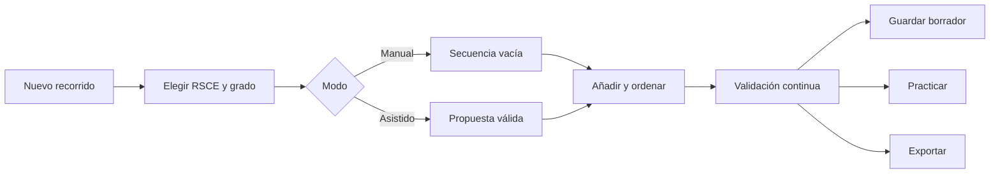

# PRD — Capítulo 13: Constructor de pistas y modo examen

| Campo | Valor |
|---|---|
| Producto | Rally O Trainer |
| Estado | Especificación funcional futura preparada |
| Fecha | 5 de agosto de 2026 |
| Dependencias | Capítulos 08, 09 y 11 |
| Próximo capítulo | Configuración, importación y copias |

---

## Análisis previo

### Hipótesis revisadas

| Hipótesis | Problema | Resolución |
|---|---|---|
| Un constructor debe empezar con un plano libre | Manipular geometría con una mano es lento | Crear primero una secuencia válida; plano visual como segunda fase |
| El sistema puede generar recorridos “oficiales” | La validez final requiere interpretación y juez | Usar “compatible con las reglas estructuradas” y mostrar límites |
| El examen debe afectar al progreso del perro | Saber identificar una señal no demuestra ejecución | Progreso de conocimiento separado y no deportivo |
| Todas las reglas del PDF deben codificarse | Complejidad innecesaria | Solo restricciones deterministas y relevantes |
| Compartir requiere nube | Añade cuenta y conflictos | Exportación/importación local de recorridos |

### Debilidades detectadas

- Las restricciones de diseño varían por grado y edición.
- Una secuencia válida puede ser físicamente imposible en un espacio concreto.
- Cada referencia a un ejercicio deberá mostrar su señal gráfica oficial.
- El modo examen puede convertirse en curso, que es un no objetivo.
- Los recorridos no deben contaminar el progreso individual sin distinguir contexto.

### Mejoras propuestas

1. Constructor en dos modos: lista guiada y plano opcional.
2. Validación continua, explicable y sin bloquear borradores.
3. Generación asistida determinista, no aleatoria opaca.
4. Modo examen breve centrado en reconocimiento y reglas prácticas.
5. Formato portable propio y versionado.

---

## Versión definitiva

### 1. Alcance

#### Constructor

- crear recorrido desde cero;
- generar propuesta por grado;
- añadir, ordenar, sustituir y eliminar señales;
- validar cantidades, grupos, lados, pares y material;
- guardar borradores;
- practicar el recorrido;
- exportar/importar archivo local;
- plano visual en segunda iteración.

#### Modo examen

- reconocer señales propias de la aplicación;
- elegir interpretación correcta;
- ordenar secuencias;
- contestar reglas prácticas;
- repasar errores;
- funcionar offline.

No incluye homologación, arbitraje, resultados oficiales, rankings ni certificados.

### 2. Entidades adicionales

```ts
type Course = {
  id: string;
  name: string;
  regulationId: string;
  contentPackageVersion: string;
  startSide: Side;
  status: 'draft' | 'valid' | 'outdated';
  createdAt: number;
  updatedAt: number;
};

type CourseItem = {
  id: string;
  courseId: string;
  sequence: number;
  signalRevisionId: string;
  plannedSide: Side;
  placement?: { x: number; y: number; rotation: number };
};

type CourseValidation = {
  courseId: string;
  rulesVersion: string;
  errors: ValidationIssue[];
  warnings: ValidationIssue[];
};
```

Las validaciones son proyecciones regenerables.

### 3. Flujo del constructor



### 4. Construcción por lista

Pantalla principal:

- nombre y grado;
- contador de ejercicios;
- indicador `Borrador`, `Compatible` o `Revisar`;
- lista numerada;
- botón `Añadir señal`;
- panel de problemas;
- `Practicar recorrido`.

Acciones por elemento:

- abrir ficha;
- sustituir;
- mover arriba/abajo;
- arrastrar cuando sea accesible, nunca como única vía;
- cambiar lado cuando la regla lo permita;
- eliminar.

### 5. Validaciones v1

Tipos previstos:

- mínimo y máximo de ejercicios;
- mínimos por grupo;
- señales permitidas en el grado;
- inicio y final presentes en representación de recorrido;
- lado inicial;
- cambio de lado emparejado;
- combinaciones obligatorias o prohibidas;
- repeticiones de una señal;
- disponibilidad de salto, conos u otro material;
- revisión reglamentaria vigente;
- secuencia incompatible conocida.

Cada problema incluye:

- severidad;
- regla humana;
- elementos implicados;
- propuesta de corrección;
- fuente.

### 6. Estados de validez

| Estado | Regla |
|---|---|
| Borrador | Incompleto, pero editable y guardable |
| Compatible | Sin errores según restricciones implementadas |
| Con avisos | Sin errores, pero requiere revisión humana |
| Desactualizado | Cambió el paquete reglamentario |

Nunca se usará “recorrido oficial” o “aprobado por RSCE/FCI”.

### 7. Generación asistida

Algoritmo local:

1. cargar restricciones del grado;
2. elegir cantidad dentro del rango, usando el mínimo por defecto;
3. reservar cupos de grupos obligatorios;
4. seleccionar señales compatibles con material y lados;
5. evitar repeticiones y patrones consecutivos poco útiles;
6. insertar cambios de lado válidos;
7. validar;
8. reparar hasta 20 iteraciones deterministas;
9. si no encuentra solución, explicar qué restricción lo impide.

Semilla opcional derivada del ID permite reproducir una propuesta. No se usa IA remota.

### 8. Plano visual

Fase posterior a lista funcional:

- lienzo rectangular con cuadrícula opcional;
- tocar para seleccionar, arrastrar para colocar;
- controles numéricos alternativos;
- rotación en pasos de 15°;
- zoom y desplazamiento;
- área segura y escala configurables;
- rutas orientativas, no cálculo geométrico oficial;
- exportación a PDF o imagen propia en fase futura.

En móvil se prioriza ordenar la secuencia; la edición precisa se recomienda en tableta u ordenador.

### 9. Práctica de recorrido

- contexto `course` separado;
- selección explícita de perro;
- repaso previo de material;
- cronómetro opcional;
- registro rápido por señal: incorrecto, con ayuda, autónomo;
- navegación `Anterior/Siguiente`;
- finalizar antes;
- resumen por señal y lado;
- evidencia guardada como recorrido, no individual.

### 10. Portabilidad de recorridos

Archivo JSON:

```json
{
  "format": "rally-o-trainer-course",
  "version": 1,
  "exportedAt": "2026-08-05T12:00:00Z",
  "course": {},
  "items": [],
  "requiredSignals": [],
  "checksum": "sha256"
}
```

No incluye perro, sesiones ni datos personales. Al importar:

- validar esquema y tamaño;
- comprobar revisiones disponibles;
- mapear identidades compatibles;
- mostrar diferencias;
- crear copia local, nunca sobrescribir silenciosamente.

### 11. Modo examen

#### Tipos de pregunta

| Tipo | Interacción |
|---|---|
| Identificar señal | Elegir nombre entre 3 opciones |
| Interpretar | Elegir explicación correcta |
| Ordenar pasos | Reordenar 3–5 acciones, con botones alternativos |
| Regla práctica | Elegir una respuesta sobre lado, material o ejecución |
| Verdadero/falso | Solo cuando no simplifique en exceso |

No se pregunta por numeración aislada salvo que ayude a competición.

#### Sesión de examen

- 5 preguntas por defecto;
- ámbito elegible: grado, errores o todo lo consultable;
- sin límite de tiempo por defecto;
- explicación inmediata;
- resultado final descriptivo;
- `Repasar errores`;
- sin rankings ni rachas.

### 12. Progreso de conocimiento

Se guarda separado:

```ts
type KnowledgeAttempt = {
  id: string;
  questionKey: string;
  signalRevisionId?: string;
  answeredAt: number;
  correct: boolean;
  questionVersion: string;
};
```

No cambia estados `learned`, `consolidated` o `needs-review` del perro.

### 13. Generación de preguntas

- banco editorial local y versionado;
- distractores revisados, no generados al azar por similitud peligrosa;
- no mostrar como correcta una paráfrasis ambigua;
- conservar fuente de la respuesta;
- retirar preguntas afectadas por cambio incompatible.

### 14. Criterios de aceptación

- [ ] Se puede crear y guardar un borrador inválido.
- [ ] Cada error de validación explica regla y fuente.
- [ ] Un recorrido compatible nunca se denomina oficial.
- [ ] La generación es local y reproducible.
- [ ] La lista funciona antes de implementar el plano.
- [ ] La práctica de recorrido usa contexto separado.
- [ ] Importar no sobrescribe recorridos existentes.
- [ ] El examen funciona offline.
- [ ] Una respuesta teórica no modifica progreso deportivo.
- [ ] Los errores pueden repasarse.
- [ ] Todo es accesible sin depender de arrastrar.

## Riesgos

| Riesgo | Mitigación |
|---|---|
| Falsa garantía de validez | Lenguaje “compatible”, avisos y fuentes |
| Geometría demasiado compleja en móvil | Lista primero; plano posterior y adaptable |
| Reglas incompletas | Estado con avisos y cobertura visible |
| Distractores de examen ambiguos | Banco editorial revisado |
| Recorridos antiguos incompatibles | Versiones y estado desactualizado |

## Mejoras posibles

- Plantillas de recorridos por objetivo.
- Impresión y PDF.
- Compartir mediante código QR sin servidor.
- Biblioteca local de recorridos del club.
- Simulador de recorrido paso a paso.

## Decisiones pendientes

| ID | Decisión | Momento límite |
|---|---|---|
| DP-13-001 | Dimensiones y escala predeterminadas de pista | Reglas de constructor |
| DP-13-002 | Restricciones geométricas que pueden validarse con seguridad | Prototipo de plano |
| DP-13-003 | Incluir constructor en MVP ampliado o versión 2 | Roadmap final |
| DP-13-004 | Cantidad final y cobertura del banco de preguntas | Base de contenido |
