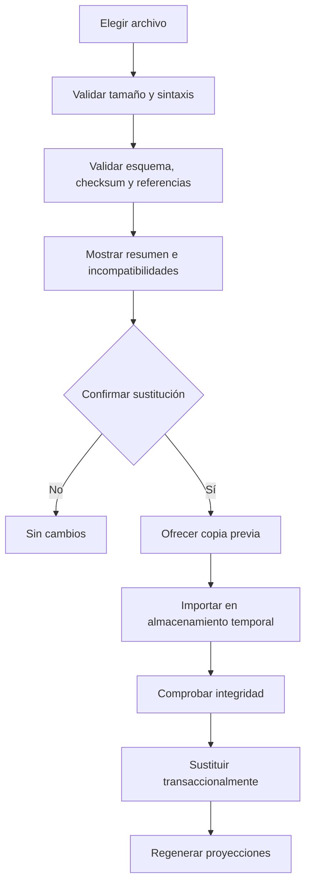

# PRD — Capítulo 14: Configuración, importación, exportación y copias

| Campo | Valor |
|---|---|
| Producto | Rally O Trainer |
| Estado | Especificación funcional y de seguridad |
| Fecha | 5 de agosto de 2026 |
| Dependencias | Capítulos 06 y 07 |
| Próximo capítulo | Wireframes |

---

## Análisis previo

### Hipótesis revisadas

| Hipótesis | Problema | Resolución |
|---|---|---|
| IndexedDB es suficiente respaldo | Puede borrarse por el navegador o usuario | Copia manual completa y recordatorio cada 30 días |
| Sincronización es necesaria para cinco personas | Añade cuentas, servidor y conflictos | Instalaciones independientes y archivos portables |
| Importar debe combinar automáticamente | UUID, revisiones y sesiones pueden entrar en conflicto | MVP restaura sustituyendo tras previsualización y confirmación |
| Una copia debe cifrarse con contraseña | El usuario aceptó sencillez y sin contraseña | JSON legible, aviso de privacidad y control del archivo |
| Configuración debe contener muchas opciones | Traslada decisiones del producto al usuario | Ajustes mínimos con buenos valores predeterminados |

### Debilidades detectadas

- iOS no permite programar copias automáticas arbitrarias a archivos.
- Restaurar sobre datos activos es potencialmente destructivo.
- Un JSON modificado puede contener referencias inválidas o cargas enormes.
- El usuario puede confundir exportación legible con copia restaurable.
- Borrar todo sin copia puede ser irreversible.

### Mejoras propuestas

1. Distinguir `Copia completa` de `Exportar datos`.
2. Validar en memoria antes de modificar la base.
3. Crear copia de seguridad previa a restaurar cuando sea posible.
4. Mantener configuración pequeña.
5. Incluir diagnóstico local sin telemetría.

---

## Versión definitiva

### 1. Configuración

Secciones:

1. Apariencia.
2. Entrenamiento.
3. Material disponible.
4. Datos y copias.
5. Aplicación y fuentes.
6. Zona de peligro.

### 2. Apariencia

| Ajuste | Valores | Predeterminado |
|---|---|---|
| Tema | Sistema, claro, oscuro | Sistema |
| Movimiento | Sistema, reducido | Sistema |
| Vibración | Activada/desactivada si existe soporte | Desactivada |

La tipografía base respeta preferencias del navegador. No se ofrece una escala paralela que compita con accesibilidad del sistema.

### 3. Entrenamiento

| Ajuste | Valores |
|---|---|
| Ubicación preferida | Casa, exterior reducido, club/pista |
| Objetivo preferido | Último usado o ninguno |
| Avisos de fase | Activados/desactivados |

El intervalo de recordatorio de descanso permanece fijo en 15 minutos activos. No existe una duración máxima configurable ni se solicita fecha de competición.

### 4. Inventario opcional

- lista de materiales del catálogo;
- inicialmente conos y elementos naturales pueden marcarse disponibles;
- vacío significa que el planificador no presupone material especializado;
- los premios no necesitan inventario;
- el inventario filtra recomendaciones, no el acceso a señales.

### 5. Copia completa

#### 5.1 Contenido

- manifiesto y versiones;
- perros y contextos;
- sesiones, bloques y registros;
- preferencias;
- revisiones históricas mínimas necesarias;
- recorridos y conocimiento cuando existan;
- no incluye cachés regenerables;
- no incluye service worker ni archivos ejecutables.

#### 5.2 Formato

- JSON UTF-8;
- extensión sugerida `.rallyotrainer-backup.json`;
- nombre `rally-o-trainer-copia-AAAA-MM-DD.json`;
- `backupFormatVersion` entero;
- checksum de carga útil canónica;
- tamaños y conteos en manifiesto.

#### 5.3 Flujo

1. `Crear copia`.
2. Generar instantánea lógica consistente.
3. Validar la instantánea.
4. Invocar descarga/compartir del sistema.
5. Solo marcar `lastBackupAt` si la plataforma confirma creación del archivo cuando sea posible.
6. Mostrar ubicación dependiente del sistema sin prometer una carpeta concreta.

### 6. Recordatorio

- aparece al superar 30 días desde la última copia confirmada;
- no interrumpe una sesión;
- se puede posponer 7 días;
- no usa notificaciones push;
- si nunca hubo copia, aparece tras 7 días de uso o 5 sesiones, lo que ocurra después;
- no se interpreta como fallo.

### 7. Restauración

Reglas:

- el archivo nunca se ejecuta;
- validar antes de borrar o sustituir;
- rechazar versiones futuras no comprendidas;
- migrar versiones antiguas soportadas;
- cancelar deja datos intactos;
- un fallo conserva la base anterior;
- restauración MVP sustituye, no combina;
- mostrar perros, sesiones, fecha y versión antes de confirmar.

### 8. Límites de importación

Valores iniciales defensivos, revisables:

| Límite | Valor inicial |
|---|---:|
| Archivo de copia | 25 MiB |
| Perros | 100 |
| Sesiones | 100.000 |
| Bloques por sesión | 200 |
| Registros por bloque | 1.000 |
| Texto de nota | 2.000 caracteres |
| Profundidad JSON | Validación mediante esquema, sin estructuras libres profundas |

Son límites de seguridad, no objetivos de capacidad.

### 9. Exportación legible

Separada de la copia:

- CSV de sesiones;
- JSON documental;
- resumen por perro;
- recorridos sin datos personales;
- PDF futuro.

Una exportación legible puede perder relaciones y no se ofrece para restaurar. La pantalla lo indica expresamente.

### 10. Importación de contenido y recorridos

Tres formatos diferentes:

| Formato | Efecto |
|---|---|
| Copia completa | Sustituye datos locales tras confirmación |
| Paquete editorial | Instala contenido firmado o aprobado localmente |
| Recorrido | Crea un recorrido nuevo sin datos personales |

Cada uno tiene identificador MIME/extensión lógica, esquema y validador propio. Nunca se intenta adivinar el tipo solo por extensión.

### 11. Borrar todos los datos

Flujo:

1. abrir `Zona de peligro`;
2. pulsar `Borrar todos los datos`;
3. mostrar alcance y opción de copia;
4. primera confirmación;
5. segunda confirmación escribiendo `BORRAR` o manteniendo un botón accesible durante un intervalo breve; la decisión final se validará en wireframes;
6. eliminar datos personales, sesiones, preferencias y recorridos;
7. reiniciar aplicación;
8. mantener solo archivos estáticos de la PWA y contenido base reinstalable.

El resultado indica que solo se recupera mediante copia previa.

### 12. Diagnóstico local

Pantalla accesible desde “Acerca de”:

- versión de aplicación;
- versiones de esquema, contenido y reglas;
- navegador y modo instalado sin identificador persistente exportado;
- uso aproximado de almacenamiento;
- última comprobación de integridad;
- última copia;
- botón `Comprobar datos`;
- exportar informe técnico sin nombres ni notas por defecto.

### 13. Fuentes y actualizaciones

- lista de paquetes RSCE y FCI activos;
- fecha de revisión;
- fuentes oficiales enlazadas;
- aviso de independencia;
- estado de actualización de la aplicación;
- `Actualizar ahora` solo cuando no haya sesión activa;
- contenido candidato nunca se activa silenciosamente.

### 14. Seguridad

- validación por esquema estricto y rechazo de campos inesperados sensibles;
- ningún HTML importado se renderiza sin escapar;
- SVG externo no se acepta en copias normales;
- checksums detectan corrupción accidental, no prueban autoría;
- transacciones y copia previa reducen pérdida;
- mensajes no incluyen contenido personal innecesario;
- enlaces externos usan `noopener` y aviso de salida si procede.

### 15. Criterios de aceptación

- [ ] Configuración contiene solo opciones necesarias.
- [ ] Crear copia funciona offline.
- [ ] La copia contiene todos los hechos y no depende del esquema Dexie.
- [ ] Restaurar valida antes de sustituir.
- [ ] Cancelar o fallar no modifica datos.
- [ ] Se distingue copia de exportación legible.
- [ ] El recordatorio aparece cada 30 días sin interrumpir sesiones.
- [ ] Borrar todo exige doble confirmación.
- [ ] Diagnóstico no envía datos.
- [ ] Paquetes, copias y recorridos usan validadores distintos.
- [ ] Una versión futura desconocida se rechaza con explicación.

## Riesgos

| Riesgo | Mitigación |
|---|---|
| El navegador no confirma que el usuario guardó el archivo | Lenguaje prudente y fecha solo cuando la API lo permita |
| Restauración destructiva | Resumen, doble confirmación, copia previa y almacenamiento temporal |
| JSON malicioso o enorme | Límites, esquema estricto y renderizado escapado |
| Usuario intenta restaurar CSV | Tipos separados y explicación |
| Copia sin cifrar se comparte accidentalmente | Aviso claro y nombre reconocible |

## Mejoras posibles

- Copias cifradas opcionales en versión futura.
- Combinación explícita de dos copias.
- Guardado directo en proveedor elegido por el usuario mediante APIs estándar.
- Firma de paquetes editoriales.
- Automatización de copias cuando las plataformas web lo permitan de forma fiable.

## Decisiones pendientes

| ID | Decisión | Momento límite |
|---|---|---|
| DP-14-001 | Interacción exacta de segunda confirmación de borrado | Wireframes y accesibilidad |
| DP-14-002 | Umbrales de tamaño definitivos | Pruebas de volumen |
| DP-14-003 | Qué confirma realmente `lastBackupAt` en Safari | Prueba en iPhone 16 Pro |
| DP-14-004 | Incluir CSV en MVP o después | Roadmap final |
