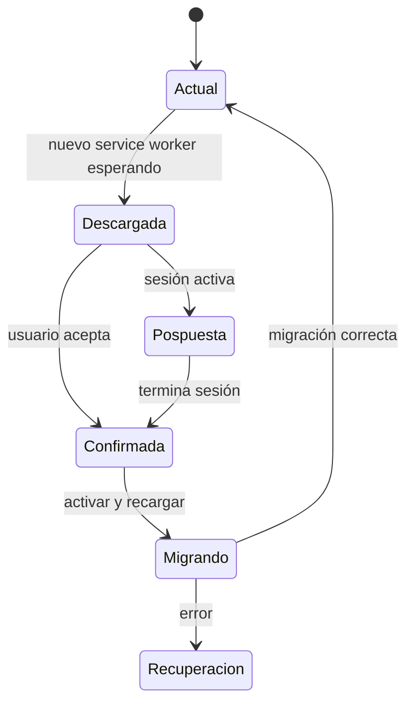

# PRD — Capítulo 17: Especificación PWA y requisitos transversales

| Campo | Valor |
|---|---|
| Producto | Rally O Trainer |
| Estado | Especificación técnica verificable |
| Fecha | 5 de agosto de 2026 |
| Dependencias | Capítulos 06, 07, 14–16 |
| Próximo capítulo | MVP, roadmap, backlog y plan de pruebas |

---

## Análisis previo

### Fuentes técnicas revisadas

- [MDN — Making PWAs installable](https://developer.mozilla.org/en-US/docs/Web/Progressive_web_apps/Guides/Making_PWAs_installable).
- [MDN — Offline and background operation](https://developer.mozilla.org/en-US/docs/Web/Progressive_web_apps/Guides/Offline_and_background_operation).
- [WebKit — Home Screen web apps on iOS and iPadOS](https://webkit.org/blog/13878/web-push-for-web-apps-on-ios-and-ipados/).

Estas fuentes confirman que la instalación depende del manifiesto y HTTPS, que el service worker permite la experiencia offline y que iOS ofrece el flujo de añadir a pantalla de inicio con particularidades propias. La aplicación no basará la interfaz en una API exclusiva de Chromium.

### Hipótesis revisadas

| Hipótesis | Problema | Resolución |
|---|---|---|
| Una PWA instalada se comporta igual en todos los sistemas | Instalación, almacenamiento y ciclo de vida varían | Detección de capacidades y guías específicas por plataforma |
| Cachear todo garantiza offline | Puede servir versiones incompatibles o crecer sin control | Precaché del shell y paquetes activos versionados |
| Actualizar automáticamente es siempre mejor | Puede interrumpir una sesión o migración | Actualización solicitada fuera de sesión |
| “Carga menor de dos segundos” basta como rendimiento | No define dispositivo, red o interacción | Presupuestos medibles de carga, interacción y tamaño |
| No tener servidor elimina riesgos | Importación, XSS local y pérdida de datos siguen existiendo | Modelo de amenazas local y validación estricta |
| Español fijo simplifica todo | Dificulta FCI y expansión futura | Español inicial con arquitectura internacionalizable |

### Mejoras propuestas

1. Shell totalmente precacheado y contenido esencial local.
2. Rutas con hash para hosting estático simple.
3. Ciclo de actualización consciente de sesiones.
4. Objetivos WCAG 2.2 AA y pruebas reales VoiceOver/TalkBack.
5. Presupuestos de rendimiento en CI.
6. Política de seguridad sin HTML dinámico ni recursos remotos.

---

## Versión definitiva

### 1. Objetivos PWA

- instalable en iPhone, iPad, Android, Mac y PC cuando el navegador lo admita;
- funcional tras la primera carga aun sin conexión;
- inicio desde icono en modo `standalone`;
- datos locales disponibles sin autenticación;
- actualización segura y explícita;
- experiencia web completa aunque no se instale;
- coste operativo cero en el MVP.

### 2. Manifiesto

Configuración contractual:

```json
{
  "id": "/rally-o-trainer/",
  "name": "Rally O Trainer",
  "short_name": "Rally O",
  "description": "Entrenamiento de Rally Obedience basado en RSCE y FCI",
  "start_url": "/rally-o-trainer/#/",
  "scope": "/rally-o-trainer/",
  "display": "standalone",
  "orientation": "any",
  "background_color": "#062E24",
  "theme_color": "#062E24",
  "lang": "es-ES",
  "dir": "ltr",
  "prefer_related_applications": false
}
```

La ruta base se parametriza para desarrollo y despliegue; no se codifica literalmente en dominio.

### 3. Iconos

Mínimos:

- 192 × 192 PNG;
- 512 × 512 PNG;
- 512 × 512 `maskable`;
- `apple-touch-icon` 180 × 180;
- favicon SVG/PNG;
- capturas opcionales solo cuando representen la interfaz real.

El símbolo no contiene texto pequeño y conserva área segura.

### 4. Service worker

#### Estrategia MVP

`vite-plugin-pwa` con `generateSW` y actualización `prompt`.

| Recurso | Estrategia |
|---|---|
| HTML de entrada | Network-first con fallback cacheado y tiempo corto |
| JS/CSS con hash | Cache-first, inmutables |
| Iconos e ilustraciones versionadas | Cache-first |
| Paquetes de contenido incluidos en build | Precaché |
| Fuentes oficiales externas | Network-only; no necesarias para usar la app |
| Datos personales | IndexedDB; nunca Cache Storage |

No se cachean páginas de terceros ni PDFs oficiales completos en el MVP.

#### Navegación

- una SPA con rutas hash evita reescrituras del host;
- toda navegación interna resuelve al shell;
- recargar una ruta funciona offline;
- enlaces oficiales se abren como externos;
- la ausencia de red muestra que el enlace no está disponible, sin romper la ficha local.

### 5. Instalación

#### Chromium

- capturar `beforeinstallprompt` solo si existe;
- mostrar ayuda de instalación después de valor demostrado, no al primer segundo;
- no insistir tras descartarla;
- la aplicación funciona igual desde navegador.

#### iOS/iPadOS

- detectar contexto compatible sin asumir evento de instalación;
- instrucción breve: Compartir → Añadir a pantalla de inicio;
- ilustración propia del flujo, revisada con la versión probada;
- comprobar `apple-touch-icon` y modo standalone;
- no prometer que Safari confirmará instalación.

#### Escritorio

- usar promoción del navegador cuando exista;
- no crear instaladores nativos.

### 6. Primer uso offline

Una PWA no puede funcionar antes de haberse descargado. Contrato:

- primera visita requiere red;
- la interfaz indica cuando la preparación offline está completa;
- no mostrar “lista para usar sin conexión” hasta que el service worker controle la página y los paquetes esenciales estén instalados;
- si la primera carga se interrumpe, permitir reintento;
- pruebas verifican cierre completo y reapertura en modo avión.

### 7. Actualizaciones



Reglas:

- nunca recargar durante sesión activa;
- mostrar versión y resumen si está disponible;
- cerrar escrituras antes de activar;
- ejecutar migraciones idempotentes;
- validar integridad después;
- si falla, bloquear nuevas escrituras y ofrecer copia/diagnóstico;
- no borrar caché o base indiscriminadamente.

### 8. Persistencia y almacenamiento

- IndexedDB mediante Dexie;
- solicitar persistencia con `navigator.storage.persist()` cuando esté disponible, después de explicar el beneficio;
- tratar respuesta negativa como normal;
- medir uso con `navigator.storage.estimate()` cuando exista;
- avisar al acercarse a riesgo o si el navegador indica presión;
- las copias siguen siendo defensa principal;
- no depender de almacenamiento privado/incógnito.

### 9. Compatibilidad mínima de producto

Política: últimas dos versiones principales disponibles de Safari/iOS, Chrome/Android, Chrome/desktop, Edge y Firefox, con prueba prioritaria en el dispositivo real disponible.

| Entorno | Nivel |
|---|---|
| iPhone 16 Pro, Safari y PWA instalada | Obligatorio, prueba real |
| Android Chrome reciente | Obligatorio antes de piloto del club |
| iPad Safari | Compatible, prueba manual al disponer de dispositivo |
| macOS Safari/Chrome | Obligatorio funcional |
| Windows Edge/Chrome | Obligatorio funcional |
| Firefox escritorio | Aplicación web funcional; instalación según plataforma |

No se usa detección de navegador para lógica de dominio; solo detección de capacidades.

### 10. Accesibilidad

Objetivo: WCAG 2.2 AA.

#### Semántica

- landmarks `header`, `nav`, `main`, `footer` cuando proceda;
- un `h1` por pantalla;
- botones para acciones y enlaces para navegación;
- listas y tablas reales;
- diálogos nativos o patrón ARIA completo;
- estado activo de navegación anunciado;
- mensajes dinámicos con región viva solo cuando sea necesario.

#### Teclado y foco

- recorrido completo sin ratón;
- foco visible;
- al navegar, foco al título principal;
- hojas y diálogos contienen el foco y lo devuelven al origen;
- no usar índices positivos;
- Escape cierra superposiciones no destructivas;
- acciones de ordenar tienen botones alternativos.

#### Lectores de pantalla

- botones de resultado anuncian etiqueta y contador;
- ilustraciones complejas tienen descripción textual equivalente;
- gráficos tienen resumen y tabla;
- errores se asocian al campo;
- avisos de actualización no interrumpen lectura de sesión;
- probar VoiceOver y TalkBack reales.

#### Cognitiva y motora

- lenguaje sencillo;
- una pregunta por pantalla;
- consistencia de botones;
- sin límites de tiempo en examen;
- 44 × 44 px;
- no exigir gestos complejos;
- deshacer disponible para captura rápida.

### 11. Rendimiento

#### Presupuestos

| Métrica | Objetivo |
|---|---:|
| JS inicial comprimido | ≤170 KiB gzip |
| CSS inicial comprimido | ≤35 KiB gzip |
| Shell total inicial sin contenido pesado | ≤350 KiB gzip |
| Largest Contentful Paint, móvil medio, carga repetida | ≤1,5 s |
| LCP, primera carga en red 4G simulada | ≤2,0 s objetivo de producto |
| Interaction to Next Paint | ≤200 ms |
| Cumulative Layout Shift | ≤0,1 |
| Apertura de lista local | ≤500 ms |
| Registro y confirmación visual | ≤100 ms percibidos |
| Consulta de planificador típica | ≤100 ms |

Los presupuestos se miden, no se garantizan por intuición.

#### Estrategias

- división por rutas para constructor/examen;
- ninguna librería gráfica pesada para resúmenes simples;
- ilustraciones SVG optimizadas;
- consultas indexadas;
- cálculo de progreso fuera del render y por lotes;
- listas de cien señales sin virtualización inicial; medir antes;
- evitar trabajo de red en Inicio;
- no bloquear UI durante exportación grande; usar worker si las mediciones lo requieren.

### 12. Seguridad

#### Activos protegidos

- sesiones y progreso;
- copias;
- integridad del contenido;
- capacidad de seguir usando la app offline;
- confianza en que el producto no suplanta fuentes oficiales.

#### Amenazas principales

| Amenaza | Control |
|---|---|
| XSS mediante texto/importación | React escapado, sin `dangerouslySetInnerHTML`, esquema estricto |
| SVG malicioso | Solo activos de build revisados; no importar SVG arbitrario |
| Copia corrupta | Checksum, validación y restauración temporal |
| Paquete reglamentario manipulado | Checksums; firma futura; aprobación local |
| Dependencia comprometida | Lockfile, auditoría, dependencias mínimas y actualizaciones revisadas |
| Service worker obsoleto | Estrategia de versión y actualización solicitada |
| Pérdida local | Copias y recordatorio |
| Enlace externo malicioso tras cambio | Dominios esperados, `noopener`, revisión de fuentes |

#### Cabeceras recomendadas

Cuando el hosting lo permita:

- Content-Security-Policy sin `unsafe-eval`;
- `X-Content-Type-Options: nosniff`;
- `Referrer-Policy: strict-origin-when-cross-origin` o más restrictiva;
- `Permissions-Policy` deshabilitando capacidades no usadas;
- `frame-ancestors 'none'` mediante CSP;
- HTTPS y HSTS en host compatible.

GitHub Pages limita configuración de cabeceras; por ello el código no dependerá exclusivamente de ellas. Si el riesgo lo justifica, Cloudflare Pages será alternativa gratuita posterior.

### 13. Privacidad

- sin cuenta;
- sin cookies de seguimiento;
- sin analítica;
- sin anuncios;
- sin identificadores remotos;
- sin llamadas de red durante entrenamiento;
- enlaces externos solo por acción;
- informe de diagnóstico anonimizado por defecto;
- política de privacidad breve explicando almacenamiento local.

### 14. Internacionalización

#### Arquitectura

- idioma inicial `es-ES`;
- textos UI mediante claves, no literales dispersos;
- `Intl.DateTimeFormat`, `Intl.NumberFormat` y `Intl.ListFormat`;
- claves y enums nunca traducidos;
- contenido reglamentario identifica idioma y autoridad;
- soporte futuro de paquetes de traducción por revisión;
- diseño preparado para textos un 30 % más largos;
- estructura preparada para RTL, aunque no sea requisito de entrega.

#### Terminología

Glosario central con:

- término preferido;
- definición accesible;
- equivalentes o sinónimos de búsqueda;
- término reglamentario por autoridad;
- notas de traducción.

No se traducen automáticamente textos reglamentarios sin revisión.

### 15. Fiabilidad

- persistir cada resultado;
- transacciones para operaciones compuestas;
- única sesión activa;
- migraciones con fixtures;
- comprobación de integridad manual y tras restaurar;
- fallos de proyección no bloquean lectura de hechos;
- error crítico bloquea escritura antes de agravar daño;
- no depender de red para recuperar la sesión.

### 16. Observabilidad local

Sin telemetría:

- errores recientes en memoria o registro local limitado;
- versión y contexto técnico;
- nunca incluir nombres/notas por defecto;
- límite de 100 eventos técnicos o 200 KiB;
- limpieza al superar límite;
- exportación voluntaria;
- botón de borrar diagnóstico.

### 17. Criterios de aceptación

- [ ] La PWA es instalable mediante manifiesto válido y HTTPS.
- [ ] Tras preparación inicial funciona en modo avión.
- [ ] Recargar cualquier ruta interna funciona offline.
- [ ] No se actualiza durante una sesión.
- [ ] Datos personales nunca se guardan en Cache Storage.
- [ ] Safari iPhone instalado supera el recorrido principal.
- [ ] Android Chrome supera el recorrido principal antes del piloto.
- [ ] Se cumplen pruebas WCAG 2.2 AA automatizadas y manuales críticas.
- [ ] Los presupuestos de tamaño y rendimiento se comprueban en CI.
- [ ] No hay recursos de terceros necesarios para usar la aplicación.
- [ ] Importación no puede inyectar HTML o SVG ejecutable.
- [ ] Toda interfaz está internacionalizada por claves.
- [ ] No existe telemetría ni registro obligatorio.

## Riesgos

| Riesgo | Mitigación |
|---|---|
| Diferencias PWA en iOS | Prueba real temprana y guía específica |
| Presupuesto JS insuficiente al crecer | División por rutas y control en CI |
| GitHub Pages limita cabeceras | Código seguro por diseño y hosting alternativo si se necesita |
| Almacenamiento eliminado por sistema | Copias y persistencia cuando exista |
| Actualización deja esquema incompatible | Prompt, migraciones y recuperación |
| Accesibilidad automatizada da falsa confianza | VoiceOver, TalkBack y teclado manuales |

## Mejoras posibles

- Pruebas periódicas en granja de dispositivos cuando exista presupuesto.
- CSP más estricta mediante hosting configurable.
- Workers para cálculos o exportaciones grandes.
- Compartir recorridos mediante Web Share API con fallback.
- Atajos de manifiesto tras validar uso.

## Decisiones pendientes

| ID | Decisión | Momento límite |
|---|---|---|
| DP-17-001 | GitHub Pages elegido; reevaluar sus cabeceras solo si aparece un requisito no cubierto | Antes de alfa pública |
| DP-17-002 | Versiones mínimas concretas de navegadores | Al iniciar implementación y matriz de soporte |
| DP-17-003 | Necesidad real de solicitar persistencia | Prueba en dispositivos |
| DP-17-004 | Umbral de fallo de presupuesto en CI | Primer build de producción |
