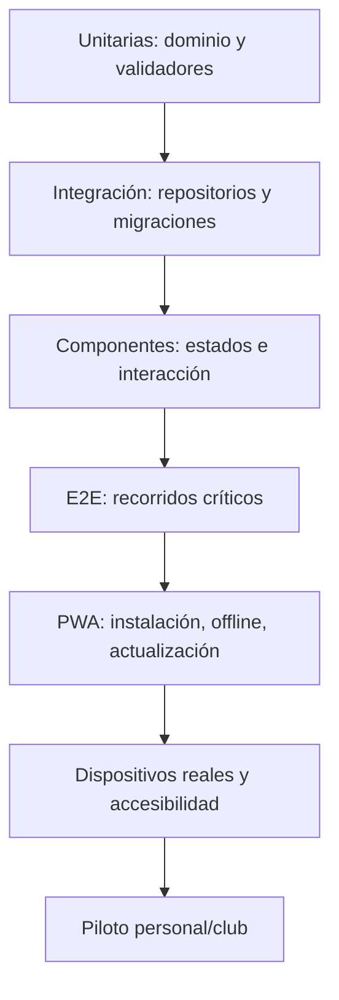
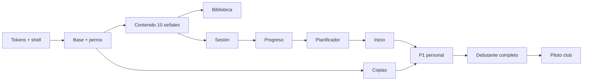

# PRD — Capítulo 18: MVP, roadmap, backlog y calidad

| Campo | Valor |
|---|---|
| Producto | Rally O Trainer |
| Estado | Plan maestro de entrega |
| Fecha | 5 de agosto de 2026 |
| Dependencias | Capítulos 01–17 |
| Siguiente artefacto | Base de contenido estructurado |

---

## Análisis previo

### Hipótesis revisadas

| Hipótesis | Problema | Resolución |
|---|---|---|
| El MVP debe contener todos los grados | Retrasa la validación del ciclo principal | MVP funcional con Debutante completo, arquitectura preparada para todo |
| El planificador puede esperar a versión 2 | Es la promesa central y necesidad inmediata | Planificador determinista básico dentro del MVP |
| Las estadísticas deben ser amplias desde el principio | No existen datos suficientes | Resúmenes accionables; tendencias después |
| Constructor y examen son necesarios para probar valor | No ayudan al objetivo inmediato de planificar sesiones individuales | Versión posterior |
| Terminar documentación equivale a estar listo para desarrollar | Faltan contenido, fixtures y decisiones visuales | Puertas de calidad antes de cada incremento |
| Una sola versión grande reduce trabajo | Aumenta riesgo y dificulta probar en iPhone | Cortes verticales instalables y utilizables |

### Restricciones

- una persona decide y desarrolla con asistencia;
- presupuesto económico cero;
- sin cuenta ni backend;
- dispositivo principal iPhone 16 Pro;
- aproximadamente cinco personas para piloto;
- Android todavía sin dispositivo confirmado;
- prioridad inmediata: saber qué practicar cada día;
- recordatorio de descanso cada 15 minutos, sin límite máximo de sesión;
- sencillez por encima del número de funciones.

### Mejoras propuestas

1. Definir un prototipo técnico antes del MVP.
2. Introducir contenido por lotes C0–C5.
3. Probar el ciclo completo con 10 señales antes de cargar cien.
4. Usar puertas de salida objetivas.
5. Mantener constructor, examen y sincronización fuera del MVP.

---

## Versión definitiva

### 1. Definición de MVP

El MVP es una PWA personal que permite:

1. crear un perro con nombre y raza;
2. consultar la biblioteca RSCE Debutante completa;
3. recibir una recomendación explicada;
4. seleccionar una o varias señales y elegir repetición o circuito;
5. registrar correcta o incorrecta con avance automático y deshacer;
6. guardar y recuperar una sesión interrumpida;
7. calcular progreso 7/10 por lado y dos días;
8. indicar repasos y siguiente práctica;
9. pausar, recuperar y consultar un resumen multiseñal e historial;
10. crear y restaurar una copia completa;
11. instalarse y funcionar offline en iPhone y Android compatible.

### 2. Fuera del MVP

- Grados 1–3 completos y bloque FCI avanzado;
- constructor de pistas;
- práctica de recorridos;
- modo examen;
- vídeos;
- comparación entre perros;
- compartir recorridos;
- sincronización;
- cuentas;
- modo instructor;
- colaboración;
- importación combinada;
- exportación PDF;
- notificaciones push;
- datos de competición.

El modelo admite estas extensiones sin exponerlas anticipadamente.

### 3. Prototipo técnico P0

Antes del MVP:

- shell React/TypeScript;
- manifiesto e icono provisional;
- service worker;
- base Dexie y migración inicial;
- un perro;
- tres señales ficticias claramente marcadas como fixture;
- una sesión persistente;
- registro con tres botones;
- reapertura offline;
- copia y restauración mínima.

P0 no se comparte como contenido real. Su salida es confirmar arquitectura, no valor reglamentario.

### 4. Corte vertical P1

- 10 señales reales de Debutante revisadas;
- recomendación v1;
- biblioteca y ficha;
- sesión completa;
- progreso;
- historial;
- iPhone real;
- pruebas automatizadas críticas.

P1 se usa personalmente durante al menos 10 sesiones antes de expandir contenido.

### 5. MVP personal P2

- Debutante completo;
- señales nacionales aplicables;
- señales gráficas oficiales obligatorias para todo contenido publicado;
- ambos lados como objetivo de entrenamiento;
- copia de seguridad;
- modos claro y oscuro;
- accesibilidad crítica;
- rendimiento dentro de presupuesto.

### 6. Piloto de club P3

- instalación documentada;
- contenido Debutante cerrado;
- Android probado;
- formato de copia estable;
- consentimiento informal para recoger comentarios, no datos;
- cinco instalaciones independientes;
- canal manual de incidencias;
- corrección de problemas P0/P1 antes de nuevas funciones.

### 7. Versiones

| Versión | Resultado |
|---|---|
| 0.1 | Prototipo técnico local |
| 0.2 | Corte de 10 señales usado personalmente |
| 0.5 | MVP Debutante completo |
| 0.8 | Piloto del club estable |
| 1.0 | RSCE Debutante y Grados 1–3, biblioteca FCI relacionada, planificador, sesiones, progreso, copias |
| 1.5 | Bloque FCI completo, modo examen y estadísticas ampliadas |
| 2.0 | Constructor por lista, recorridos e importación/exportación |
| 3.0 | Ilustraciones/vídeos propios, comparación personal y compartir recorridos sin cuenta |
| 4.0 | Sincronización opcional y colaboración solo si existe necesidad, recursos y diseño de privacidad |

Se corrige el roadmap inicial: el planificador básico pasa al MVP porque sin él el producto sería principalmente un catálogo y registro.

### 8. Épicas

| ID | Épica | Prioridad | Entrega |
|---|---|---:|---|
| E01 | Shell, navegación y temas | Must | P0 |
| E02 | PWA, instalación y offline | Must | P0 |
| E03 | Persistencia y migraciones | Must | P0 |
| E04 | Perros | Must | P0 |
| E05 | Contenido y biblioteca | Must | P1–1.0 |
| E06 | Sesiones y captura | Must | P0–P1 |
| E07 | Progreso y repaso | Must | P1 |
| E08 | Planificador | Must | P1 |
| E09 | Historial y estadísticas | Must | P1–P2 |
| E10 | Copias y recuperación | Must | P0–P2 |
| E11 | Accesibilidad y rendimiento | Must | Todas |
| E12 | Contenido RO1–RO3/FCI | Should | 1.0–1.5 |
| E13 | Examen | Could | 1.5 |
| E14 | Constructor y recorridos | Could | 2.0 |
| E15 | Sincronización | Won't now | 4.0 |

### 9. Backlog priorizado

#### E01 — Shell

| ID | Historia | Prioridad | Criterio resumido |
|---|---|---:|---|
| S01 | Como guía, quiero ver Inicio con mi perro activo | Must | Recomendación o continuación visible |
| S02 | Quiero llegar a Entrenar, Señales y Progreso rápidamente | Must | ≤3 pulsaciones |
| S03 | Quiero tema claro, oscuro o sistema | Should | Cambio persistente sin recarga |
| S04 | Quiero usar escritorio sin perder funciones | Should | Navegación lateral adaptable |

#### E02–E03 — PWA y datos

| ID | Historia | Prioridad | Criterio resumido |
|---|---|---:|---|
| S05 | Quiero instalar la aplicación | Must | Manifiesto válido y guía iOS |
| S06 | Quiero abrirla sin conexión | Must | Ciclo principal tras primera carga |
| S07 | Quiero que una actualización no interrumpa sesión | Must | Prompt pospuesto |
| S08 | Quiero recuperar datos tras recarga | Must | Persistencia por acción |
| S09 | Quiero migraciones seguras | Must | Fixtures y fallo recuperable |

#### E04 — Perros

| ID | Historia | Prioridad | Criterio resumido |
|---|---|---:|---|
| S10 | Crear perro con nombre y raza | Must | Únicos campos obligatorios |
| S11 | Cambiar perro activo | Must | Sin mezcla de progreso |
| S12 | Editar y archivar | Should | Archivar reversible |
| S13 | Borrar definitivamente | Must | Doble confirmación y cascada |

#### E05 — Biblioteca

| ID | Historia | Prioridad | Criterio resumido |
|---|---|---:|---|
| S14 | Ver señales por RSCE y grado | Must | Asignaciones sin duplicar progreso |
| S15 | Buscar por número o nombre | Must | Offline y <100 ms |
| S16 | Abrir ficha completa | Must | Tres capas y fuente |
| S17 | Filtrar por estado/lado/ubicación | Should | Filtros limpiables |
| S18 | Elegir cualquier señal | Must | Sin bloqueo de progresión |

#### E06 — Sesiones

| ID | Historia | Prioridad | Criterio resumido |
|---|---|---:|---|
| S19 | Ver material antes de empezar | Must | Requerido y opcional diferenciados |
| S20 | Registrar Correcta o Incorrecta | Must | Un toque, persistencia y avance automático |
| S21 | Deshacer último resultado | Must | Recalcula contador |
| S22 | Cambiar de lado | Must | Nuevo bloque separado |
| S23 | Pausar y recuperar | Must | Sin perder datos |
| S24 | Finalizar antes | Must | Motivo opcional, sin penalización |
| S25 | Registrar agregado | Should | Suma válida y modo exclusivo |

#### E07–E08 — Progreso y planificador

| ID | Historia | Prioridad | Criterio resumido |
|---|---|---:|---|
| S26 | Calcular aprendida 7/10 | Must | Dos días y lado separado |
| S27 | Calcular consolidada | Should | 8/10, tres días, mantenimiento |
| S28 | Marcar repaso a 30 días | Must | Modalidad y lado correctos |
| S29 | Recomendar una señal | Must | Determinista y explicada |
| S30 | Ver alternativas | Must | Hasta dos y elección libre |
| S31 | Respetar ubicación/material | Must | Sin sorpresa al empezar |

#### E09–E10 — Historial y copias

| ID | Historia | Prioridad | Criterio resumido |
|---|---|---:|---|
| S32 | Ver historial | Must | Hechos por fecha |
| S33 | Ver detalle de sesión | Must | Revisión y resultados exactos |
| S34 | Eliminar sesión | Should | Confirmación y recalculo |
| S35 | Ver estados accionables | Must | Repaso primero |
| S36 | Crear copia completa | Must | JSON semántico válido |
| S37 | Restaurar copia | Must | Prevalidación y sustitución segura |
| S38 | Recibir recordatorio | Should | 30 días, no durante sesión |

### 10. Criterios de salida por fase

#### P0

- [ ] Build reproducible.
- [ ] Pruebas unitarias y de integración básicas pasan.
- [ ] PWA abre offline tras primera carga.
- [ ] Sesión se recupera tras recarga.
- [ ] Copia ida/vuelta conserva fixtures.

#### P1

- [ ] Diez señales reales aprobadas.
- [ ] Diez sesiones personales completadas.
- [ ] Ninguna pérdida de registros.
- [ ] Recomendación entendible sin consultar documentación.
- [ ] Flujo crítico usable con una mano.
- [ ] VoiceOver crítico funciona.

#### P2

- [ ] Debutante completo y revisado.
- [ ] Algoritmo cubierto por tabla de decisiones.
- [ ] Restauración probada con versión anterior.
- [ ] Presupuestos de rendimiento cumplidos.
- [ ] Cero defectos críticos conocidos.

#### P3

- [ ] Android real probado.
- [ ] Cinco personas pueden instalar y completar una sesión.
- [ ] Instrucciones de copia comprendidas.
- [ ] Incidencias de severidad alta resueltas.
- [ ] No se añaden funciones durante la ventana de estabilidad.

### 11. Definición de hecho

Una historia está terminada cuando:

- cumple criterios funcionales;
- incluye estados vacío, error, carga y offline;
- tiene pruebas unitarias donde exista lógica;
- tiene pruebas de integración de persistencia;
- pasa teclado y accesibilidad automatizada;
- se revisa en modo claro y oscuro;
- funciona a 320 px y en escritorio;
- no supera presupuestos;
- actualiza documentación;
- no introduce datos o red fuera de alcance.

### 12. Estrategia de pruebas

### 13. Matriz de pruebas

| Área | Unitarias | Integración | E2E | Manual |
|---|:---:|:---:|:---:|:---:|
| Progreso 7/10 y repaso | Sí | Sí | Sí | Muestra |
| Planificador | Sí | Sí | Sí | Explicación |
| Sesión | Sí | Sí | Sí | Una mano |
| Dexie/migraciones | Parcial | Sí | Sí | Recuperación |
| Copias | Sí | Sí | Sí | Archivos sistema |
| Service worker | No | Sí | Sí | iOS/Android |
| Biblioteca | Sí | Sí | Sí | Lectura exterior |
| Accesibilidad | Parcial | Sí | Sí | VoiceOver/TalkBack |
| Rendimiento | Sí presupuesto | Sí | Sí | Dispositivo real |
| Seguridad importación | Sí | Sí | Sí | Revisión |

### 14. Casos críticos E2E

1. Primera apertura → crear perro → recomendación → sesión → resumen.
2. Cerrar durante sesión → reabrir offline → continuar → finalizar.
3. Entrenar ambos lados → estados independientes.
4. Obtener 7/10 en dos días simulados → aprendida.
5. Avanzar reloj 30 días → necesita repaso.
6. Elegir señal no recomendada → práctica permitida.
7. Crear copia → borrar datos de prueba → restaurar → comparar hechos.
8. Actualización pendiente durante sesión → no recargar → actualizar al finalizar.
9. Borrar perro → doble confirmación → cascada íntegra.
10. Navegar con teclado/lector en biblioteca y sesión.

### 15. Fixtures temporales

- fechas mediante reloj inyectable;
- UUID deterministas en pruebas;
- un perro, dos perros y perro archivado;
- señales sin lado, izquierda y bilateral;
- revisión compatible e incompatible;
- sesiones individuales y agregadas;
- copias por cada versión soportada;
- archivos corruptos, excesivos y con referencias huérfanas;
- estados claro, oscuro y movimiento reducido.

### 16. Severidad de defectos

| Nivel | Ejemplo | Salida |
|---|---|---|
| Crítico | Pérdida/corrupción, aplicación no abre, restaura mal | Bloquea toda publicación |
| Alto | Sesión o progreso incorrecto, offline falla | Bloquea fase |
| Medio | Flujo alternativo difícil, accesibilidad parcial | Resolver antes de piloto salvo excepción documentada |
| Bajo | Texto, alineación o mejora menor | Puede planificarse |

### 17. Piloto

#### Personal

- mínimo 20 sesiones;
- al menos cuatro semanas para validar 14/30 días con reloj real y pruebas simuladas;
- registrar incidencias en archivo local del proyecto, sin telemetría;
- observar tiempo para iniciar y registrar;
- no ajustar algoritmo por una sola sesión.

#### Club

- aproximadamente cinco personas;
- mezcla de iOS y Android si es posible;
- cada una usa su instalación y copia;
- guion de 30 minutos: instalar, crear perro, consultar, entrenar, copiar;
- comentarios sobre comprensión, no rendimiento del perro;
- no recopilar datos personales ni exportaciones salvo entrega voluntaria explícita.

### 18. Métricas de éxito

| Métrica | Objetivo inicial |
|---|---:|
| Inicio de sesión recomendada | ≤3 pulsaciones |
| Preparación comprendida | 5/5 usuarios piloto sin explicación externa tras primera vez |
| Registro de intento | 1 pulsación |
| Sesiones perdidas | 0 |
| Restauraciones de fixture correctas | 100 % |
| Flujo crítico offline | 100 % en matriz obligatoria |
| Errores críticos abiertos en piloto | 0 |
| Recomendación entendida | ≥4/5 usuarios explican por qué aparece |

No se fijan métricas de retención, engagement, rachas o crecimiento comercial.

### 19. Dependencias y orden

### 20. Riesgos de proyecto

| Riesgo | Señal temprana | Respuesta |
|---|---|---|
| Alcance crece antes de validar | Trabajo en constructor antes de P1 | Congelar versión y volver al corte vertical |
| Contenido bloquea desarrollo | No hay 10 señales aprobadas | Fixtures explícitos para técnica; lote editorial paralelo posterior |
| Falta Android | Nadie del club confirma dispositivo | Conseguir prueba antes de P3, no afirmar soporte verificado |
| Arquitectura excesiva | Más infraestructura que pantallas | Revisar dependencias y eliminar abstracciones sin segundo uso |
| Trabajo individual introduce errores | Revisiones apresuradas | Checklist, pruebas y revisión separada en el tiempo |
| Cero presupuesto limita hosting | Publicación o cabeceras insuficientes | GitHub Pages primero; evaluar alternativa gratuita |

### 21. Criterios de aceptación del capítulo

- [ ] El MVP entrega la promesa de recomendación, no solo catálogo.
- [ ] Debutante completo es el límite de contenido del MVP.
- [ ] Existe un corte de 10 señales antes de expansión.
- [ ] Constructor, examen y sincronización quedan fuera del MVP.
- [ ] Cada fase tiene puerta de salida verificable.
- [ ] El backlog está ordenado por dependencia y valor.
- [ ] La definición de hecho incluye offline, accesibilidad y errores.
- [ ] Existen casos críticos de copia, actualización y recuperación.
- [ ] El piloto Android es requisito antes del club.
- [ ] Las métricas no incentivan uso innecesario.

## Riesgos

| Riesgo | Mitigación |
|---|---|
| “Todo” se interpreta como una única entrega | Versiones y cortes explícitos |
| MVP parece demasiado pequeño | Cierra el ciclo central y Debutante completo |
| Planificador v1 se sobreajusta | Pesos versionados y validación tras 20 sesiones |
| Piloto se inicia con defectos de datos | Puertas P1/P2 y cero críticos |
| Documentación diverge del código | Definición de hecho y enlaces contractuales |

## Mejoras posibles

- Convertir el backlog en issues cuando exista repositorio.
- Añadir matriz requisito→prueba automatizada.
- Ejecutar pruebas visuales de componentes en CI.
- Generar changelog desde versiones de contenido y aplicación.
- Incorporar un pequeño registro de decisiones técnicas en el repositorio.

## Decisiones pendientes

| ID | Decisión | Momento límite |
|---|---|---|
| DP-18-001 | Seleccionar las 10 señales del corte P1 | Tras cerrar inventario Debutante |
| DP-18-002 | Confirmar una persona/dispositivo Android | Antes de P3 |
| DP-18-003 | Publicación en GitHub Pages | Resuelta; falta validación física |
| DP-18-004 | Incluir consolidación en MVP o activarla tras piloto | Antes de P2 |
| DP-18-005 | Incluir registro agregado en P1 o P2 | Antes de implementar sesión |
